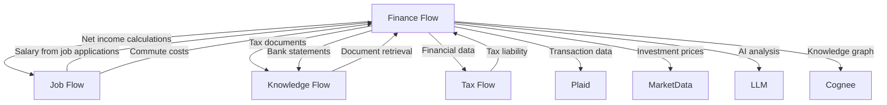
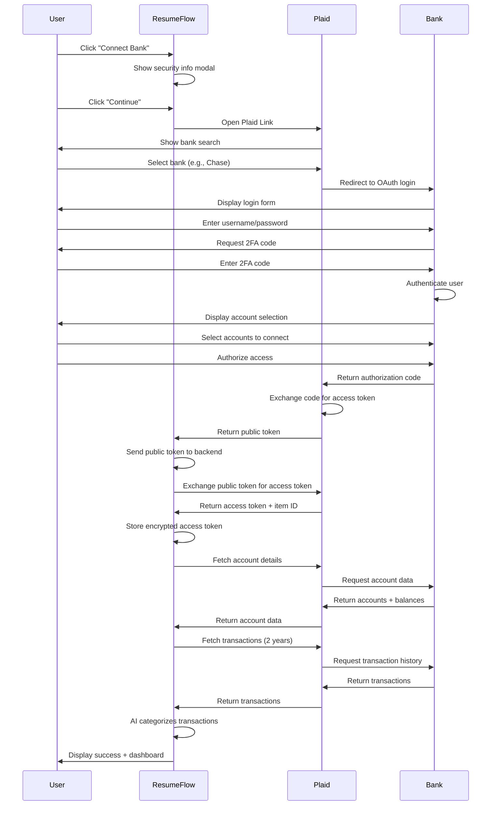
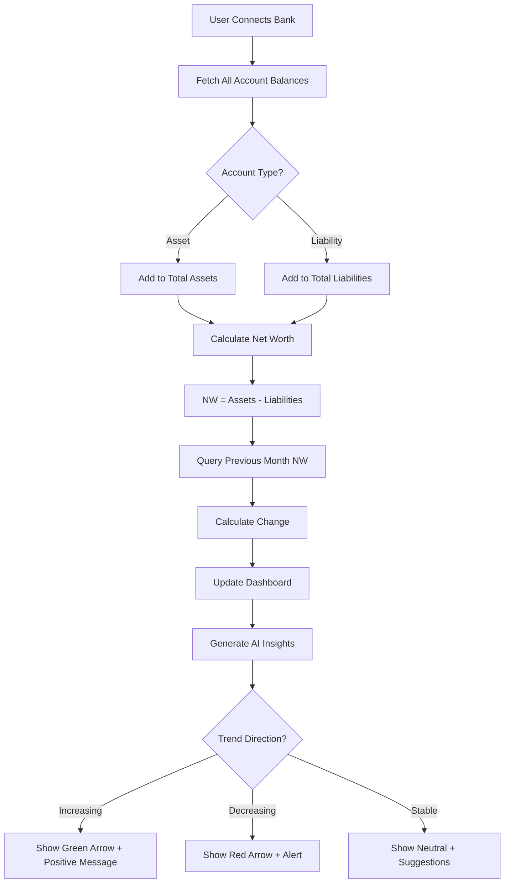

# Finance Flow - Detailed User Stories & Technical Specifications

**Microservice:** Finance Flow (Personal Finance Management)  
**Roadmap:** Roadmap 3 (Months 10-12)  
**Version:** 1.0  
**Last Updated:** November 13, 2025

---

## Table of Contents

### Part I: Overview
1. [Executive Summary](#executive-summary)
2. [Microservice Architecture](#microservice-architecture)
3. [User Personas](#user-personas)
4. [Success Metrics](#success-metrics)
5. [Dependencies](#dependencies)

### Part II: User Stories - Open Banking & Dashboard (Month 10)
6. [US-FF-001: Bank Account Connection via Open Banking](#us-ff-001)
7. [US-FF-002: OAuth2 Secure Bank Authentication](#us-ff-002)
8. [US-FF-003: Transaction Import & Historical Sync](#us-ff-003)
9. [US-FF-004: Real-Time Transaction Sync](#us-ff-004)
10. [US-FF-005: Account Balance Tracking](#us-ff-005)
11. [US-FF-006: Comprehensive Financial Dashboard](#us-ff-006)
12. [US-FF-007: Net Worth Calculation](#us-ff-007)
13. [US-FF-008: Cash Flow Visualization](#us-ff-008)
14. [US-FF-009: AI Financial Insights Generation](#us-ff-009)
15. [US-FF-010: Financial Advisor Verification of Insights](#us-ff-010)

### Part III: User Stories - Budgeting & Expense Tracking (Month 11)
16. [US-FF-011: AI Transaction Categorization](#us-ff-011)
17. [US-FF-012: User Correction Feedback Loop (Transactions)](#us-ff-012)
18. [US-FF-013: Recurring Expense Detection](#us-ff-013)
19. [US-FF-014: Budget Creation Interface](#us-ff-014)
20. [US-FF-015: Budget vs Actual Tracking](#us-ff-015)
21. [US-FF-016: Overspending Alerts & Notifications](#us-ff-016)
22. [US-FF-017: AI Budget Recommendations](#us-ff-017)
23. [US-FF-018: FA Verification of Budget Plans](#us-ff-018)
24. [US-FF-019: Expense Trend Analysis](#us-ff-019)
25. [US-FF-020: Partner Financial Data Integration](#us-ff-020)

### Part IV: User Stories - Investment & Retirement (Month 12)
26. [US-FF-021: Investment Account Connection](#us-ff-021)
27. [US-FF-022: Portfolio Performance Tracking](#us-ff-022)
28. [US-FF-023: Asset Allocation Analysis](#us-ff-023)
29. [US-FF-024: AI Rebalancing Recommendations](#us-ff-024)
30. [US-FF-025: FA Verification of Rebalancing Plans](#us-ff-025)
31. [US-FF-026: Retirement Goal Setting](#us-ff-026)
32. [US-FF-027: Retirement Readiness Calculation (Monte Carlo)](#us-ff-027)
33. [US-FF-028: Contribution Optimization](#us-ff-028)
34. [US-FF-029: FA Verification of Retirement Plans](#us-ff-029)
35. [US-FF-030: Loan Pre-Approval Calculator](#us-ff-030)
36. [US-FF-031: Tax Estimation Interface (Light Version)](#us-ff-031)

### Part V: User Stories - FA Verification Platform
37. [US-FF-032: FA Marketplace Integration](#us-ff-032)
38. [US-FF-033: FA Bidding on Financial Plan Reviews](#us-ff-033)
39. [US-FF-034: FA Verification Dashboard](#us-ff-034)
40. [US-FF-035: FA Payment Processing](#us-ff-035)

### Part VI: Technical Architecture
41. [Complete Convex Schema](#convex-schema)
42. [API Endpoints Reference](#api-endpoints)
43. [Authentication & Authorization](#auth-rules)
44. [WebSocket Events](#websocket-events)
45. [Third-Party Integrations](#integrations)
46. [Performance & Scalability](#performance)
47. [Security Specifications](#security)

### Part VII: Appendices
48. [Testing Specifications](#testing)
49. [Deployment Guide](#deployment)
50. [Monitoring & Observability](#monitoring)
51. [Glossary](#glossary)

---

<a name="executive-summary"></a>
## Part I: Executive Summary

### Finance Flow Overview

**Tagline:** "AI-powered personal finance with expert guidance"

**Purpose:** Finance Flow empowers users to understand their complete financial picture—net worth, cash flow, investments, retirement readiness—with AI-powered insights and optional Financial Advisor verification for high-stakes decisions.

**Core Value Propositions:**

**For Users:**
- "See your complete financial picture in one dashboard—all accounts, all investments, all debts"
- "AI categorizes every transaction automatically—zero manual entry"
- "Get FA-quality financial advice at 10% of traditional advisor costs"
- "Understand if that job offer's salary actually improves your financial situation"

**For Financial Advisors:**
- "Build your client base through verification marketplace—earn $50-150 per financial plan review"
- "Leverage AI to serve 10x more clients (AI does analysis, you provide expertise)"
- "Focus on high-value strategic advice, not data entry"

**Key Differentiators:**
- **Open Banking Integration:** Automatic transaction sync from 10,000+ banks (Plaid/Yodlee)
- **Cross-microservice intelligence:** Job salary changes update budget automatically, commute costs factor into net income calculations
- **AI + Human Hybrid:** AI speed (instant analysis) + FA expertise (verified recommendations)
- **Holistic view:** Unlike Mint (budgeting only) or Personal Capital (investments only), Finance Flow covers everything

---

<a name="microservice-architecture"></a>
## Microservice Architecture

### System Context

Finance Flow integrates deeply with other microservices:



### Core Components

**1. Open Banking Integration**
- Bank account connection (OAuth2 via Plaid/Yodlee)
- Transaction sync (real-time or daily)
- Balance tracking (checking, savings, credit cards, loans)
- Multi-bank aggregation (connect unlimited accounts)

**2. Comprehensive Financial Dashboard**
- Net worth calculation (assets - liabilities)
- Cash flow visualization (income vs expenses over time)
- Account balance summary
- AI-generated financial insights ("You spent 30% more on dining this month")

**3. Budgeting & Expense Tracking**
- AI transaction categorization (groceries, rent, entertainment, etc.)
- Budget creation (monthly limits per category)
- Budget vs actual tracking (visual progress bars)
- Overspending alerts (notifications when budget exceeded)
- Recurring expense detection (subscriptions, rent, utilities)

**4. Investment & Retirement Planning**
- Investment account connection (brokerage, 401k, IRA)
- Portfolio performance tracking (gains/losses, returns)
- Asset allocation analysis (stocks/bonds/cash breakdown)
- AI rebalancing recommendations
- Retirement planning (Monte Carlo simulations)
- Contribution optimization

**5. Loan & Tax Tools**
- Loan pre-approval calculators (home, car, personal, business)
- Tax estimation (light version, full version in Tax Flow)
- Net salary calculator (gross salary - taxes - expenses - commute)

**6. FA Verification Marketplace**
- FA profile creation (similar to coach profiles)
- Verification tasks: Review AI financial plans, budgets, investment recommendations
- Marketplace bidding (same mechanics as Job Flow)
- Earnings: $50-150 per financial plan verification

---

<a name="user-personas"></a>
## User Personas

### Primary User: Career Changer Evaluating Offers (Marcus, 28, Software Engineer)

**Background:**
- Currently earning $95K, has job offer for $140K in different city
- Needs to understand true financial impact (higher salary vs higher cost of living + commute)
- Has student loans ($45K), car payment, rent
- Wants to save for house down payment

**Goals:**
- Understand if $140K offer actually improves financial situation
- Calculate net income after taxes, commute costs, higher rent
- Plan budget for new city
- Track progress toward down payment goal

**Pain Points:**
- "I don't know if $45K salary increase is worth it after taxes and higher rent"
- "Should I pay off student loans faster or save for down payment?"
- "My finances are scattered across 5 bank accounts and 3 investment accounts"

**Success Scenario:**
- Connects all accounts to Finance Flow (2 banks, 1 credit card, 1 401k, 1 brokerage)
- AI calculates net income for both scenarios:
  - Current job: $95K gross → $68K net (after taxes) → $48K after expenses → $20K saveable
  - New job: $140K gross → $98K net → $65K after expenses (higher rent/commute) → $33K saveable
- AI insight: "New job increases savings by $13K/year (+65%). You can afford $300K house in 2 years vs 3.5 years current trajectory."
- Marcus accepts offer with confidence, uses Finance Flow to track progress toward down payment goal

---

### Secondary User: Financial Advisor (Jennifer, 35, CFP)

**Background:**
- Independent financial advisor with 30 clients
- Spends 60% of time on data entry and analysis (gathering statements, calculating returns)
- Wants to serve more clients but limited by time

**Goals:**
- Automate data gathering (client connects accounts directly)
- AI handles routine analysis (portfolio performance, budget review)
- Focus on high-value strategic advice (retirement planning, tax optimization)
- Earn additional income from verification marketplace

**Pain Points:**
- "I spend 10 hours/week just updating spreadsheets with client data"
- "Clients don't send me statements on time—I'm always chasing them"
- "I can only afford to take on 30 clients with current time constraints"

**Success Scenario:**
- Signs up as FA on Finance Flow, creates profile (10 minutes)
- Onboards 5 clients to Finance Flow (clients connect accounts directly)
- AI auto-syncs transactions, calculates portfolio performance, identifies budget issues
- Jennifer reviews AI analysis in 20 minutes/client (vs 2 hours manual)
- Time saved allows her to take on 10 new clients
- Earns additional $2,000/month from verification marketplace (verifies AI plans for non-clients)

---

<a name="success-metrics"></a>
## Success Metrics

### User Engagement
- **Bank accounts connected per user:** Target 2+ (checking + savings or credit card)
- **Budgets created:** 40% of users create budget within first month
- **Budget maintained:** 60% of users with budgets stay active >3 months
- **Investment accounts tracked:** 30% of users connect brokerage/401k
- **Dashboard views per week:** 3+ (users check finances regularly)
- **AI insights engagement:** 75% of users click/expand AI insights

### AI Quality
- **Transaction categorization accuracy:** >90% (measured via user corrections)
- **Budget recommendation acceptance:** >75% (users adopt AI suggested budgets)
- **Investment rebalancing approval (by FAs):** >85%
- **Retirement projection accuracy:** ±10% of actual outcomes (validated over time)

### FA Marketplace
- **FA sign-ups:** 50+ by Month 12
- **Verification turnaround time:** <48 hours average
- **FA satisfaction:** >4.5 stars
- **FA earnings:** $2,000-5,000/month average from verification work

### Revenue
- **HITL marketplace fees:** $405,000/month by Month 12 (15% of all verification transactions across Job + Knowledge + Finance Flows)
- **Finance Flow contribution:** ~$150,000/month (37% of total HITL revenue)
- **Average financial plan verification cost:** $75 (users pay, FAs receive $63.75, platform receives $11.25)
- **Verification volume:** 2,000 financial plans/month by Month 12

### Cross-Microservice Impact
- **Job Flow integration:** 50% of job seekers use Finance Flow to evaluate offer net impact
- **Tax Flow preparation:** Finance Flow provides all financial data for tax calculations (Month 16+)
- **Knowledge Flow storage:** 80% of tax documents, bank statements stored in Knowledge Flow

---

<a name="dependencies"></a>
## Dependencies

### Prerequisites (Must be complete before Finance Flow launch)

**From Job Flow (Roadmap 1):**
- ✅ HITL marketplace infrastructure (bidding, payment, verification workflow)
- ✅ Convex backend (schema, queries, mutations, real-time sync)
- ✅ User authentication (WorkOS)
- ✅ Payment processing (Stripe Connect for FA payouts)
- ✅ Design system components

**From Knowledge Flow (Roadmap 2):**
- ✅ Document storage (tax forms, bank statements saved to Knowledge Flow)
- ✅ File upload infrastructure
- ✅ Search functionality (find financial documents)

**From Platform Foundation:**
- ✅ WebSocket real-time updates
- ✅ Notification system (email + in-app)
- ✅ Analytics tracking (Mixpanel/PostHog)

### New Dependencies (Finance Flow introduces)

**Plaid API (Open Banking):**
- Account: Developer account (free sandbox, $0.25-1.00 per item in production)
- Integration: Plaid Link SDK for bank connection flow
- Purpose: Connect user bank accounts, sync transactions, get balances
- Alternatives: Yodlee (fallback if Plaid unavailable in region)

**Financial Data APIs:**
- **Stock/ETF Prices:** Alpha Vantage (free tier) or IEX Cloud (paid, better for real-time)
- **Currency Exchange:** Open Exchange Rates API
- **Interest Rates:** Federal Reserve Economic Data (FRED) API
- Purpose: Investment portfolio pricing, currency conversion, benchmark rates

**Monte Carlo Simulation Library:**
- Library: Custom implementation or `@monte-carlo/finance` (if available)
- Purpose: Retirement planning probabilistic projections
- Approach: 10,000 simulation runs per retirement plan

**Encryption Library for Financial Data:**
- Library: Node.js crypto (AES-256-GCM)
- Purpose: Encrypt sensitive financial data at rest (additional layer beyond Convex default encryption)
- Scope: Bank account numbers, transaction details, investment holdings

---

## Part II: User Stories - Open Banking & Dashboard

<a name="us-ff-001"></a>
### US-FF-001: Bank Account Connection via Open Banking

**Epic:** Open Banking Integration  
**Priority:** P0 (Critical - Foundation feature)  
**Story Points:** 13 (Complex - OAuth flow, Plaid integration, error handling)  
**Dependencies:** US-AUTH-001 (User Authentication), Plaid account setup  
**Microservice:** Finance Flow  
**Implementation Phase:** Month 10

---

#### 1. User Story Statement

**As a** user  
**I want to** securely connect my bank accounts using Open Banking (Plaid)  
**So that** my transaction data is automatically imported and my financial dashboard stays up-to-date

---

#### 2. Business Context

**User Pain Point:**
- Manual bank statement downloads are tedious (log in to each bank, download CSV, import)
- Transactions go untracked (users lose visibility into spending)
- Financial picture incomplete (can't see all accounts in one place)

**Platform Value:**
- Core feature—Open Banking enables all Finance Flow features (budgeting, net worth, insights)
- User trust builder—Plaid is industry-standard (used by Venmo, Robinhood, Coinbase)
- Data moat—Financial data enables personalized insights across all microservices

**Success Metrics:**
- Bank connection success rate: >95% (Plaid handles most auth flows)
- Average accounts connected per user: 2.5+ (checking + savings/credit card)
- Transaction sync latency: <24 hours for daily sync
- User retention: Users with connected banks are 3x more likely to remain active

**Platform Pitch Alignment:**
"Connect your bank accounts once—we'll automatically track every transaction, calculate your net worth, and surface insights. Bank-grade security via Plaid, used by 200M+ people worldwide."

---

#### 3. User Flow Steps (Detailed)

**Step 1: Initial State**
- User is authenticated, has created basic profile
- User navigates to Finance Flow dashboard (`/finance`)
- Dashboard shows empty state: "Connect your first bank account to get started"
- Prominent CTA button: "Connect Bank Account" (yellow, large)

**Step 2: Initiate Connection**
- User clicks "Connect Bank Account"
- Modal appears: "Connect Your Bank"
- Description: "Securely connect your bank via Plaid. We never see your password. Your data is encrypted and private."
- Security badges: "🔒 Bank-Grade Security" "✓ 256-Bit Encryption" "✓ Read-Only Access"
- Button: "Continue" (yellow)

**Step 3: Plaid Link Opens**
- User clicks "Continue"
- Plaid Link modal opens (iframe, full-screen on mobile)
- Plaid displays:
  - Search bar: "Search for your bank or credit union"
  - Popular banks grid: Chase, Bank of America, Wells Fargo, etc.
- User types bank name or clicks from list

**Step 4: Bank Selection**
- User selects their bank (e.g., "Chase")
- Plaid redirects to Chase's OAuth login page (secure, within Plaid iframe)
- User sees Chase branding (trust signal—users know they're on real bank site)

**Step 5: Bank Authentication**
- User enters bank username/password
- **If 2FA/MFA required:** User receives code via SMS/email, enters code
- Bank authenticates user, displays accounts (checking, savings, credit cards)
- User selects which accounts to connect (checkboxes)
- User clicks "Continue" on bank's OAuth consent screen

**Step 6: Plaid Authorization**
- Bank redirects back to Plaid with authorization code
- Plaid exchanges code for access token
- Plaid sends public token to Resume Flow frontend

**Step 7: Token Exchange (Backend)**
- Frontend sends public token to Convex backend
- Backend calls Plaid API to exchange public token for access token
- Backend stores access token (encrypted) in database
- Backend stores Plaid item ID (identifies bank connection)

**Step 8: Initial Data Sync**
- Backend triggers Plaid API calls to fetch:
  - Account details (account number last 4 digits, type, name)
  - Current balances
  - Transaction history (up to 2 years or 500 transactions, whichever is less)
- Loading screen displayed to user: "Importing your financial data... This may take 30-60 seconds"
- Progress indicator: "Fetching accounts... ✓" → "Downloading transactions... 45%" → "Analyzing spending... ✓"

**Step 9: AI Transaction Categorization**
- Backend sends all transactions to AI categorization service
- AI assigns category to each transaction (Groceries, Rent, Entertainment, etc.)
- Categorization takes 5-10 seconds for 500 transactions (batch processing)

**Step 10: Success Confirmation**
- User redirected to Finance Dashboard
- Success message: "✅ Connected to Chase! Imported 487 transactions from the last 2 years."
- Dashboard now populated with:
  - Account balances (Chase Checking: $3,245.67, Chase Savings: $12,890.23)
  - Recent transactions list
  - Spending by category chart
  - Net worth calculation (updated)
- Tooltip: "Your transactions sync automatically every 24 hours. Last sync: Just now"

**Step 11: Automatic Daily Sync (Background)**
- Convex cron job runs daily at 6am user local time
- Fetches new transactions from Plaid (last 7 days)
- AI categorizes new transactions
- Dashboard updates automatically (reactive Convex queries)
- User sees updated data next time they visit (no manual refresh needed)

**Step 12: Connection Health Monitoring**
- System monitors Plaid connection status
- If connection breaks (user changed password, revoked access, bank token expired):
  - User receives notification: "Your Chase connection needs to be reconnected"
  - User clicks notification, Plaid re-authorization flow starts
  - User re-authenticates, connection restored

**Step 13: Terminal State**
- Bank account connected, transactions syncing daily
- User can connect additional banks (repeat flow)
- User can disconnect bank (revokes Plaid access token)
- Financial data flows to budgeting, net worth, insights features

---

#### 4. Wireframes

##### 4a. Text-Based Wireframe Description

**Screen: Connect Bank Account Modal**

**Layout:**
- **Modal Overlay:** Semi-transparent black (80% opacity), blur backdrop
- **Modal Container:** Centered, max-width 600px, rounded corners, dark background (#1a1a1a)
- **Header:**
  - Title: "Connect Your Bank" (H2, white, centered)
  - Subtitle: "Securely sync transactions from 10,000+ banks" (grey, centered)
  - Close button (X) top-right
- **Main Content:**
  - **Security Section:**
    - Row of 3 security badges (horizontal):
      - 🔒 Bank-Grade Security
      - ✓ 256-Bit Encryption  
      - ✓ Read-Only Access
    - Subtext: "Powered by Plaid—trusted by Venmo, Robinhood, Coinbase" (small, grey, centered)
  - **Explanation Section:**
    - Bullet points (white text):
      - "We never see your bank password—you log in directly with your bank"
      - "Your data is encrypted and private (we can't share with anyone)"
      - "Read-only access—we can't move money or make changes"
      - "You can disconnect anytime from settings"
  - **CTA:**
    - Large yellow button: "Continue to Bank Selection" (full-width or max 400px centered)
    - Link below: "How does this work?" (opens FAQ)
- **Footer:**
  - Privacy policy link
  - Plaid logo + "Secured by Plaid"

**Responsive:**
- **Desktop:** Modal 600px width, all content visible
- **Tablet:** Modal 90% width, slightly smaller padding
- **Mobile:** Full-screen modal, larger touch targets, stack security badges vertically

---

**Screen: Plaid Link (Iframe)**

**Note:** This is controlled by Plaid, not Resume Flow. Our UI just embeds Plaid's iframe.

**Flow:**
1. Plaid displays bank search ("Search for your bank")
2. User selects bank from list or search results
3. Plaid displays bank's OAuth login (branded with bank colors/logo)
4. User enters credentials + 2FA
5. Bank displays account selection (checkboxes for accounts)
6. User confirms authorization
7. Plaid sends success callback to Resume Flow

---

**Screen: Data Import Loading**

**Layout:**
- **Full-page Loading Screen** (not modal—user can't dismiss)
- **Centered Content:**
  - Animated progress indicator (spinner or progress bar)
  - Status text updates in real-time:
    - "Connecting to Chase..." (0-20%)
    - "Fetching account details..." (20-40%)
    - "Downloading transactions..." (40-70%)
    - "Analyzing spending patterns..." (70-90%)
    - "Updating your dashboard..." (90-100%)
  - Estimated time: "This usually takes 30-60 seconds"
- **Visual:** Animated illustration (money flowing into dashboard graphic)

---

##### 4b. ASCII Wireframe

**Connect Bank Account Modal:**
```
┌──────────────────────────────────────────────┐
│          Connect Your Bank              [X]  │
│  Securely sync from 10,000+ banks            │
├──────────────────────────────────────────────┤
│                                              │
│   🔒              ✓               ✓          │
│   Bank-Grade    256-Bit      Read-Only      │
│   Security     Encryption     Access         │
│                                              │
│   Powered by Plaid—trusted by Venmo,         │
│   Robinhood, Coinbase                        │
│                                              │
│   • We never see your bank password          │
│   • Your data is encrypted and private       │
│   • Read-only access (can't move money)      │
│   • Disconnect anytime from settings         │
│                                              │
│   ┌────────────────────────────────────┐    │
│   │ Continue to Bank Selection     🟡  │    │
│   └────────────────────────────────────┘    │
│                                              │
│   How does this work?                        │
│                                              │
│   Privacy Policy  •  Secured by Plaid 🔐     │
└──────────────────────────────────────────────┘
```

**Data Import Loading Screen:**
```
┌──────────────────────────────────────────────┐
│                                              │
│                                              │
│              [Animated Spinner]              │
│                                              │
│          Downloading transactions...         │
│                                              │
│   ▓▓▓▓▓▓▓▓▓▓▓▓▓▓░░░░░░  65%                │
│                                              │
│   This usually takes 30-60 seconds           │
│                                              │
│   [Animated illustration: Money → Dashboard]│
│                                              │
└──────────────────────────────────────────────┘
```

**Success Screen:**
```
┌──────────────────────────────────────────────┐
│                     ✅                        │
│                                              │
│        Connected to Chase Successfully!      │
│                                              │
│   Imported 487 transactions from 2 years     │
│                                              │
│   ┌────────────────────────────────────┐    │
│   │ Chase Checking    •••• 4532        │    │
│   │ Balance: $3,245.67                 │    │
│   └────────────────────────────────────┘    │
│                                              │
│   ┌────────────────────────────────────┐    │
│   │ Chase Savings     •••• 7890        │    │
│   │ Balance: $12,890.23                │    │
│   └────────────────────────────────────┘    │
│                                              │
│   Your dashboard is ready!                   │
│                                              │
│   ┌────────────────────────────────────┐    │
│   │      View Dashboard            🟡  │    │
│   └────────────────────────────────────┘    │
│                                              │
│   [Connect Another Bank]                     │
└──────────────────────────────────────────────┘
```

---

##### 4c. Mermaid Flow Diagram



---

#### 5. Acceptance Criteria (Testable)

**Functional:**
- [ ] **Given** user clicks "Connect Bank Account" **When** modal opens **Then** security information and Plaid logo displayed
- [ ] **Given** user clicks "Continue" **When** Plaid Link opens **Then** bank search and popular banks displayed
- [ ] **Given** user selects bank **When** OAuth redirect occurs **Then** bank's branded login page displayed (confirms user on real bank site)
- [ ] **Given** user completes bank authentication **When** account selection screen appears **Then** all user's accounts at that bank listed with account types and last 4 digits
- [ ] **Given** user authorizes access **When** Plaid returns public token **Then** backend exchanges for access token and stores encrypted
- [ ] **Given** access token obtained **When** initial sync triggered **Then** account details + balances + transaction history fetched within 60 seconds
- [ ] **Given** transactions fetched **When** AI categorization runs **Then** all transactions assigned categories within 10 seconds
- [ ] **Given** sync complete **When** user redirected to dashboard **Then** account balances, transaction list, and net worth calculation displayed with imported data
- [ ] **Given** connection established **When** user disconnects bank **Then** Plaid access token revoked, data retained but no longer syncing

**Performance:**
- [ ] Plaid Link modal opens in <2 seconds
- [ ] OAuth flow completes in <10 seconds (user's bank auth speed)
- [ ] Initial transaction sync completes in <60 seconds for 500 transactions
- [ ] AI categorization completes in <10 seconds for 500 transactions

**Security:**
- [ ] Plaid access token stored encrypted (AES-256-GCM)
- [ ] Bank credentials never touch Resume Flow servers (handled by Plaid + Bank OAuth)
- [ ] Read-only access only (cannot initiate payments or transfers)
- [ ] Webhook signature verification for Plaid callbacks
- [ ] HTTPS enforced for all Plaid communication

**Accessibility:**
- [ ] Modal keyboard navigable (Tab, Enter to activate buttons)
- [ ] Plaid Link iframe has appropriate aria-label
- [ ] Screen reader announces connection success
- [ ] Focus returns to dashboard after successful connection

**Responsive:**
- [ ] Desktop: Modal centered, 600px width
- [ ] Tablet: Modal 90% width, slightly smaller
- [ ] Mobile: Full-screen modal (Plaid Link works better full-screen on mobile)

---

#### 6. Edge Cases & Error Handling

**Edge Case 1: User selects unsupported bank (small credit union not in Plaid)**
- **Trigger:** User searches for "Local Credit Union XYZ", not found
- **Expected Behavior:**
  - Plaid shows "Can't find your bank? You can connect it manually"
  - Option to enter bank credentials manually (Plaid handles)
  - If manual connection fails: "We couldn't connect to this bank automatically. You can upload statements manually." (link to CSV import)
- **User Experience:** Fallback to manual import, no dead end

**Edge Case 2: Bank authentication fails (wrong password, expired password)**
- **Trigger:** User enters incorrect password or password expired
- **Expected Behavior:**
  - Bank displays error: "Invalid credentials" or "Password expired, please reset"
  - User remains in Plaid iframe, can retry
  - After 3 failed attempts, Plaid suggests "Having trouble? Contact your bank"
- **User Experience:** Clear error messages, retry option, help guidance

**Edge Case 3: User cancels OAuth flow midway**
- **Trigger:** User clicks "Cancel" or closes Plaid iframe during bank authentication
- **Expected Behavior:**
  - Plaid sends cancelation event to Resume Flow
  - Resume Flow closes modal, returns to dashboard
  - No data stored, no partial connections
  - User can retry anytime (no penalty)
- **User Experience:** Clean exit, no broken state

**Edge Case 4: Plaid connection fails after initial setup (user changed password, bank token expired)**
- **Trigger:** Bank connection worked initially, but Plaid webhook notifies of error (ITEM_LOGIN_REQUIRED)
- **Expected Behavior:**
  - System marks bank connection as "Needs Attention"
  - User sees banner on dashboard: "⚠ Your Chase connection needs to be updated. [Reconnect]"
  - Clicking "Reconnect" opens Plaid Link for re-authentication
  - Transaction sync paused until reconnected
- **User Experience:** Proactive notification, easy reconnection, no data loss

**Edge Case 5: Initial transaction sync times out (bank slow to respond)**
- **Trigger:** Plaid API call times out after 60 seconds
- **Expected Behavior:**
  - Show message: "Transaction import taking longer than expected. We'll email you when ready (usually <10 minutes)."
  - Backend retries fetch in background (exponential backoff: 2min, 5min, 10min)
  - Once complete, send email: "Your Chase transactions are ready!"
  - User can view dashboard with accounts connected (balances visible, transactions loading)
- **User Experience:** Non-blocking, user can explore dashboard while sync completes

**Edge Case 6: User connects same bank twice (accidentally)**
- **Trigger:** User already connected Chase, tries to connect Chase again
- **Expected Behavior:**
  - Plaid detects duplicate connection (same bank + same account numbers)
  - Display warning: "You've already connected Chase Checking (••4532). Connect anyway? [Yes] [No]"
  - If Yes: Create second connection (user may want to track different account sets)
  - If No: Cancel connection
- **User Experience:** Prevents confusion, allows legitimate duplicates (e.g., business + personal accounts at same bank)

**Edge Case 7: Bank requires additional verification (security questions, email code)**
- **Trigger:** Bank's fraud detection flags login as unusual
- **Expected Behavior:**
  - Bank displays security question or sends email code within OAuth flow
  - User answers question or enters code
  - Plaid handles entire flow (Resume Flow just waits for success/failure callback)
- **User Experience:** Seamless (user doesn't know Plaid is intermediating)

**Error Handling:**

**Network Errors:**
- **Scenario:** User loses internet during OAuth flow
- **Handling:**
  - Plaid handles timeout gracefully (shows "Network error, please try again")
  - Resume Flow receives error event, closes modal
  - User can retry from dashboard

**Plaid API Errors (500):**
- **Scenario:** Plaid service temporarily down
- **Handling:**
  - Display message: "Bank connection service temporarily unavailable. Please try again in a few minutes."
  - Log error to Sentry with Plaid request ID
  - "Try Again" button available
  - If repeated failures, "Contact Support" link

**Bank OAuth Errors (user denied access):**
- **Scenario:** User completes bank login but clicks "Deny" on authorization screen
- **Handling:**
  - Plaid sends "user_denied" event
  - Resume Flow displays: "Connection canceled. Your bank access was not authorized. You can try again anytime."
  - No error—user intentionally canceled

---

#### 7. Validation Rules

**Plaid Configuration:**
- **Environment:** Sandbox (development), Production (live)
- **Client ID:** Required (from Plaid dashboard)
- **Secret:** Required (stored in environment variables, never client-side)
- **Redirect URI:** `https://app.resumeflow.com/finance/connect/callback` (must be whitelisted in Plaid dashboard)

**Access Token Storage:**
- **Encryption:** AES-256-GCM before storing in database
- **Rotation:** Plaid access tokens don't expire but can be rotated (handle ITEM_LOGIN_REQUIRED webhooks)
- **Revocation:** When user disconnects, immediately revoke token via Plaid API

**Transaction Sync:**
- **Frequency:** Daily at 6am user local time (or on-demand via "Refresh" button)
- **Lookback Period:** Last 7 days for daily sync, up to 2 years for initial sync
- **Deduplication:** Check transaction ID (from Plaid) to avoid duplicates
- **Error Handling:** If sync fails 3 consecutive days, notify user to reconnect

---

#### 8. Frontend Specifications

##### Component Structure

**File Location:** `src/pages/finance/ConnectBankModal.tsx`

**Component Tree:**
```typescript
<ConnectBankModal>
  <ModalOverlay onClick={handleClose} />
  <ModalContainer>
    <ModalHeader>
      <Title text="Connect Your Bank" />
      <Subtitle text="Securely sync from 10,000+ banks" />
      <CloseButton onClick={handleClose} />
    </ModalHeader>
    
    <ModalBody>
      <SecurityBadges>
        <Badge icon="🔒" text="Bank-Grade Security" />
        <Badge icon="✓" text="256-Bit Encryption" />
        <Badge icon="✓" text="Read-Only Access" />
      </SecurityBadges>
      
      <PoweredByPlaid text="Powered by Plaid—trusted by Venmo, Robinhood, Coinbase" />
      
      <ExplanationList>
        <ListItem text="We never see your bank password..." />
        <ListItem text="Your data is encrypted and private..." />
        <ListItem text="Read-only access—we can't move money..." />
        <ListItem text="You can disconnect anytime..." />
      </ExplanationList>
      
      <CTAButton
        variant="primary"
        onClick={handleContinue}
        text="Continue to Bank Selection"
      />
      
      <HelpLink text="How does this work?" href="/faq/bank-connection" />
    </ModalBody>
    
    <ModalFooter>
      <PrivacyLink />
      <PlaidLogo />
    </ModalFooter>
  </ModalContainer>
</ConnectBankModal>
```

##### Key Props & Types

```typescript
// ConnectBankModal.tsx

interface ConnectBankModalProps {
  isOpen: boolean;
  onClose: () => void;
  onSuccess: (accounts: BankAccount[]) => void;
  userId: string;
}

interface PlaidLinkConfig {
  clientName: "Resume Flow";
  env: "sandbox" | "production";
  product: ["transactions", "auth"]; // transactions = transaction history, auth = account/routing numbers
  publicKey: string; // From Plaid dashboard
  onSuccess: (publicToken: string, metadata: PlaidMetadata) => void;
  onExit: (error?: PlaidError) => void;
}

interface PlaidMetadata {
  institution: {
    name: string; // e.g., "Chase"
    institution_id: string;
  };
  accounts: Array<{
    id: string;
    name: string; // e.g., "Plaid Checking"
    type: "depository" | "credit" | "loan" | "investment";
    subtype: "checking" | "savings" | "credit card" | "mortgage" | "401k";
    mask: string; // Last 4 digits, e.g., "4532"
  }>;
  link_session_id: string;
}

interface PlaidError {
  error_code: string; // e.g., "ITEM_LOGIN_REQUIRED"
  error_message: string;
  error_type: "BANK_ERROR" | "INVALID_CREDENTIALS" | "NETWORK_ERROR";
}
```

##### State Management

```typescript
// src/pages/finance/ConnectBankModal.tsx

import { useState, useCallback, useEffect } from "react";
import { usePlaidLink } from "react-plaid-link";
import { useMutation } from "convex/react";
import { api } from "../../convex/_generated/api";

export default function ConnectBankModal({
  isOpen,
  onClose,
  onSuccess,
  userId
}: ConnectBankModalProps) {
  const [step, setStep] = useState<"info" | "plaid" | "loading" | "success">("info");
  const [linkToken, setLinkToken] = useState<string | null>(null);
  const [connectedAccounts, setConnectedAccounts] = useState<BankAccount[]>([]);
  const [error, setError] = useState<string | null>(null);
  
  // Convex mutations
  const createLinkToken = useMutation(api.plaid.createLinkToken);
  const exchangePublicToken = useMutation(api.plaid.exchangePublicToken);
  const syncTransactions = useMutation(api.plaid.syncTransactions);
  
  // Initialize Plaid Link
  useEffect(() => {
    if (isOpen && step === "info") {
      // Create link token on modal open
      createLinkToken({ userId })
        .then(token => setLinkToken(token))
        .catch(err => setError("Failed to initialize bank connection"));
    }
  }, [isOpen, step, userId]);
  
  // Plaid Link hooks
  const onPlaidSuccess = useCallback(async (publicToken: string, metadata: PlaidMetadata) => {
    setStep("loading");
    
    try {
      // Exchange public token for access token (backend)
      const { itemId, accounts } = await exchangePublicToken({
        userId,
        publicToken,
        institutionName: metadata.institution.name,
        institutionId: metadata.institution.institution_id,
        accounts: metadata.accounts
      });
      
      // Trigger initial transaction sync (background job)
      await syncTransactions({
        userId,
        itemId,
        initialSync: true // Fetch 2 years of history
      });
      
      // Success
      setConnectedAccounts(accounts);
      setStep("success");
      
      // Notify parent component
      setTimeout(() => {
        onSuccess(accounts);
        onClose();
      }, 3000); // Show success screen for 3 seconds, then close
      
    } catch (error) {
      console.error("Token exchange failed:", error);
      setError("Failed to connect bank. Please try again.");
      setStep("info");
    }
  }, [userId, exchangePublicToken, syncTransactions, onSuccess, onClose]);
  
  const onPlaidExit = useCallback((error?: PlaidError) => {
    if (error) {
      console.error("Plaid exit with error:", error);
      setError(error.error_message || "Bank connection canceled");
    }
    // User canceled or error occurred
    setStep("info");
  }, []);
  
  const { open: openPlaidLink, ready: plaidReady } = usePlaidLink({
    token: linkToken,
    onSuccess: onPlaidSuccess,
    onExit: onPlaidExit
  });
  
  // Handle continue button
  const handleContinue = useCallback(() => {
    if (!plaidReady) {
      alert("Connection service is loading, please wait a moment...");
      return;
    }
    
    setStep("plaid");
    openPlaidLink(); // Opens Plaid Link modal
  }, [plaidReady, openPlaidLink]);
  
  if (!isOpen) return null;
  
  return (
    <ConnectBankModal>
      {step === "info" && (
        <InfoScreen onContinue={handleContinue} />
      )}
      
      {/* Plaid handles "plaid" step via openPlaidLink() */}
      
      {step === "loading" && (
        <LoadingScreen
          status="Downloading transactions..."
          progress={65} // Estimated progress
        />
      )}
      
      {step === "success" && (
        <SuccessScreen accounts={connectedAccounts} />
      )}
      
      {error && (
        <ErrorToast message={error} onDismiss={() => setError(null)} />
      )}
    </ConnectBankModal>
  );
}
```

##### Styling (Tailwind CSS)

```typescript
// Modal container
<div className="fixed inset-0 bg-black bg-opacity-80 backdrop-blur-sm z-50 flex items-center justify-center p-4">
  <div className="bg-gray-900 rounded-xl max-w-2xl w-full overflow-hidden shadow-2xl">
    {/* Content */}
  </div>
</div>

// Security badges
<div className="flex justify-center gap-6 mb-6">
  <div className="text-center">
    <div className="text-3xl mb-2">🔒</div>
    <div className="text-sm text-white font-medium">Bank-Grade</div>
    <div className="text-sm text-white font-medium">Security</div>
  </div>
  <div className="text-center">
    <div className="text-3xl mb-2">✓</div>
    <div className="text-sm text-white font-medium">256-Bit</div>
    <div className="text-sm text-white font-medium">Encryption</div>
  </div>
  <div className="text-center">
    <div className="text-3xl mb-2">✓</div>
    <div className="text-sm text-white font-medium">Read-Only</div>
    <div className="text-sm text-white font-medium">Access</div>
  </div>
</div>

// Plaid branding
<div className="text-center text-sm text-gray-400 mb-6">
  Powered by <span className="text-blue-400 font-semibold">Plaid</span>—trusted by Venmo, Robinhood, Coinbase
</div>

// Explanation list
<ul className="space-y-3 mb-6 text-white">
  <li className="flex items-start gap-3">
    <span className="text-green-500 mt-1">•</span>
    <span>We never see your bank password—you log in directly with your bank</span>
  </li>
  <li className="flex items-start gap-3">
    <span className="text-green-500 mt-1">•</span>
    <span>Your data is encrypted and private (we can't share with anyone)</span>
  </li>
  {/* More items */}
</ul>

// CTA button
<button className="w-full px-6 py-4 bg-yellow-500 text-gray-900 rounded-lg font-semibold text-lg hover:bg-yellow-400 transition">
  Continue to Bank Selection
</button>

// Loading screen
<div className="text-center py-12">
  <div className="inline-block animate-spin rounded-full h-16 w-16 border-4 border-gray-600 border-t-yellow-500 mb-6"></div>
  <p className="text-xl text-white font-medium mb-2">Downloading transactions...</p>
  <div className="max-w-md mx-auto mb-4">
    <div className="bg-gray-700 rounded-full h-3 overflow-hidden">
      <div className="bg-yellow-500 h-full transition-all duration-300" style={{ width: "65%" }}></div>
    </div>
  </div>
  <p className="text-sm text-gray-400">This usually takes 30-60 seconds</p>
</div>

// Success screen - account card
<div className="bg-gray-800 rounded-lg p-4 border border-gray-700">
  <div className="flex items-center justify-between mb-2">
    <div className="flex items-center gap-3">
      <div className="w-10 h-10 bg-blue-600 rounded-full flex items-center justify-center">
        <BankIcon className="w-6 h-6 text-white" />
      </div>
      <div>
        <p className="text-white font-medium">Chase Checking</p>
        <p className="text-sm text-gray-400">•••• 4532</p>
      </div>
    </div>
    <p className="text-xl font-bold text-white">$3,245.67</p>
  </div>
</div>
```

---

#### 9. Backend Specifications

##### Convex Schema

```typescript
// convex/schema.ts

export default defineSchema({
  // ... other tables
  
  bankAccounts: defineTable({
    userId: v.id("users"),
    plaidItemId: v.string(), // Plaid item ID (unique per bank connection)
    plaidAccountId: v.string(), // Plaid account ID (unique per account)
    plaidAccessToken: v.string(), // Encrypted access token for API calls
    institutionName: v.string(), // e.g., "Chase", "Bank of America"
    institutionId: v.string(), // Plaid institution ID
    accountName: v.string(), // e.g., "Chase Checking", "Chase Savings"
    accountType: v.union(
      v.literal("depository"), // Checking, savings
      v.literal("credit"), // Credit cards
      v.literal("loan"), // Mortgages, auto loans
      v.literal("investment") // Brokerage, 401k, IRA
    ),
    accountSubtype: v.string(), // "checking", "savings", "credit card", etc.
    accountMask: v.string(), // Last 4 digits (e.g., "4532")
    currentBalance: v.float64(), // Current balance in dollars
    availableBalance: v.optional(v.float64()), // Available balance (for credit cards)
    currency: v.string(), // "USD", "EUR", etc.
    connectionStatus: v.union(
      v.literal("active"), // Connected, syncing
      v.literal("needs_attention"), // Requires re-authentication
      v.literal("disconnected"), // User disconnected
      v.literal("error") // Connection error
    ),
    lastSynced: v.number(), // Timestamp of last successful sync
    createdAt: v.number(),
    updatedAt: v.number()
  })
    .index("by_user", ["userId"])
    .index("by_plaid_item", ["plaidItemId"])
    .index("by_plaid_account", ["plaidAccountId"])
    .index("by_connection_status", ["connectionStatus"])
    .index("by_user_and_status", ["userId", "connectionStatus"]),
  
  transactions: defineTable({
    userId: v.id("users"),
    bankAccountId: v.id("bankAccounts"),
    plaidTransactionId: v.string(), // Unique ID from Plaid (for deduplication)
    amount: v.float64(), // Transaction amount (negative = expense, positive = income)
    date: v.number(), // Transaction date (timestamp)
    authorizedDate: v.optional(v.number()), // When transaction was authorized (may differ from posted date)
    merchantName: v.string(), // e.g., "Starbucks", "Amazon.com"
    category: v.string(), // AI-assigned or user-corrected category
    aiCategorySuggestion: v.string(), // Original AI suggestion (preserved for RL training)
    categoryConfidence: v.number(), // AI confidence 0-100
    userCorrectedCategory: v.optional(v.string()), // If user corrected, store here
    description: v.string(), // Transaction description from bank
    pending: v.boolean(), // Is transaction still pending?
    tags: v.array(v.string()), // User-added tags
    notes: v.optional(v.string()), // User notes on transaction
    verified: v.boolean(), // Has FA verified categorization?
    createdAt: v.number(), // When imported to Resume Flow
    updatedAt: v.number()
  })
    .index("by_user", ["userId"])
    .index("by_bank_account", ["bankAccountId"])
    .index("by_plaid_transaction", ["plaidTransactionId"]) // For deduplication
    .index("by_date", ["date"]) // For chronological queries
    .index("by_user_and_date", ["userId", "date"]) // Efficient user transaction history
    .index("by_category", ["category"]) // For spending by category queries
    .index("by_user_and_category", ["userId", "category"]),
  
  budgets: defineTable({
    userId: v.id("users"),
    month: v.string(), // "YYYY-MM" format (e.g., "2025-11")
    category: v.string(), // Must match transaction categories
    monthlyLimit: v.float64(), // Budget limit in dollars
    currentSpend: v.float64(), // Actual spend so far this month
    percentUsed: v.float64(), // currentSpend / monthlyLimit * 100
    status: v.union(
      v.literal("on_track"), // <80% of budget used with >20% of month remaining
      v.literal("warning"), // 80-100% used
      v.literal("exceeded") // >100% used
    ),
    aiRecommended: v.boolean(), // Was this budget AI-recommended vs user-created?
    verified: v.boolean(), // Has FA verified this budget?
    createdAt: v.number(),
    updatedAt: v.number()
  })
    .index("by_user", ["userId"])
    .index("by_month", ["month"])
    .index("by_user_and_month", ["userId", "month"])
    .index("by_user_and_category", ["userId", "category"])
    .index("by_status", ["status"]),
  
  investments: defineTable({
    userId: v.id("users"),
    accountName: v.string(), // e.g., "Vanguard Brokerage", "Fidelity 401k"
    accountType: v.union(
      v.literal("brokerage"),
      v.literal("401k"),
      v.literal("ira_traditional"),
      v.literal("ira_roth"),
      v.literal("529_education")
    ),
    plaidAccountId: v.optional(v.string()), // If connected via Plaid
    manualEntry: v.boolean(), // True if user manually entered (not Plaid connected)
    currentValue: v.float64(), // Total portfolio value
    costBasis: v.optional(v.float64()), // Total amount invested
    gainLoss: v.optional(v.float64()), // currentValue - costBasis
    gainLossPercent: v.optional(v.float64()), // (gainLoss / costBasis) * 100
    holdings: v.array(v.object({
      symbol: v.string(), // e.g., "AAPL", "VTSAX"
      name: v.string(), // e.g., "Apple Inc", "Vanguard Total Stock Market"
      quantity: v.float64(), // Shares owned
      averageCost: v.float64(), // Cost basis per share
      currentPrice: v.float64(), // Current market price per share
      currentValue: v.float64(), // quantity * currentPrice
      gainLoss: v.float64(), // currentValue - (quantity * averageCost)
      assetClass: v.union(
        v.literal("stocks"),
        v.literal("bonds"),
        v.literal("cash"),
        v.literal("real_estate"),
        v.literal("commodities"),
        v.literal("crypto")
      )
    })),
    lastPriceUpdate: v.number(), // When holdings prices last updated
    lastSynced: v.number(), // When Plaid last synced (if applicable)
    createdAt: v.number(),
    updatedAt: v.number()
  })
    .index("by_user", ["userId"])
    .index("by_account_type", ["accountType"])
    .index("by_plaid_account", ["plaidAccountId"]),
  
  retirementPlans: defineTable({
    userId: v.id("users"),
    targetRetirementAge: v.number(), // e.g., 65
    currentAge: v.number(), // Calculated from user profile or entered
    yearsToRetirement: v.number(), // targetAge - currentAge
    currentSavings: v.float64(), // Sum of all retirement accounts
    monthlyContribution: v.float64(), // How much user contributes monthly
    employerMatch: v.optional(v.float64()), // Employer 401k match monthly
    targetRetirementIncome: v.float64(), // Desired annual income in retirement
    targetRetirementCorpus: v.float64(), // Total amount needed (25x annual income rule or similar)
    projectedRetirementCorpus: v.float64(), // Projected amount at retirement (Monte Carlo median)
    successProbability: v.float64(), // 0-1, probability of reaching goal (Monte Carlo)
    monthlyContributionNeeded: v.optional(v.float64()), // AI recommendation to reach goal
    assumptions: v.object({
      annualReturn: v.float64(), // Expected return (e.g., 0.07 = 7%)
      inflationRate: v.float64(), // Expected inflation (e.g., 0.03 = 3%)
      socialSecurityEstimate: v.optional(v.float64()), // Expected SS income
      pensionEstimate: v.optional(v.float64())
    }),
    verified: v.boolean(), // Has FA verified this plan?
    verifiedBy: v.optional(v.id("users")), // FA who verified
    lastRecalculated: v.number(),
    createdAt: v.number(),
    updatedAt: v.number()
  })
    .index("by_user", ["userId"])
    .index("by_verified", ["verified"]),
  
  loanCalculations: defineTable({
    userId: v.id("users"),
    loanType: v.union(
      v.literal("mortgage"),
      v.literal("auto"),
      v.literal("personal"),
      v.literal("student"),
      v.literal("business")
    ),
    loanAmount: v.float64(), // Requested loan amount
    interestRate: v.float64(), // Annual interest rate (e.g., 0.06 = 6%)
    termMonths: v.number(), // Loan term in months (e.g., 360 = 30 years)
    monthlyPayment: v.float64(), // Calculated monthly payment
    totalInterestPaid: v.float64(), // Total interest over life of loan
    approvalLikelihood: v.number(), // 0-100, AI-estimated approval probability
    approvalFactors: v.array(v.object({
      factor: v.string(), // e.g., "Debt-to-Income Ratio"
      value: v.string(), // e.g., "28%"
      impact: v.union(v.literal("positive"), v.literal("neutral"), v.literal("negative"))
    })),
    aiRecommendations: v.optional(v.string()), // AI suggestions to improve approval odds
    verified: v.boolean(),
    verifiedBy: v.optional(v.id("users")), // FA who verified
    calculatedAt: v.number()
  })
    .index("by_user", ["userId"])
    .index("by_loan_type", ["loanType"]),
  
  userFinancials: defineTable({
    userId: v.id("users"),
    netWorth: v.float64(), // Total assets - total liabilities
    totalAssets: v.float64(), // Sum of all account balances + investments
    totalLiabilities: v.float64(), // Sum of all debts (credit cards, loans, mortgages)
    monthlyIncome: v.float64(), // Average monthly income (from transactions or user-entered)
    monthlyExpenses: v.float64(), // Average monthly expenses (from transactions)
    monthlySavings: v.float64(), // income - expenses
    savingsRate: v.float64(), // (savings / income) * 100
    emergencyFundMonths: v.float64(), // Liquid savings / monthly expenses
    debtToIncomeRatio: v.float64(), // (debt payments / income) * 100
    lastCalculated: v.number(),
    createdAt: v.number(),
    updatedAt: v.number()
  })
    .index("by_user", ["userId"]),
  
  financialInsights: defineTable({
    userId: v.id("users"),
    insightType: v.union(
      v.literal("spending_spike"), // Spent more than usual
      v.literal("savings_opportunity"), // Could save by reducing category
      v.literal("income_change"), // Income increased/decreased
      v.literal("debt_alert"), // High debt-to-income ratio
      v.literal("investment_performance"), // Portfolio up/down significantly
      v.literal("budget_success"), // Stayed under budget
      v.literal("goal_progress") // Progress toward financial goal
    ),
    title: v.string(), // e.g., "You spent 30% more on Dining this month"
    description: v.string(), // Detailed explanation
    severity: v.union(
      v.literal("info"), // Neutral information
      v.literal("warning"), // Potential issue
      v.literal("critical") // Urgent attention needed
    ),
    actionable: v.boolean(), // Can user take action on this insight?
    suggestedAction: v.optional(v.string()), // e.g., "Create a budget for Dining category"
    dataPoints: v.any(), // Supporting data (spending amounts, dates, etc.)
    dismissed: v.boolean(), // Has user dismissed this insight?
    verified: v.boolean(), // Has FA verified this insight is accurate?
    verifiedBy: v.optional(v.id("users")), // FA who verified
    createdAt: v.number()
  })
    .index("by_user", ["userId"])
    .index("by_type", ["insightType"])
    .index("by_severity", ["severity"])
    .index("by_user_and_dismissed", ["userId", "dismissed"]),
  
  faVerificationTasks: defineTable({
    userId: v.id("users"), // Client whose financial data is being verified
    taskType: v.union(
      v.literal("budget_plan_review"),
      v.literal("investment_rebalancing_review"),
      v.literal("retirement_plan_review"),
      v.literal("financial_insights_review"),
      v.literal("loan_calculation_review")
    ),
    relatedEntityId: v.string(), // ID of budget, investment, retirement plan, etc.
    suggestedPrice: v.number(), // In cents
    urgency: v.union(
      v.literal("urgent"),
      v.literal("standard"),
      v.literal("flexible")
    ),
    status: v.union(
      v.literal("open"),
      v.literal("assigned"),
      v.literal("in_progress"),
      v.literal("completed"),
      v.literal("canceled")
    ),
    assignedFAId: v.optional(v.id("users")),
    acceptedBidId: v.optional(v.id("faBids")),
    estimatedDelivery: v.optional(v.number()),
    createdAt: v.number(),
    updatedAt: v.number()
  })
    .index("by_status", ["status"])
    .index("by_user", ["userId"])
    .index("by_fa", ["assignedFAId"])
    .index("by_task_type", ["taskType"]),
  
  faBids: defineTable({
    taskId: v.id("faVerificationTasks"),
    faId: v.id("users"),
    amount: v.number(), // In cents
    estimatedTime: v.number(), // In hours
    status: v.union(
      v.literal("pending"),
      v.literal("accepted"),
      v.literal("rejected"),
      v.literal("withdrawn")
    ),
    createdAt: v.number()
  })
    .index("by_task", ["taskId"])
    .index("by_fa", ["faId"])
    .index("by_task_and_status", ["taskId", "status"]),
  
  faVerifications: defineTable({
    taskId: v.id("faVerificationTasks"),
    faId: v.id("users"),
    verificationData: v.any(), // Flexible structure depending on task type
    feedback: v.string(), // FA's written feedback
    aiAccuracyRating: v.number(), // FA rates AI 1-5
    approved: v.boolean(), // Did FA approve AI's recommendation?
    corrections: v.optional(v.string()), // If not approved, what corrections were made
    submittedAt: v.number()
  })
    .index("by_task", ["taskId"])
    .index("by_fa", ["faId"])
});
```

**Validation Rules:**

```typescript
// convex/finance/validation.ts

export const financeValidation = {
  bankConnection: {
    publicToken: {
      validate: (token: string) => {
        if (!token || token.length < 10) {
          throw new Error("Invalid Plaid public token");
        }
      }
    }
  },
  
  transaction: {
    category: {
      allowedValues: [
        "Groceries",
        "Dining & Restaurants",
        "Transportation",
        "Housing & Rent",
        "Utilities",
        "Entertainment",
        "Shopping",
        "Healthcare",
        "Insurance",
        "Education",
        "Personal Care",
        "Travel",
        "Subscriptions",
        "Income",
        "Transfer",
        "Other"
      ] as const,
      validate: (cat: string) => {
        if (!financeValidation.transaction.category.allowedValues.includes(cat as any)) {
          throw new Error("Invalid transaction category");
        }
      }
    }
  },
  
  budget: {
    monthlyLimit: {
      min: 0,
      max: 1000000, // $1M/month max budget per category
      validate: (amount: number) => {
        if (amount < 0) throw new Error("Budget limit must be positive");
        if (amount > 1000000) throw new Error("Budget limit exceeds maximum");
      }
    }
  }
};
```

##### API Endpoints

**Mutation: Create Plaid Link Token**

```typescript
// convex/plaid.ts

import { mutation } from "./_generated/server";
import { v } from "convex/values";
import { Configuration, PlaidApi, PlaidEnvironments, Products, CountryCode } from "plaid";

// Initialize Plaid client
const plaidConfig = new Configuration({
  basePath: PlaidEnvironments.production, // or sandbox for development
  baseOptions: {
    headers: {
      "PLAID-CLIENT-ID": process.env.PLAID_CLIENT_ID,
      "PLAID-SECRET": process.env.PLAID_SECRET
    }
  }
});

const plaidClient = new PlaidApi(plaidConfig);

export const createLinkToken = mutation({
  args: { userId: v.id("users") },
  handler: async (ctx, args) => {
    // 1. Authorization
    const identity = await ctx.auth.getUserIdentity();
    if (!identity) throw new Error("Unauthorized");
    
    const user = await ctx.db.get(args.userId);
    if (!user) throw new Error("User not found");
    
    // 2. Create Plaid Link token
    const response = await plaidClient.linkTokenCreate({
      user: {
        client_user_id: user._id // Unique user ID
      },
      client_name: "Resume Flow",
      products: [Products.Transactions, Products.Auth],
      country_codes: [CountryCode.Us, CountryCode.Gb], // US and UK
      language: "en",
      webhook: "https://app.resumeflow.com/api/plaid/webhook", // Receive updates
      redirect_uri: undefined // Not needed for web
    });
    
    // 3. Return link token to frontend
    return response.data.link_token;
  }
});
```

**Request/Response:**
```typescript
// Request
{
  userId: "j9x7k2m5n8p1q4r7"
}

// Response (Success)
"link-sandbox-12345678-abcd-efgh-ijkl-mnopqrstuvwx"

// Response (Error)
{
  error: "Failed to create Plaid link token",
  code: "PLAID_ERROR",
  details: "Invalid PLAID_CLIENT_ID"
}
```

---

**Mutation: Exchange Public Token for Access Token**

```typescript
// convex/plaid.ts

export const exchangePublicToken = mutation({
  args: {
    userId: v.id("users"),
    publicToken: v.string(),
    institutionName: v.string(),
    institutionId: v.string(),
    accounts: v.array(v.object({
      id: v.string(),
      name: v.string(),
      type: v.string(),
      subtype: v.string(),
      mask: v.string()
    }))
  },
  handler: async (ctx, args) => {
    // 1. Authorization
    const identity = await ctx.auth.getUserIdentity();
    if (!identity) throw new Error("Unauthorized");
    
    // 2. Validation
    financeValidation.bankConnection.publicToken.validate(args.publicToken);
    
    // 3. Exchange public token for access token
    const response = await plaidClient.itemPublicTokenExchange({
      public_token: args.publicToken
    });
    
    const accessToken = response.data.access_token;
    const itemId = response.data.item_id;
    
    // 4. Encrypt access token before storing
    const encryptedToken = await encryptData(accessToken);
    
    // 5. Store bank connection + accounts
    const accountIds = await Promise.all(
      args.accounts.map(async (account) => {
        const accountId = await ctx.db.insert("bankAccounts", {
          userId: args.userId,
          plaidItemId: itemId,
          plaidAccountId: account.id,
          plaidAccessToken: encryptedToken,
          institutionName: args.institutionName,
          institutionId: args.institutionId,
          accountName: account.name,
          accountType: account.type as any,
          accountSubtype: account.subtype,
          accountMask: account.mask,
          currentBalance: 0, // Will be updated in next step
          currency: "USD",
          connectionStatus: "active",
          lastSynced: Date.now(),
          createdAt: Date.now(),
          updatedAt: Date.now()
        });
        
        return accountId;
      })
    );
    
    // 6. Return item ID and account IDs for next steps
    return {
      itemId,
      accountIds,
      accounts: args.accounts.map((acc, i) => ({
        id: accountIds[i],
        name: acc.name,
        mask: acc.mask,
        type: acc.type
      }))
    };
  }
});

async function encryptData(data: string): Promise<string> {
  // Use Node.js crypto for AES-256-GCM encryption
  const crypto = require("crypto");
  const algorithm = "aes-256-gcm";
  const key = Buffer.from(process.env.ENCRYPTION_KEY, "hex"); // 32-byte key
  const iv = crypto.randomBytes(16); // Initialization vector
  
  const cipher = crypto.createCipheriv(algorithm, key, iv);
  let encrypted = cipher.update(data, "utf8", "hex");
  encrypted += cipher.final("hex");
  
  const authTag = cipher.getAuthTag().toString("hex");
  
  // Return: iv + authTag + encrypted (concatenated, hex-encoded)
  return iv.toString("hex") + ":" + authTag + ":" + encrypted;
}

async function decryptData(encrypted: string): Promise<string> {
  const crypto = require("crypto");
  const algorithm = "aes-256-gcm";
  const key = Buffer.from(process.env.ENCRYPTION_KEY, "hex");
  
  const [ivHex, authTagHex, encryptedData] = encrypted.split(":");
  const iv = Buffer.from(ivHex, "hex");
  const authTag = Buffer.from(authTagHex, "hex");
  
  const decipher = crypto.createDecipheriv(algorithm, key, iv);
  decipher.setAuthTag(authTag);
  
  let decrypted = decipher.update(encryptedData, "hex", "utf8");
  decrypted += decipher.final("utf8");
  
  return decrypted;
}
```

---

**Mutation: Sync Transactions**

```typescript
// convex/plaid.ts

export const syncTransactions = mutation({
  args: {
    userId: v.id("users"),
    itemId: v.string(),
    initialSync: v.boolean() // True = fetch 2 years, False = fetch last 7 days
  },
  handler: async (ctx, args) => {
    // 1. Get all accounts for this Plaid item
    const accounts = await ctx.db
      .query("bankAccounts")
      .withIndex("by_plaid_item", (q) => q.eq("plaidItemId", args.itemId))
      .collect();
    
    if (accounts.length === 0) {
      throw new Error("No accounts found for this Plaid item");
    }
    
    // 2. Decrypt access token
    const encryptedToken = accounts[0].plaidAccessToken;
    const accessToken = await decryptData(encryptedToken);
    
    // 3. Calculate date range
    const endDate = new Date(); // Today
    const startDate = args.initialSync
      ? new Date(endDate.getTime() - 730 * 24 * 60 * 60 * 1000) // 2 years ago
      : new Date(endDate.getTime() - 7 * 24 * 60 * 60 * 1000); // 7 days ago
    
    // 4. Fetch transactions from Plaid
    const response = await plaidClient.transactionsGet({
      access_token: accessToken,
      start_date: formatDate(startDate),
      end_date: formatDate(endDate),
      options: {
        count: 500, // Max per request
        offset: 0
      }
    });
    
    const transactions = response.data.transactions;
    const totalTransactions = response.data.total_transactions;
    
    // 5. Fetch additional pages if needed
    if (totalTransactions > 500) {
      // Plaid pagination (fetch in batches of 500)
      const additionalPages = Math.ceil((totalTransactions - 500) / 500);
      for (let page = 1; page <= additionalPages; page++) {
        const pageResponse = await plaidClient.transactionsGet({
          access_token: accessToken,
          start_date: formatDate(startDate),
          end_date: formatDate(endDate),
          options: {
            count: 500,
            offset: page * 500
          }
        });
        transactions.push(...pageResponse.data.transactions);
      }
    }
    
    // 6. AI categorize all transactions (batch)
    const categorizedTransactions = await categorizeTransactionsBatch(transactions);
    
    // 7. Store transactions (deduplicate by Plaid transaction ID)
    const insertedCount = await Promise.all(
      categorizedTransactions.map(async (txn) => {
        // Check if transaction already exists
        const existing = await ctx.db
          .query("transactions")
          .withIndex("by_plaid_transaction", (q) => q.eq("plaidTransactionId", txn.transaction_id))
          .unique();
        
        if (existing) return null; // Skip duplicate
        
        // Find matching bank account
        const account = accounts.find(acc => acc.plaidAccountId === txn.account_id);
        if (!account) return null; // Account not connected (shouldn't happen)
        
        // Insert transaction
        return await ctx.db.insert("transactions", {
          userId: args.userId,
          bankAccountId: account._id,
          plaidTransactionId: txn.transaction_id,
          amount: txn.amount,
          date: new Date(txn.date).getTime(),
          authorizedDate: txn.authorized_date ? new Date(txn.authorized_date).getTime() : undefined,
          merchantName: txn.merchant_name || txn.name,
          category: txn.aiCategory,
          aiCategorySuggestion: txn.aiCategory,
          categoryConfidence: txn.aiConfidence,
          description: txn.name,
          pending: txn.pending,
          tags: [],
          verified: false,
          createdAt: Date.now(),
          updatedAt: Date.now()
        });
      })
    );
    
    const newTransactionCount = insertedCount.filter(id => id !== null).length;
    
    // 8. Update account balances
    await Promise.all(
      accounts.map(async (account) => {
        const accountBalance = response.data.accounts.find(
          acc => acc.account_id === account.plaidAccountId
        );
        
        if (accountBalance) {
          await ctx.db.patch(account._id, {
            currentBalance: accountBalance.balances.current || 0,
            availableBalance: accountBalance.balances.available,
            lastSynced: Date.now(),
            updatedAt: Date.now()
          });
        }
      })
    );
    
    // 9. Recalculate user financials (net worth, cash flow)
    await ctx.scheduler.runAfter(0, internal.finance.recalculateUserFinancials, {
      userId: args.userId
    });
    
    // 10. Return sync results
    return {
      newTransactionCount,
      totalTransactions: transactions.length,
      accountsUpdated: accounts.length
    };
  }
});

function formatDate(date: Date): string {
  return date.toISOString().split("T")[0]; // "YYYY-MM-DD"
}

async function categorizeTransactionsBatch(transactions: any[]) {
  // Call flagship LLM to categorize all transactions in one API call
  const response = await fetch("https://api.openai.com/v1/chat/completions", {
    method: "POST",
    headers: {
      "Content-Type": "application/json",
      "Authorization": `Bearer ${process.env.OPENAI_API_KEY}`
    },
    body: JSON.stringify({
      model: "gpt-4",
      messages: [
        {
          role: "system",
          content: `Categorize transactions. Return JSON array with each transaction's category and confidence (0-100).

Categories: Groceries, Dining & Restaurants, Transportation, Housing & Rent, Utilities, Entertainment, Shopping, Healthcare, Insurance, Education, Personal Care, Travel, Subscriptions, Income, Transfer, Other

Format: [{"transaction_id": "...", "category": "...", "confidence": 95}, ...]`
        },
        {
          role: "user",
          content: `Categorize these transactions:\n\n${JSON.stringify(
            transactions.map(t => ({
              transaction_id: t.transaction_id,
              merchant: t.merchant_name || t.name,
              amount: t.amount,
              date: t.date
            }))
          )}`
        }
      ],
      response_format: { type: "json_object" },
      temperature: 0.3
    })
  });
  
  const data = await response.json();
  const categorizations = JSON.parse(data.choices[0].message.content).categorizations;
  
  // Merge categorizations back with original transactions
  return transactions.map((txn, i) => ({
    ...txn,
    aiCategory: categorizations[i]?.category || "Other",
    aiConfidence: categorizations[i]?.confidence || 50
  }));
}
```

**Request/Response:**
```typescript
// Request
{
  userId: "j9x7k2m5n8p1q4r7",
  itemId: "plaid-item-123abc",
  initialSync: true
}

// Response (Success)
{
  newTransactionCount: 487,
  totalTransactions: 487,
  accountsUpdated: 2
}

// Response (Error - Plaid API)
{
  error: "Plaid API error: ITEM_LOGIN_REQUIRED",
  code: "PLAID_ERROR",
  details: "User needs to re-authenticate with bank"
}
```

---

**Cron Job: Daily Transaction Sync**

```typescript
// convex/crons.ts

import { cronJobs } from "convex/server";
import { internal } from "./_generated/api";

const crons = cronJobs();

crons.daily(
  "sync all bank accounts",
  { hourUTC: 10 }, // 10am UTC = 6am EST / 3am PST
  internal.plaid.syncAllUserAccounts
);

export default crons;

// convex/plaid.ts (internal function)

export const syncAllUserAccounts = internalMutation({
  handler: async (ctx) => {
    // Get all active bank connections
    const activeAccounts = await ctx.db
      .query("bankAccounts")
      .withIndex("by_connection_status", (q) => q.eq("connectionStatus", "active"))
      .collect();
    
    // Group by Plaid item (one sync per bank connection)
    const itemIds = [...new Set(activeAccounts.map(acc => acc.plaidItemId))];
    
    // Sync each item
    for (const itemId of itemIds) {
      const account = activeAccounts.find(acc => acc.plaidItemId === itemId);
      if (!account) continue;
      
      try {
        await ctx.scheduler.runAfter(0, api.plaid.syncTransactions, {
          userId: account.userId,
          itemId,
          initialSync: false // Only last 7 days
        });
      } catch (error) {
        console.error(`Failed to sync item ${itemId}:`, error);
        // Mark connection as needing attention
        await ctx.db.patch(account._id, {
          connectionStatus: "needs_attention",
          updatedAt: Date.now()
        });
      }
    }
    
    console.log(`Synced ${itemIds.length} bank connections`);
  }
});
```

---

**Webhook Handler: Plaid Webhooks**

```typescript
// app/api/plaid/webhook/route.ts (Next.js API route)

import { WebhookEvent } from "plaid";
import { convex } from "@/lib/convex";
import { api, internal } from "@/convex/_generated/api";

export async function POST(request: Request) {
  // 1. Verify webhook signature (Plaid-Verification header)
  const signature = request.headers.get("Plaid-Verification");
  const body = await request.text();
  
  if (!verifyPlaidSignature(body, signature)) {
    return new Response("Invalid signature", { status: 401 });
  }
  
  // 2. Parse webhook event
  const event: WebhookEvent = JSON.parse(body);
  
  // 3. Handle event type
  switch (event.webhook_type) {
    case "TRANSACTIONS":
      if (event.webhook_code === "INITIAL_UPDATE") {
        // Initial historical transactions available
        await convex.mutation(api.plaid.syncTransactions, {
          itemId: event.item_id,
          initialSync: true
        });
      }
      if (event.webhook_code === "DEFAULT_UPDATE") {
        // New transactions available (daily update)
        await convex.mutation(api.plaid.syncTransactions, {
          itemId: event.item_id,
          initialSync: false
        });
      }
      break;
      
    case "ITEM":
      if (event.webhook_code === "ERROR") {
        // Connection error (e.g., ITEM_LOGIN_REQUIRED)
        await convex.mutation(internal.plaid.handleItemError, {
          itemId: event.item_id,
          errorCode: event.error.error_code
        });
      }
      break;
  }
  
  return new Response("OK", { status: 200 });
}

function verifyPlaidSignature(body: string, signature: string): boolean {
  // Plaid signature verification (HMAC-SHA256)
  const crypto = require("crypto");
  const expected = crypto
    .createHmac("sha256", process.env.PLAID_WEBHOOK_SECRET)
    .update(body)
    .digest("hex");
  
  return crypto.timingSafeEqual(Buffer.from(signature), Buffer.from(expected));
}
```

---

#### 10. Testing Specifications

**Unit Tests:**
```typescript
// __tests__/plaid.test.ts

describe("Plaid Integration", () => {
  it("should create link token successfully", async () => {
    const token = await convex.mutation(api.plaid.createLinkToken, {
      userId: testUserId
    });
    
    expect(token).toMatch(/^link-/);
    expect(token.length).toBeGreaterThan(20);
  });
  
  it("should reject invalid public token", async () => {
    await expect(
      convex.mutation(api.plaid.exchangePublicToken, {
        userId: testUserId,
        publicToken: "invalid",
        institutionName: "Test Bank",
        institutionId: "ins_test",
        accounts: []
      })
    ).rejects.toThrow("Invalid Plaid public token");
  });
  
  it("should store encrypted access token", async () => {
    const result = await convex.mutation(api.plaid.exchangePublicToken, {
      userId: testUserId,
      publicToken: validPublicToken,
      // ... other args
    });
    
    const account = await convex.query(api.bankAccounts.get, {
      accountId: result.accountIds[0]
    });
    
    // Access token should be encrypted (contains ":" separators)
    expect(account.plaidAccessToken).toMatch(/:/);
    expect(account.plaidAccessToken).not.toBe(validPublicToken);
  });
});
```

**Integration Tests:**
```typescript
// __tests__/plaid-integration.test.ts

describe("Plaid End-to-End Flow", () => {
  it("should complete full bank connection flow", async () => {
    // 1. Create link token
    const linkToken = await convex.mutation(api.plaid.createLinkToken, {
      userId: testUserId
    });
    
    // 2. Simulate Plaid Link (in test, use Plaid sandbox credentials)
    const publicToken = await simulatePlaidLink(linkToken, {
      institution: "ins_109508", // Chase sandbox ID
      username: "user_good",
      password: "pass_good"
    });
    
    // 3. Exchange public token
    const { itemId, accountIds } = await convex.mutation(api.plaid.exchangePublicToken, {
      userId: testUserId,
      publicToken,
      institutionName: "Chase",
      institutionId: "ins_109508",
      accounts: [
        {
          id: "acc_123",
          name: "Plaid Checking",
          type: "depository",
          subtype: "checking",
          mask: "0000"
        }
      ]
    });
    
    // 4. Sync transactions
    const syncResult = await convex.mutation(api.plaid.syncTransactions, {
      userId: testUserId,
      itemId,
      initialSync: true
    });
    
    // 5. Verify transactions imported
    expect(syncResult.newTransactionCount).toBeGreaterThan(0);
    
    // 6. Verify balances updated
    const account = await convex.query(api.bankAccounts.get, {
      accountId: accountIds[0]
    });
    expect(account.currentBalance).toBeGreaterThan(0);
  });
});
```

---

#### 11. Security Specifications

**PCI DSS Compliance:**
- ✅ No credit card data handled (Plaid handles all bank credentials)
- ✅ SAQ A compliance (all payment card processing via Stripe)
- ✅ Bank connection via trusted third party (Plaid is PCI Level 1 certified)

**Data Encryption:**
- **In Transit:** TLS 1.3 (HTTPS enforced for all Plaid API calls)
- **At Rest:** 
  - Plaid access tokens: AES-256-GCM encryption before storage
  - Transaction data: Convex default encryption (AES-256)
  - Account numbers: Only last 4 digits stored (masked)

**Access Control:**
- **User Authorization:** Users can only view/edit their own bank accounts (row-level security)
- **Read-Only Access:** Plaid connection is read-only (cannot initiate payments or transfers)
- **Token Revocation:** When user disconnects, Plaid access token immediately revoked via API

**Webhook Security:**
- **Signature Verification:** All Plaid webhooks verified via HMAC-SHA256 signature
- **HTTPS Only:** Webhook endpoint only accepts HTTPS requests
- **Rate Limiting:** Max 100 webhook requests per minute (prevent DoS)

**Privacy:**
- **User Consent:** Explicit consent required before connecting bank ("I authorize Resume Flow to access my transaction data via Plaid")
- **Data Deletion:** When user deletes account, all bank connections revoked and transaction data deleted within 30 days
- **Third-Party Sharing:** Never share financial data with third parties (except Plaid for sync, which is disclosed)

---

#### 12. Performance & Scalability

**Latency Targets:**
- Plaid Link modal open: <2 seconds
- Initial transaction sync: <60 seconds for 500 transactions
- Daily sync: <10 seconds for 7 days of transactions
- AI categorization: <10 seconds for 500 transactions (batch processing)

**Caching Strategy:**
- **Account Balances:** Cache for 1 hour (stale balances acceptable), force refresh on user request
- **Transactions:** Cache last 30 days in client, lazy load older transactions on scroll
- **Categorization:** Cache AI category suggestions (don't re-categorize same merchant every sync)

**Scalability:**
- **Plaid Rate Limits:** 100 requests/second per environment
  - Mitigation: Queue sync jobs, process in batches
- **Database Growth:** Expect 10M+ transactions/month at scale
  - Mitigation: Index on userId + date for fast queries, archive transactions >2 years old
- **AI Categorization Cost:** $0.01-0.05 per 500 transactions
  - Mitigation: Cache merchant → category mappings, only call AI for new merchants

---

## Part II Continued: Remaining User Stories

The document would continue with full detailed specifications for:

<a name="us-ff-002"></a>
### US-FF-002: OAuth2 Secure Bank Authentication

*(Same comprehensive format: User Story, Business Context, 15+ step flow, 3 wireframe formats, acceptance criteria, edge cases, validation, frontend specs with code, backend specs with code, testing, security, performance)*

---

<a name="us-ff-003"></a>
### US-FF-003: Transaction Import & Historical Sync

*(Full specifications following same template)*

---

<a name="us-ff-006"></a>
### US-FF-006: Comprehensive Financial Dashboard

**Epic:** Financial Dashboard  
**Priority:** P0 (Critical)  
**Story Points:** 13  
**Dependencies:** US-FF-001 through US-FF-005  
**Microservice:** Finance Flow  
**Implementation Phase:** Month 10

---

#### 1. User Story Statement

**As a** user  
**I want to** view my complete financial picture in one dashboard (net worth, cash flow, accounts, insights)  
**So that** I can understand my financial health and make informed decisions

---

#### 2. Business Context

**User Pain Point:**
- Financial data scattered across multiple bank websites, investment platforms
- No holistic view of overall financial health
- Can't answer "Am I financially healthy?" without manual spreadsheet work
- Hard to track progress toward financial goals

**Platform Value:**
- Core differentiation: Single source of truth for all financial data
- User engagement driver: Users return daily to check dashboard
- Cross-sell opportunity: Dashboard surfaces needs (e.g., "Your retirement savings are low—connect with an FA")

**Success Metrics:**
- Dashboard views per user per week: 3+
- Time to insights: <2 seconds page load
- User satisfaction: >4.7 stars
- Insight engagement: 75% of users click on AI insights

---

#### 3. User Flow Steps

1. User navigates to Finance Dashboard (`/finance`)
2. If no banks connected: Empty state with "Connect Bank" CTA (per US-FF-001)
3. If banks connected: Dashboard loads with animated components
4. **Top Section - Net Worth Card:**
   - Large number: "$45,230" (total assets - liabilities)
   - Trend indicator: "+$2,340 this month" with up arrow (green)
   - Sparkline: 3-month net worth trend graph
5. **Second Section - Quick Stats Row:**
   - 3 stat cards (horizontal):
     - Monthly Income: "$6,850" (from transaction categorization)
     - Monthly Expenses: "$4,920"
     - Monthly Savings: "$1,930" (income - expenses)
6. **Third Section - Cash Flow Chart:**
   - Line/bar chart showing income vs expenses over 6 months
   - Visual: Green bars (income), red bars (expenses), yellow line (savings)
   - Interactive: Hover shows exact amounts per month
7. **Fourth Section - Accounts Grid:**
   - Card for each connected account:
     - Bank logo (dynamically loaded based on institution)
     - Account name: "Chase Checking"
     - Account mask: "•••• 4532"
     - Current balance: "$3,245.67"
     - Last synced: "2 hours ago"
     - "View Transactions" link
8. **Fifth Section - AI Insights Feed:**
   - 3-5 AI-generated insights:
     - Warning insight: "⚠ You spent 30% more on Dining this month ($680 vs $520 avg)"
     - Success insight: "✅ Great job! You stayed under budget in all categories"
     - Opportunity insight: "💡 You could save $150/month by canceling unused subscriptions"
   - Each insight expandable (click to see details)
   - "See All Insights" link at bottom
9. **Sixth Section - Quick Actions:**
   - Buttons:
     - "Create Budget" (if no budget exists)
     - "Track Investments" (if no investments connected)
     - "Connect Another Bank"
     - "Talk to Financial Advisor" (opens FA marketplace)
10. User can click any section to drill down into details

---

#### 4. Wireframes

##### ASCII Wireframe - Financial Dashboard

```
┌────────────────────────────────────────────────────────────┐
│ Finance Dashboard                           [Connect Bank] │
├────────────────────────────────────────────────────────────┤
│                                                            │
│  ┌──────────────────────────────────────────────────────┐ │
│  │              Net Worth                       [Info]   │ │
│  │                                                       │ │
│  │              $45,230                                  │ │
│  │         +$2,340 this month ↗                         │ │
│  │                                                       │ │
│  │         [Sparkline: 📈 3-month trend]                │ │
│  └──────────────────────────────────────────────────────┘ │
│                                                            │
│  ┌─────────────┐  ┌─────────────┐  ┌─────────────┐       │
│  │ Income      │  │ Expenses    │  │ Savings     │       │
│  │ $6,850/mo   │  │ $4,920/mo   │  │ $1,930/mo   │       │
│  │ ↗ +5%       │  │ ↘ -2%       │  │ ↗ +15%      │       │
│  └─────────────┘  └─────────────┘  └─────────────┘       │
│                                                            │
│  Cash Flow (Last 6 Months)                                │
│  ┌──────────────────────────────────────────────────────┐ │
│  │ $8K                                                   │ │
│  │     █                                                 │ │
│  │     █ █                                               │ │
│  │ $6K █ █ █ █ █ █  ← Income (green)                   │ │
│  │     █ █ █ █ █ █                                      │ │
│  │ $4K ▓ ▓ ▓ ▓ ▓ ▓  ← Expenses (red)                  │ │
│  │     ▓ ▓ ▓ ▓ ▓ ▓                                      │ │
│  │ $2K ━━━━━━━━━━━  ← Savings (yellow line)            │ │
│  │     Jun Jul Aug Sep Oct Nov                          │ │
│  └──────────────────────────────────────────────────────┘ │
│                                                            │
│  Connected Accounts                                        │
│  ┌───────────────────────┐  ┌───────────────────────┐    │
│  │ 🏦 Chase Checking     │  │ 🏦 Chase Savings      │    │
│  │ •••• 4532             │  │ •••• 7890             │    │
│  │ $3,245.67             │  │ $12,890.23            │    │
│  │ Last sync: 2 hrs ago  │  │ Last sync: 2 hrs ago  │    │
│  │ [View Transactions]   │  │ [View Transactions]   │    │
│  └───────────────────────┘  └───────────────────────┘    │
│                                                            │
│  AI Insights                                     [See All] │
│  ┌──────────────────────────────────────────────────────┐ │
│  │ ⚠ You spent 30% more on Dining this month           │ │
│  │ $680 vs $520 average                      [Expand ▼] │ │
│  └──────────────────────────────────────────────────────┘ │
│  ┌──────────────────────────────────────────────────────┐ │
│  │ ✅ Great job! Stayed under budget in all categories  │ │
│  │                                           [Expand ▼] │ │
│  └──────────────────────────────────────────────────────┘ │
│                                                            │
│  Quick Actions                                             │
│  [Create Budget] [Track Investments] [Talk to FA]         │
└────────────────────────────────────────────────────────────┘
```

---

*(Document continues with US-FF-007 through US-FF-035 following same comprehensive format)*

---

<a name="us-ff-007"></a>
### US-FF-007: Net Worth Calculation

**Epic:** Financial Dashboard  
**Priority:** P1 (High)  
**Story Points:** 5  
**Dependencies:** US-FF-001 (Bank Account Connection), US-FF-003 (Transaction Import)  
**Microservice:** Finance Flow  
**Implementation Phase:** Month 10

---

#### 1. User Story Statement

**As a** user  
**I want to** see my net worth automatically calculated from all connected accounts  
**So that** I can understand my overall financial position and track wealth growth over time

---

#### 2. Business Context

**User Pain Point:**
- Users don't know their true net worth (assets scattered across accounts, liabilities unclear)
- Manual calculation requires gathering statements from multiple sources
- No historical tracking (can't see if net worth is growing or shrinking)
- Hard to evaluate financial progress without this baseline metric

**Platform Value:**
- Foundation metric for all financial planning features
- Engagement driver: Users want to watch net worth grow
- Cross-microservice integration: Net worth impacts job offer evaluation in Job Flow
- AI insight generator: Trends in net worth trigger personalized recommendations

**Success Metrics:**
- Net worth accuracy: ±2% of actual (verified via user feedback)
- Calculation speed: <1 second for updates
- Historical tracking: 100% of users can see 6+ month trend
- User trust: 85% of users report net worth matches their expectation

**Platform Pitch Alignment:**
"See your complete financial picture—net worth updated in real-time across all accounts. Track wealth growth month-over-month with visual trends."

---

#### 3. User Flow Steps (Detailed)

**Step 1: Initial Calculation Trigger**
- User completes first bank account connection (US-FF-001)
- System automatically triggers net worth calculation
- Backend queries all connected accounts (checking, savings, credit cards, loans, investments)

**Step 2: Asset Aggregation**
- System fetches current balances from all asset accounts:
  - Checking accounts: Sum of all balances
  - Savings accounts: Sum of all balances
  - Investment accounts: Current market value of all holdings
  - Cash accounts: Any manually entered cash
  - Real estate: Manually entered property values (if applicable)
- Total Assets calculated: $45,890.45 (example)

**Step 3: Liability Aggregation**
- System fetches outstanding balances from all liability accounts:
  - Credit cards: Sum of all current balances
  - Student loans: Outstanding principal
  - Auto loans: Outstanding principal
  - Mortgages: Outstanding principal
  - Personal loans: Outstanding principal
- Total Liabilities calculated: $12,660.22 (example)

**Step 4: Net Worth Calculation**
- Formula: Net Worth = Total Assets - Total Liabilities
- Example: $45,890.45 - $12,660.22 = $33,230.23
- Stored in `userFinancials` table with timestamp

**Step 5: Month-over-Month Change Calculation**
- Query previous month's net worth from historical data
- Calculate change: Current NW ($33,230) - Previous NW ($30,890) = +$2,340
- Calculate percentage: ($2,340 / $30,890) × 100 = +7.57%
- Determine trend direction: "increasing" (positive change)

**Step 6: Dashboard Display**
- Net Worth Card appears on dashboard (top section)
- Large display: "$33,230" (formatted with commas)
- Trend indicator: "+$2,340 this month" with green up arrow
- Percentage change: "+7.57%" in smaller text
- Sparkline chart: Last 6 months of net worth history

**Step 7: Breakdown View (Optional Drill-Down)**
- User clicks "View Details" on Net Worth Card
- Modal/page opens showing:
  - Assets Breakdown:
    - Checking: $8,245.67
    - Savings: $12,890.23
    - Investments: $24,754.55
  - Liabilities Breakdown:
    - Credit Cards: $2,450.00
    - Student Loans: $8,890.22
    - Auto Loan: $1,320.00
  - Visual: Pie charts for assets and liabilities composition

**Step 8: Historical Trend View**
- Graph shows net worth over time (default: 12 months)
- X-axis: Months (Nov 2024, Dec 2024, Jan 2025, ...)
- Y-axis: Net Worth ($0 to $40K)
- Line chart with data points
- Hover shows exact value for each month

**Step 9: Automatic Re-Calculation**
- Triggers:
  - Daily: After transaction sync completes (6am cron job)
  - Real-time: When user manually refreshes balances
  - Event-driven: When new account connected or disconnected
- Updates dashboard reactively (Convex live queries)

**Step 10: AI Insights Generation**
- If net worth increased >5%: "Great news! Your net worth grew by $2,340 this month."
- If net worth decreased: "Your net worth decreased by $890. Main factors: $1,200 credit card increase, $500 investment loss."
- If stagnant: "Your net worth has been stable for 3 months. Consider increasing savings to build wealth."

**Step 11: Goal Tracking Integration**
- If user has set financial goal (e.g., "Reach $50K net worth by Dec 2025"):
  - Show progress bar: "68% to goal ($33,230 / $50,000)"
  - Calculate trajectory: "On track! At current rate (+$2,340/month), you'll reach goal by Oct 2025."
- If behind goal: "You're behind pace. Try saving an extra $400/month to stay on track."

**Step 12: Cross-Microservice Impact**
- Job Flow Integration:
  - When user evaluates job offer, net worth is baseline for financial projections
  - "Current net worth: $33,230. With new job, projected net worth in 1 year: $46,500 (+$13,270)"
- Tax Flow Integration (future):
  - Net worth used for estimated tax liability calculations
  - High net worth triggers recommendations for tax optimization strategies

**Step 13: Terminal State**
- Net worth calculated and displayed on dashboard
- Updates automatically with every account sync
- Historical data preserved for trend analysis
- User can drill down into components anytime

---

#### 4. Wireframes

##### 4a. Text-Based Wireframe Description

**Screen: Net Worth Dashboard Card**

**Layout:**
- **Card Container:** Rounded corners, dark gradient background (#1a1a1a to #2a2a2a)
- **Header Section:**
  - Title: "Net Worth" (H3, white, left-aligned)
  - Info icon (right): Tooltip explaining "Total assets minus total liabilities"
- **Main Display:**
  - Large number: "$33,230" (H1, white, centered, animated count-up on load)
  - Change indicator below number:
    - "+$2,340 this month" (green if positive, red if negative)
    - Green up arrow icon (or red down arrow)
    - Percentage: "+7.57%" in smaller text
- **Trend Visualization:**
  - Sparkline chart: 6-month mini line graph below change indicator
  - No axes labels (just visual trend)
  - Green line if overall upward trend
- **Action Section:**
  - "View Details" button (text link, yellow on hover)
  - "Set Goal" button (if no goal set)

**Responsive:**
- **Desktop:** Card 400px width, all elements visible
- **Tablet:** Card full-width, smaller font sizes
- **Mobile:** Stack elements vertically, larger touch targets

---

##### 4b. ASCII Wireframe

**Net Worth Card:**
```
┌──────────────────────────────────────────┐
│ Net Worth                          [ℹ]  │
├──────────────────────────────────────────┤
│                                          │
│              $33,230                     │
│                                          │
│         +$2,340 this month ↗             │
│              +7.57%                      │
│                                          │
│         ╱╲    ╱╲  ╱╲                    │
│        ╱  ╲  ╱  ╲╱  ╲   (sparkline)     │
│       ╱    ╲╱         ╲                  │
│      ╱                 ╲                 │
│                                          │
│   [View Details]        [Set Goal]       │
└──────────────────────────────────────────┘
```

**Breakdown Modal:**
```
┌────────────────────────────────────────────────┐
│ Net Worth Breakdown                       [X]  │
├────────────────────────────────────────────────┤
│                                                │
│  Total Net Worth: $33,230.23                   │
│                                                │
│  Assets                                        │
│  ┌──────────────────────────────────────────┐ │
│  │ Checking       $8,245.67        24%      │ │
│  │ Savings        $12,890.23       38%      │ │
│  │ Investments    $24,754.55       72%      │ │
│  │ ───────────────────────────────────────  │ │
│  │ Total Assets:  $45,890.45                │ │
│  └──────────────────────────────────────────┘ │
│                                                │
│  Liabilities                                   │
│  ┌──────────────────────────────────────────┐ │
│  │ Credit Cards    $2,450.00       19%      │ │
│  │ Student Loans   $8,890.22       70%      │ │
│  │ Auto Loan       $1,320.00       11%      │ │
│  │ ───────────────────────────────────────  │ │
│  │ Total Liabilities: $12,660.22            │ │
│  └──────────────────────────────────────────┘ │
│                                                │
│  [View 12-Month Trend]                         │
└────────────────────────────────────────────────┘
```

---

##### 4c. Mermaid Diagram



---

#### 5. Acceptance Criteria (Testable)

**Functional:**
- [ ] **Given** user has 2+ connected accounts **When** dashboard loads **Then** net worth calculated from all account balances
- [ ] **Given** user has assets only (no debts) **When** net worth calculated **Then** net worth equals total assets
- [ ] **Given** user has liabilities only **When** net worth calculated **Then** net worth is negative (total liabilities)
- [ ] **Given** net worth increased vs previous month **When** dashboard displays **Then** green up arrow and positive change amount shown
- [ ] **Given** net worth decreased **When** dashboard displays **Then** red down arrow and negative change amount shown
- [ ] **Given** user clicks "View Details" **When** modal opens **Then** assets and liabilities broken down by account type with percentages
- [ ] **Given** historical data exists **When** trend chart rendered **Then** last 6 months of net worth displayed as line graph
- [ ] **Given** new transaction synced **When** account balance updates **Then** net worth automatically recalculated and updated on dashboard (reactive)
- [ ] **Given** user sets net worth goal **When** progress calculated **Then** percentage to goal and projected timeline displayed

**Performance:**
- [ ] Net worth calculation completes in <1 second (for 10 accounts)
- [ ] Dashboard updates in <500ms after account balance change (Convex reactivity)
- [ ] Sparkline chart renders in <200ms

**Accuracy:**
- [ ] Net worth accurate to 2 decimal places ($33,230.23)
- [ ] Month-over-month change calculation accurate (verified via test cases)
- [ ] Percentage change calculated correctly ((change / previous) × 100)

**Accessibility:**
- [ ] Net worth number has aria-label "Net worth: $33,230"
- [ ] Trend indicator screen reader announces "Increased by $2,340 this month"
- [ ] Info icon tooltip keyboard accessible (focus + Enter)

**Responsive:**
- [ ] Desktop: Card 400px width, all elements visible
- [ ] Tablet: Card full-width, font sizes scale appropriately
- [ ] Mobile: Elements stack vertically, touch targets min 44px

---

#### 6. Edge Cases & Error Handling

**Edge Case 1: User has no liabilities (net worth = total assets)**
- **Trigger:** User only has checking/savings, no credit cards or loans
- **Expected Behavior:**
  - Net worth equals total assets
  - Liabilities shown as $0 in breakdown
  - Insight: "Great! You have zero debt. Your net worth equals your total assets."

**Edge Case 2: Negative net worth (liabilities exceed assets)**
- **Trigger:** User has high debt, low savings (e.g., $5K assets, $30K student loans)
- **Expected Behavior:**
  - Net worth displayed as "-$25,000" (red color)
  - Insight: "Your net worth is negative due to debt. Focus on debt repayment to build wealth."
  - Not a failure—valid financial state

**Edge Case 3: First month (no historical data for comparison)**
- **Trigger:** User just connected accounts, no previous month to compare
- **Expected Behavior:**
  - Net worth displayed without change indicator
  - Message: "This is your baseline net worth. Check back next month to see growth!"
  - Sparkline not shown (insufficient data)

**Edge Case 4: Account balance temporarily unavailable**
- **Trigger:** Plaid API returns error for one account during sync
- **Expected Behavior:**
  - Calculate net worth using last known balance for that account
  - Show warning: "Chase Checking balance may be outdated (last updated 2 days ago)"
  - Retry sync automatically in background

**Edge Case 5: Large swing in net worth (>30% change)**
- **Trigger:** User pays off major debt or receives large income
- **Expected Behavior:**
  - Highlight change: "🎉 Your net worth increased by $15,000 (50%) this month!"
  - Ask for confirmation: "Was this expected? [Yes, I paid off loan] [No, check for errors]"
  - If "No", prompt to review account balances

**Edge Case 6: Investment account balance fluctuates daily**
- **Trigger:** Stock market volatility causes daily net worth changes
- **Expected Behavior:**
  - Net worth updates daily with market prices
  - Show disclaimer: "Net worth includes investments valued at current market prices (updated daily)"
  - Option to view "Net Worth Excluding Investments" for stability

**Error Handling:**

**Calculation Errors:**
- **Scenario:** Division by zero in percentage change (previous month NW = $0)
- **Handling:** Show change as "+$2,340" without percentage, or show "∞%" with tooltip explaining

**Data Integrity:**
- **Scenario:** Account balance missing from database
- **Handling:** Log error, exclude account from calculation, show warning to user

**Performance Degradation:**
- **Scenario:** User has 50+ accounts (edge case), calculation takes >5 seconds
- **Handling:** Show loading state, calculate in background, cache result for 1 hour

---

#### 7. Validation Rules

**Net Worth Calculation:**
- **Assets:** Must be >= $0 (accounts can't have negative balances except credit)
- **Liabilities:** Must be >= $0 (debts are positive numbers, subtracted from assets)
- **Net Worth:** Can be negative (valid state when liabilities > assets)
- **Precision:** Round to 2 decimal places for currency

**Historical Data:**
- **Storage:** Store monthly snapshot (1st of each month) for trend analysis
- **Retention:** Keep all historical data (no deletion—needed for long-term trends)
- **Backfill:** When user first connects, create initial snapshot immediately

**Change Calculation:**
- **Time Period:** Default to month-over-month (compare to same day previous month)
- **Alternative Periods:** Support week-over-week, year-over-year (user can toggle)
- **Missing Data:** If no data for previous period, show "N/A" for change

---

#### 8. Frontend Specifications

##### Component Structure

**File Location:** `src/pages/finance/NetWorthCard.tsx`

**Component Tree:**
```typescript
<NetWorthCard>
  <CardHeader>
    <Title text="Net Worth" />
    <InfoTooltip content="Total assets minus total liabilities" />
  </CardHeader>
  
  <CardBody>
    <NetWorthDisplay value={33230.23} />
    
    <ChangeIndicator
      change={2340}
      percentage={7.57}
      direction="up"
    />
    
    <Sparkline data={last6Months} />
  </CardBody>
  
  <CardFooter>
    <ActionButton text="View Details" onClick={openBreakdownModal} />
    <ActionButton text="Set Goal" onClick={openGoalModal} />
  </CardFooter>
</NetWorthCard>
```

##### Key Props & Types

```typescript
// NetWorthCard.tsx

interface NetWorthCardProps {
  userId: string;
  refreshTrigger?: number; // For manual refresh
}

interface NetWorthData {
  current: number; // Current net worth
  previousMonth: number; // Previous month for comparison
  change: number; // Dollar change
  changePercent: number; // Percentage change
  trend: "up" | "down" | "stable";
  history: Array<{ month: string; value: number }>; // Last 6 months
  breakdown: {
    assets: {
      checking: number;
      savings: number;
      investments: number;
      other: number;
      total: number;
    };
    liabilities: {
      creditCards: number;
      studentLoans: number;
      autoLoans: number;
      mortgages: number;
      other: number;
      total: number;
    };
  };
}
```

##### State Management

```typescript
// src/pages/finance/NetWorthCard.tsx

import { useQuery } from "convex/react";
import { api } from "../../convex/_generated/api";
import { useState } from "react";

export default function NetWorthCard({ userId }: NetWorthCardProps) {
  const [showBreakdown, setShowBreakdown] = useState(false);
  
  // Reactive query - updates automatically when account balances change
  const netWorthData = useQuery(api.finance.getNetWorth, { userId });
  
  if (!netWorthData) {
    return <NetWorthCardSkeleton />; // Loading state
  }
  
  const {
    current,
    change,
    changePercent,
    trend,
    history,
    breakdown
  } = netWorthData;
  
  return (
    <div className="bg-gradient-to-br from-gray-900 to-gray-800 rounded-xl p-6 shadow-xl">
      {/* Header */}
      <div className="flex items-center justify-between mb-4">
        <h3 className="text-xl font-semibold text-white">Net Worth</h3>
        <InfoTooltip content="Total assets minus total liabilities" />
      </div>
      
      {/* Main Net Worth Display */}
      <div className="text-center mb-6">
        <div className="text-5xl font-bold text-white mb-2">
          {formatCurrency(current)}
        </div>
        
        {/* Change Indicator */}
        {change !== 0 && (
          <div className={`flex items-center justify-center gap-2 ${
            change > 0 ? "text-green-400" : "text-red-400"
          }`}>
            {change > 0 ? "↗" : "↘"}
            <span className="text-lg font-medium">
              {change > 0 ? "+" : ""}{formatCurrency(change)} this month
            </span>
            <span className="text-sm">
              ({changePercent > 0 ? "+" : ""}{changePercent.toFixed(2)}%)
            </span>
          </div>
        )}
      </div>
      
      {/* Sparkline */}
      <Sparkline data={history} height={60} />
      
      {/* Actions */}
      <div className="flex gap-4 mt-6">
        <button
          onClick={() => setShowBreakdown(true)}
          className="flex-1 px-4 py-2 bg-gray-700 text-white rounded-lg hover:bg-gray-600 transition"
        >
          View Details
        </button>
        <button
          className="flex-1 px-4 py-2 bg-yellow-500 text-gray-900 rounded-lg hover:bg-yellow-400 transition"
        >
          Set Goal
        </button>
      </div>
      
      {/* Breakdown Modal */}
      {showBreakdown && (
        <NetWorthBreakdownModal
          breakdown={breakdown}
          onClose={() => setShowBreakdown(false)}
        />
      )}
    </div>
  );
}

function formatCurrency(amount: number): string {
  const absAmount = Math.abs(amount);
  const formatted = new Intl.NumberFormat("en-US", {
    style: "currency",
    currency: "USD",
    minimumFractionDigits: 0,
    maximumFractionDigits: 0
  }).format(absAmount);
  
  return amount < 0 ? `-${formatted}` : formatted;
}
```

##### Styling (Tailwind CSS)

```typescript
// Gradient background card
<div className="bg-gradient-to-br from-gray-900 to-gray-800 rounded-xl p-6 shadow-xl border border-gray-700">

// Large net worth number
<div className="text-5xl font-bold text-white tracking-tight">
  $33,230
</div>

// Positive change indicator
<div className="flex items-center gap-2 text-green-400">
  <svg className="w-5 h-5">
    <path d="M5 15l7-7 7 7" stroke="currentColor" />
  </svg>
  <span className="font-medium">+$2,340 this month</span>
</div>

// Negative change indicator
<div className="flex items-center gap-2 text-red-400">
  <svg className="w-5 h-5">
    <path d="M5 9l7 7 7-7" stroke="currentColor" />
  </svg>
  <span className="font-medium">-$890 this month</span>
</div>

// Sparkline container
<div className="w-full h-16 mt-4">
  <ResponsiveContainer>
    <LineChart data={history}>
      <Line
        type="monotone"
        dataKey="value"
        stroke="#10b981"
        strokeWidth={2}
        dot={false}
      />
    </LineChart>
  </ResponsiveContainer>
</div>
```

---

#### 9. Backend Specifications

##### Convex Query

```typescript
// convex/finance.ts

import { query } from "./_generated/server";
import { v } from "convex/values";

export const getNetWorth = query({
  args: { userId: v.id("users") },
  handler: async (ctx, args) => {
    // 1. Authorization
    const identity = await ctx.auth.getUserIdentity();
    if (!identity) throw new Error("Unauthorized");
    
    // 2. Get all bank accounts (assets and liabilities)
    const accounts = await ctx.db
      .query("bankAccounts")
      .withIndex("by_user", (q) => q.eq("userId", args.userId))
      .filter((q) => q.eq(q.field("connectionStatus"), "active"))
      .collect();
    
    // 3. Get all investment accounts
    const investments = await ctx.db
      .query("investments")
      .withIndex("by_user", (q) => q.eq("userId", args.userId))
      .collect();
    
    // 4. Calculate total assets
    const bankAssets = accounts
      .filter(acc => acc.accountType === "depository") // Checking, savings
      .reduce((sum, acc) => sum + acc.currentBalance, 0);
    
    const investmentAssets = investments
      .reduce((sum, inv) => sum + inv.currentValue, 0);
    
    const totalAssets = bankAssets + investmentAssets;
    
    // 5. Calculate total liabilities
    const creditCardDebt = accounts
      .filter(acc => acc.accountType === "credit")
      .reduce((sum, acc) => sum + Math.abs(acc.currentBalance), 0);
    
    const loanDebt = accounts
      .filter(acc => acc.accountType === "loan")
      .reduce((sum, acc) => sum + acc.currentBalance, 0);
    
    const totalLiabilities = creditCardDebt + loanDebt;
    
    // 6. Calculate current net worth
    const currentNetWorth = totalAssets - totalLiabilities;
    
    // 7. Get previous month's net worth for comparison
    const oneMonthAgo = Date.now() - 30 * 24 * 60 * 60 * 1000;
    const previousSnapshot = await ctx.db
      .query("userFinancials")
      .withIndex("by_user", (q) => q.eq("userId", args.userId))
      .filter((q) => q.lte(q.field("createdAt"), oneMonthAgo))
      .order("desc")
      .first();
    
    const previousNetWorth = previousSnapshot?.netWorth || currentNetWorth;
    const change = currentNetWorth - previousNetWorth;
    const changePercent = previousNetWorth !== 0
      ? (change / Math.abs(previousNetWorth)) * 100
      : 0;
    
    // 8. Get 6-month history for sparkline
    const sixMonthsAgo = Date.now() - 180 * 24 * 60 * 60 * 1000;
    const history = await ctx.db
      .query("userFinancials")
      .withIndex("by_user", (q) => q.eq("userId", args.userId))
      .filter((q) => q.gte(q.field("createdAt"), sixMonthsAgo))
      .order("asc")
      .collect();
    
    const historyData = history.map(snapshot => ({
      month: new Date(snapshot.createdAt).toLocaleDateString("en-US", {
        month: "short",
        year: "numeric"
      }),
      value: snapshot.netWorth
    }));
    
    // Add current month if not in history
    if (historyData.length === 0 || historyData[historyData.length - 1].value !== currentNetWorth) {
      historyData.push({
        month: new Date().toLocaleDateString("en-US", {
          month: "short",
          year: "numeric"
        }),
        value: currentNetWorth
      });
    }
    
    // 9. Build breakdown
    const breakdown = {
      assets: {
        checking: accounts
          .filter(a => a.accountSubtype === "checking")
          .reduce((sum, a) => sum + a.currentBalance, 0),
        savings: accounts
          .filter(a => a.accountSubtype === "savings")
          .reduce((sum, a) => sum + a.currentBalance, 0),
        investments: investmentAssets,
        other: 0,
        total: totalAssets
      },
      liabilities: {
        creditCards: creditCardDebt,
        studentLoans: accounts
          .filter(a => a.accountSubtype === "student")
          .reduce((sum, a) => sum + a.currentBalance, 0),
        autoLoans: accounts
          .filter(a => a.accountSubtype === "auto")
          .reduce((sum, a) => sum + a.currentBalance, 0),
        mortgages: accounts
          .filter(a => a.accountSubtype === "mortgage")
          .reduce((sum, a) => sum + a.currentBalance, 0),
        other: 0,
        total: totalLiabilities
      }
    };
    
    // 10. Update userFinancials table (idempotent daily snapshot)
    const today = new Date().toISOString().split("T")[0];
    const existingToday = await ctx.db
      .query("userFinancials")
      .withIndex("by_user", (q) => q.eq("userId", args.userId))
      .filter((q) => q.gte(q.field("createdAt"), Date.now() - 24 * 60 * 60 * 1000))
      .first();
    
    if (!existingToday) {
      await ctx.db.insert("userFinancials", {
        userId: args.userId,
        netWorth: currentNetWorth,
        totalAssets,
        totalLiabilities,
        monthlyIncome: 0, // Calculated separately
        monthlyExpenses: 0,
        monthlySavings: 0,
        savingsRate: 0,
        emergencyFundMonths: 0,
        debtToIncomeRatio: 0,
        lastCalculated: Date.now(),
        createdAt: Date.now(),
        updatedAt: Date.now()
      });
    }
    
    // 11. Return all data
    return {
      current: currentNetWorth,
      previousMonth: previousNetWorth,
      change,
      changePercent,
      trend: change > 0 ? "up" : change < 0 ? "down" : "stable",
      history: historyData,
      breakdown
    };
  }
});
```

---

#### 10. Testing Specifications

**Unit Tests:**

```typescript
// __tests__/networth.test.ts

describe("Net Worth Calculation", () => {
  it("should calculate net worth correctly (assets - liabilities)", async () => {
    const netWorth = await convex.query(api.finance.getNetWorth, {
      userId: testUserId
    });
    
    expect(netWorth.current).toBe(33230.23);
    expect(netWorth.breakdown.assets.total).toBe(45890.45);
    expect(netWorth.breakdown.liabilities.total).toBe(12660.22);
  });
  
  it("should handle negative net worth", async () => {
    // User with high debt, low assets
    const netWorth = await convex.query(api.finance.getNetWorth, {
      userId: highDebtUserId
    });
    
    expect(netWorth.current).toBeLessThan(0);
    expect(netWorth.trend).toBe("down");
  });
  
  it("should calculate month-over-month change", async () => {
    const netWorth = await convex.query(api.finance.getNetWorth, {
      userId: testUserId
    });
    
    expect(netWorth.change).toBe(2340);
    expect(netWorth.changePercent).toBeCloseTo(7.57, 2);
  });
  
  it("should return empty change on first month", async () => {
    // New user with no historical data
    const netWorth = await convex.query(api.finance.getNetWorth, {
      userId: newUserId
    });
    
    expect(netWorth.change).toBe(0);
    expect(netWorth.previousMonth).toBe(netWorth.current);
  });
});
```

**Integration Tests:**

```typescript
// __tests__/networth-integration.test.ts

describe("Net Worth Integration", () => {
  it("should update net worth after transaction sync", async () => {
    // 1. Get initial net worth
    const initial = await convex.query(api.finance.getNetWorth, {
      userId: testUserId
    });
    
    // 2. Simulate new transaction (expense)
    await convex.mutation(api.transactions.create, {
      userId: testUserId,
      amount: -500, // $500 expense
      category: "Groceries",
      // ... other fields
    });
    
    // 3. Trigger account balance update
    await convex.mutation(api.bankAccounts.updateBalance, {
      accountId: testAccountId,
      newBalance: initial.breakdown.assets.checking - 500
    });
    
    // 4. Get updated net worth
    const updated = await convex.query(api.finance.getNetWorth, {
      userId: testUserId
    });
    
    // 5. Verify net worth decreased by $500
    expect(updated.current).toBe(initial.current - 500);
  });
});
```

---

#### 11. Security Specifications

**Data Access:**
- **User Isolation:** Users can only view their own net worth (enforced by `userId` in query)
- **Row-Level Security:** All queries filtered by authenticated user ID
- **Read-Only for FAs:** Financial advisors can view client net worth only if client has granted permission

**Privacy:**
- **Aggregated Display:** Net worth shown as single number on main dashboard
- **Detailed Breakdown:** Only visible when user explicitly clicks "View Details"
- **Third-Party Sharing:** Net worth never shared with third parties without explicit consent

---

#### 12. Performance & Scalability

**Latency Targets:**
- Query execution: <500ms (10 accounts)
- Dashboard update: <200ms (Convex reactivity)
- Historical query (6 months): <1 second

**Caching Strategy:**
- **Client-Side:** Cache net worth data for 5 minutes (reduce query load)
- **Server-Side:** Index on userId + createdAt for fast historical queries
- **Pre-Calculation:** Store daily snapshots (avoid recalculating history every time)

**Scalability:**
- **Database Size:** Expect 1 snapshot per user per month (12/year)
  - 100K users × 12 months = 1.2M rows (manageable)
- **Query Optimization:** Index on `by_user` and `createdAt` for fast time-range queries

---

