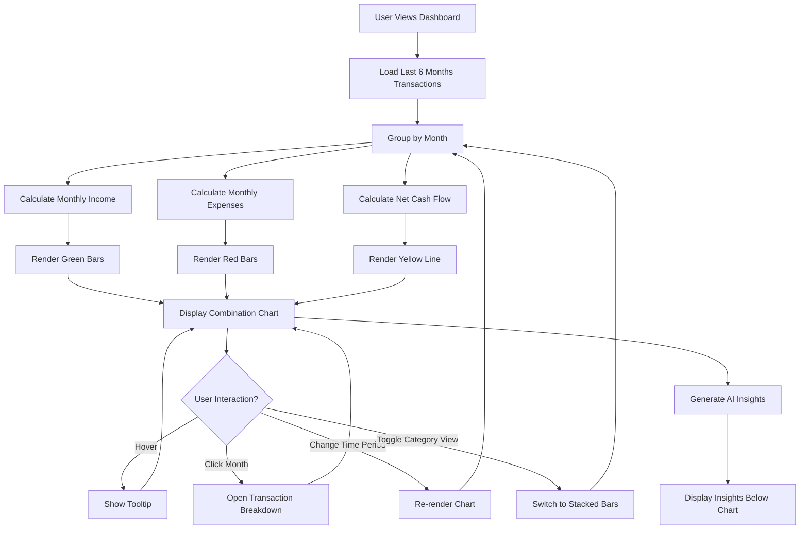
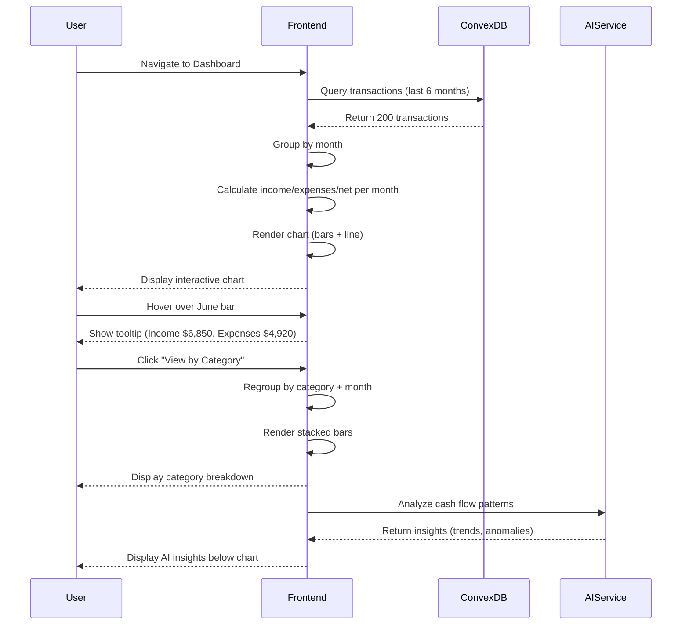

# Finance Flow User Stories - Part 2 (Continuation)

This file contains the remaining comprehensive user stories (US-FF-008 through US-FF-040) plus technical architecture and appendices.

---

<a name="us-ff-008"></a>
### US-FF-008: Cash Flow Visualization

**Epic:** Financial Dashboard  
**Priority:** P1 (High)  
**Story Points:** 8  
**Dependencies:** US-FF-001 (Bank Connection), US-FF-003 (Transaction Import), US-FF-011 (AI Categorization)  
**Microservice:** Finance Flow  
**Implementation Phase:** Month 10

---

#### 1. User Story Statement

**As a** user  
**I want to** visualize my cash flow (income vs expenses) over time with interactive charts  
**So that** I can understand spending patterns, identify trends, and make informed financial decisions

---

#### 2. Business Context

**User Pain Point:**
- Users don't know where their money goes each month
- Can't identify spending trends (e.g., "I spend more in December due to holidays")
- Hard to see relationship between income and expenses without visual representation
- Text-based budgets don't communicate patterns effectively

**Platform Value:**
- Visual engagement: Charts drive user interaction and return visits
- Pattern recognition: AI can identify trends from visual data
- Decision support: Users make better financial decisions with clear visualizations
- Differentiation: Beautiful, interactive charts set Resume Flow apart from basic budgeting apps

**Success Metrics:**
- Chart interaction rate: 70% of users interact with cash flow chart (hover, filter)
- Time on dashboard: +40% increase vs text-only view
- Insight generation: AI generates 2+ actionable insights per month from cash flow data
- User satisfaction: "Visualization helped me understand my finances" >80% agree

**Platform Pitch Alignment:**
"See exactly where your money comes from and where it goes—beautiful interactive charts that make complex financial data crystal clear."

---

#### 3. User Flow Steps (Detailed)

**Step 1: Initial Data Gathering**
- System collects all transactions from connected accounts (last 12 months)
- Categorizes transactions as income (positive) or expenses (negative)
- Groups by month: June 2024, July 2024, August 2024, etc.

**Step 2: Calculation**
- For each month:
  - Total Income: Sum of all positive transactions (salary, refunds, gifts)
  - Total Expenses: Sum of all negative transactions (groceries, rent, shopping)
  - Net Cash Flow: Income - Expenses (can be positive = surplus, negative = deficit)
- Example June 2024:
  - Income: $6,850
  - Expenses: $4,920
  - Net: +$1,930 (surplus)

**Step 3: Chart Rendering - Default View (6 Months)**
- X-axis: Months (Jun, Jul, Aug, Sep, Oct, Nov)
- Y-axis: Dollar amounts ($0, $2K, $4K, $6K, $8K)
- Three data series:
  - **Green bars:** Income per month (tallest bars)
  - **Red bars:** Expenses per month (medium bars)
  - **Yellow line:** Net cash flow (line connecting monthly net values)
- Chart type: Combination (bar + line chart)

**Step 4: Interactive Features**
- **Hover:** When user hovers over a bar/point:
  - Tooltip appears showing exact values:
    - "June 2024: Income $6,850, Expenses $4,920, Net +$1,930"
  - Hovered bar highlights (increases opacity)
- **Click on Month:** Opens modal with transaction breakdown for that month
- **Legend Toggle:** Click income/expenses/net in legend to show/hide data series

**Step 5: Time Period Selector**
- Dropdown menu above chart: "Last 6 Months" (default)
- Options:
  - Last 3 Months
  - Last 6 Months
  - Last 12 Months
  - Year-to-Date
  - All Time
  - Custom Range (date picker)
- Chart re-renders with selected time period

**Step 6: Category Breakdown View (Optional)**
- Toggle button: "View by Category"
- Chart switches to stacked bar chart:
  - X-axis: Months
  - Y-axis: Dollar amounts
  - Each bar stacked by expense category (Groceries, Rent, Transportation, etc.)
  - Colors: Unique color per category
- Helps visualize: "Rent is my biggest expense, followed by groceries"

**Step 7: Trend Line (AI-Enhanced)**
- System calculates trend line (linear regression) for:
  - Income trend (green dotted line)
  - Expense trend (red dotted line)
  - Net cash flow trend (yellow dotted line)
- Overlays trend lines on chart
- User sees: "My income is trending upward (+5% monthly growth), but expenses are flat"

**Step 8: AI Insights from Cash Flow**
- System analyzes cash flow patterns and generates insights:
  - **Surplus Months:** "Great! You had a surplus in 4 out of 6 months. Average surplus: $1,800/month."
  - **Deficit Months:** "Warning: You spent more than you earned in July and August. Consider reviewing expenses."
  - **Trend Alert:** "Your expenses increased by 15% in the last 3 months. Main drivers: Dining (+30%), Shopping (+25%)."
  - **Seasonal Pattern:** "You typically spend 20% more in December due to holidays. Plan ahead!"

**Step 9: Export Options**
- Button: "Export Data" (dropdown)
- Options:
  - Download as CSV (for Excel analysis)
  - Download as PDF (printable report with chart image)
  - Share with Financial Advisor (sends chart + data to FA platform)

**Step 10: Mobile-Optimized View**
- On mobile devices:
  - Chart switches to vertical layout (scrollable)
  - Bars wider for easier touch interaction
  - Tooltip shows on tap (not hover)
  - Category breakdown simplified (top 5 categories only)

**Step 11: Real-Time Updates**
- When new transactions sync:
  - Chart automatically updates current month data (Convex reactivity)
  - Notification: "Cash flow updated with 3 new transactions"
  - Smooth animation of bar height changes

**Step 12: Comparison Mode (Optional Advanced Feature)**
- Toggle: "Compare to Budget"
- Chart overlays budgeted amounts as dotted lines
- Visual comparison: Actual expenses (solid bars) vs Budget (dotted line)
- Color coding: Green if under budget, red if over

**Step 13: Terminal State**
- Cash flow chart displayed on main dashboard
- Updates automatically with every transaction sync
- User can interact, filter, and drill down anytime
- Historical data preserved indefinitely

---

#### 4. Wireframes

##### 4a. Text-Based Wireframe Description

**Screen: Cash Flow Chart Section**

**Layout:**
- **Section Header:**
  - Title: "Cash Flow" (H3, white, left-aligned)
  - Time period selector: Dropdown (right-aligned)
  - Toggle buttons: "View by Category" | "Compare to Budget"
- **Chart Container:**
  - Responsive chart (full width of section)
  - Height: 400px desktop, 300px mobile
  - Background: Dark gray (#1a1a1a)
  - Grid lines: Light gray horizontal lines for readability
- **Chart Elements:**
  - **Bars:** Green (income), Red (expenses) side-by-side for each month
  - **Line:** Yellow net cash flow connecting monthly net values
  - **Axes:**
    - X-axis: Month labels (Jun, Jul, Aug, Sep, Oct, Nov)
    - Y-axis: Dollar amounts with K suffix ($0, $2K, $4K, $6K, $8K)
  - **Legend:** Bottom of chart:
    - Green square: Income
    - Red square: Expenses
    - Yellow line: Net Cash Flow
    - (Clickable to toggle visibility)
- **Tooltip (on hover):**
  - Floating box near cursor
  - Background: Dark gray with border
  - Content:
    - Month: "June 2024"
    - Income: "$6,850" (green text)
    - Expenses: "$4,920" (red text)
    - Net: "+$1,930" (green if positive, red if negative)
- **AI Insights Panel (below chart):**
  - 2-3 key insights derived from cash flow data
  - Icon-based (⚠ warning, ✅ success, 💡 opportunity)
- **Export Button:**
  - Bottom-right: "Export" dropdown (CSV, PDF, Share with FA)

**Responsive:**
- **Desktop:** Full-width chart, all features visible
- **Tablet:** Slightly smaller chart, legend moves to side
- **Mobile:** Vertical scroll, simplified view, tap for tooltips

---

##### 4b. ASCII Wireframe

**Cash Flow Chart:**
```
┌────────────────────────────────────────────────────────────────┐
│ Cash Flow                    [Last 6 Months ▼] [View by Cat]  │
├────────────────────────────────────────────────────────────────┤
│                                                                │
│ $8K ┤                                                          │
│     │                                                          │
│ $6K ┤  █                                                       │
│     │  █  █  █  █  █  █   ← Income (green bars)              │
│ $4K ┤  █  █  █  █  █  █                                       │
│     │  ▓  ▓  ▓  ▓  ▓  ▓   ← Expenses (red bars)             │
│ $2K ┤  ▓  ▓  ▓  ▓  ▓  ▓                                       │
│     │  ━━●━━●━━●━━●━━●    ← Net (yellow line)                │
│ $0K ┼──────────────────────────────────                       │
│     Jun Jul Aug Sep Oct Nov                                   │
│                                                                │
│ Legend: █ Income  ▓ Expenses  ━● Net Cash Flow               │
│                                                                │
│ ┌────────────────────────────────────────────────────────┐   │
│ │ 💡 Insight: You saved $1,930/month average (28% savings │   │
│ │ rate). Great job!                                       │   │
│ └────────────────────────────────────────────────────────┘   │
│                                                                │
│                                        [Export ▼]              │
└────────────────────────────────────────────────────────────────┘
```

**Tooltip on Hover:**
```
┌─────────────────────────┐
│ June 2024               │
├─────────────────────────┤
│ Income:    $6,850       │
│ Expenses:  $4,920       │
│ Net:       +$1,930      │
└─────────────────────────┘
```

**Category Breakdown View (Stacked Bars):**
```
┌────────────────────────────────────────────────────────────────┐
│ Cash Flow by Category                                          │
├────────────────────────────────────────────────────────────────┤
│                                                                │
│ $6K ┤  ▓▓▓▓                                                    │
│     │  ▓▓▓▓ (Each color = category)                           │
│ $4K ┤  ████                                                    │
│     │  ████ Shopping                                           │
│ $2K ┤  ████ Transportation                                     │
│     │  ████ Groceries                                          │
│ $0K ┼  ████ Rent (largest)                                     │
│     Jun Jul Aug Sep Oct Nov                                   │
│                                                                │
│ Click any segment to filter transactions                      │
└────────────────────────────────────────────────────────────────┘
```

---

##### 4c. Mermaid Diagram





---

#### 5. Acceptance Criteria (Testable)

**Functional:**
- [ ] **Given** user has 6 months of transactions **When** dashboard loads **Then** cash flow chart displays last 6 months with income (green bars), expenses (red bars), and net cash flow (yellow line)
- [ ] **Given** user hovers over June bar **When** mouse enters bar area **Then** tooltip shows exact values (Income: $6,850, Expenses: $4,920, Net: +$1,930)
- [ ] **Given** user clicks "Last 12 Months" in time period selector **When** dropdown selection changes **Then** chart re-renders with 12 months of data
- [ ] **Given** user clicks "View by Category" **When** toggle activated **Then** chart switches to stacked bars showing expense breakdown by category
- [ ] **Given** user clicks a specific month **When** click event fires **Then** modal opens showing all transactions for that month
- [ ] **Given** user clicks income in legend **When** legend item toggled **Then** income bars hide/show (toggle behavior)
- [ ] **Given** user clicks "Export → CSV" **When** export triggered **Then** CSV file downloads with columns: Month, Income, Expenses, Net
- [ ] **Given** new transactions sync **When** Convex data updates **Then** chart automatically updates current month bar height (reactive)
- [ ] **Given** user has surplus months **When** AI analyzes cash flow **Then** insight generated: "You saved $X average (Y% savings rate)"
- [ ] **Given** user has deficit month **When** AI analyzes cash flow **Then** warning insight generated: "You spent more than earned in Month X"

**Performance:**
- [ ] Chart renders in <1 second for 12 months of data (500 transactions)
- [ ] Hover tooltip appears in <100ms
- [ ] Chart re-render (time period change) completes in <500ms
- [ ] Mobile chart scrolls smoothly at 60fps

**Visual:**
- [ ] Income bars displayed in green (#10b981 Tailwind green-500)
- [ ] Expense bars displayed in red (#ef4444 Tailwind red-500)
- [ ] Net cash flow line displayed in yellow (#eab308 Tailwind yellow-500)
- [ ] Grid lines visible but subtle (gray, 10% opacity)
- [ ] Y-axis labels formatted with K suffix ($2K, $4K, $6K)

**Accessibility:**
- [ ] Chart has alt text describing data trend
- [ ] Keyboard navigation: Tab to chart, arrow keys to move between months, Enter to select
- [ ] Screen reader announces: "Cash flow chart showing 6 months. June 2024: Income $6,850, Expenses $4,920, Net surplus $1,930"
- [ ] Color blind safe: Patterns used in addition to colors (income = solid, expenses = striped)

**Responsive:**
- [ ] Desktop: Chart 100% width, height 400px, all features visible
- [ ] Tablet: Chart 100% width, height 300px, legend side-by-side
- [ ] Mobile: Chart height 250px, bars wider for touch, tooltip on tap

---

#### 6. Edge Cases & Error Handling

**Edge Case 1: User has no transactions (new account)**
- **Trigger:** User just connected bank, no transactions synced yet
- **Expected Behavior:**
  - Empty state displayed: "No transactions yet. Cash flow chart will appear after first sync."
  - Placeholder chart with $0 values
  - CTA button: "Sync Transactions Now"

**Edge Case 2: User has only 1-2 months of data**
- **Trigger:** New user with limited transaction history
- **Expected Behavior:**
  - Chart displays available months (even if <6)
  - Message: "Limited data available. Chart will become more insightful as you use Resume Flow."
  - No trend lines (insufficient data for regression)

**Edge Case 3: Expenses exceed income every month (chronic deficit)**
- **Trigger:** User spending more than earning (unsustainable)
- **Expected Behavior:**
  - All net cash flow points below $0 line (negative)
  - Red color for net line (instead of yellow)
  - Critical insight: "⚠ You're spending more than you earn every month. This is unsustainable—review expenses urgently."
  - Suggested action: "Create a budget" or "Talk to Financial Advisor"

**Edge Case 4: One month has extreme spike (e.g., bonus or large purchase)**
- **Trigger:** June income is $15K (vs $6K average) due to bonus
- **Expected Behavior:**
  - Chart auto-scales Y-axis to fit spike (0 to $16K)
  - Tooltip shows: "June 2024: Income $15,000 (includes $8,000 bonus)"
  - AI insight: "You received $8,000 bonus in June. Consider saving or investing this windfall."

**Edge Case 5: User changes time period to "All Time" (5+ years of data)**
- **Trigger:** Long-time user with extensive transaction history
- **Expected Behavior:**
  - Chart switches to yearly view (2020, 2021, 2022, 2023, 2024) to avoid clutter
  - Monthly view would have 60+ bars (unreadable)
  - Option to drill down: "Click a year to see monthly breakdown"

**Edge Case 6: User has only income (no expenses tracked)**
- **Trigger:** User connected salary account but not spending accounts
- **Expected Behavior:**
  - Chart shows income bars only (no expense bars)
  - Message: "Your expense data is incomplete. Connect your credit card and checking accounts for full cash flow view."
  - CTA: "Connect Another Account"

**Edge Case 7: Mobile device with slow network (chart loads slowly)**
- **Trigger:** User on 3G connection, chart data takes 5+ seconds to load
- **Expected Behavior:**
  - Skeleton loading state: Gray placeholder bars with pulse animation
  - Status: "Loading cash flow data..."
  - Once loaded, animate bars growing from $0 to actual values (satisfying visual)

**Error Handling:**

**Data Calculation Errors:**
- **Scenario:** Sum of transactions doesn't match expected (data integrity issue)
- **Handling:** Log error to Sentry, show warning to user: "Cash flow data may be incomplete. Refresh to retry."

**Chart Rendering Errors:**
- **Scenario:** Charting library (Recharts/Chart.js) fails to render
- **Handling:** Fall back to simple HTML table with same data, button to "Retry Chart View"

**Time Period Selector Errors:**
- **Scenario:** User selects custom range with end date before start date
- **Handling:** Show validation error: "End date must be after start date" (prevent submission)

---

#### 7. Validation Rules

**Transaction Data:**
- **Income:** Positive amounts (>= $0.01)
- **Expenses:** Negative amounts (<= -$0.01) or stored as positive but flagged as expense
- **Transfer Exclusion:** Internal transfers between user's own accounts excluded from cash flow (not true income/expense)

**Time Period Selection:**
- **Min Period:** 1 month (too short = no insights)
- **Max Period:** 10 years (performance limit)
- **Default:** 6 months (balance between detail and overview)

**Chart Data Points:**
- **Min Data Points:** 2 months (need at least 2 for trend)
- **Max Data Points:** 60 months (5 years) in monthly view (beyond that, switch to yearly)
- **Granularity:** Monthly for periods up to 2 years, yearly for longer

**Export:**
- **CSV:** UTF-8 encoding, column headers (Month, Income, Expenses, Net)
- **PDF:** A4 size, chart image embedded, max file size 5MB

---

#### 8. Frontend Specifications

##### Component Structure

**File Location:** `src/components/finance/CashFlowChart.tsx`

**Component Tree:**
```typescript
<CashFlowChart>
  <ChartHeader>
    <Title text="Cash Flow" />
    <Controls>
      <TimePeriodSelector onChange={handlePeriodChange} />
      <ToggleButton text="View by Category" onClick={toggleCategoryView} />
      <ExportButton options={["CSV", "PDF", "Share with FA"]} />
    </Controls>
  </ChartHeader>
  
  <ChartContainer>
    {isLoading ? (
      <ChartSkeleton />
    ) : (
      <ResponsiveContainer width="100%" height={400}>
        <ComposedChart data={monthlyData}>
          <XAxis dataKey="month" />
          <YAxis tickFormatter={formatCurrency} />
          <Tooltip content={<CustomTooltip />} />
          <Legend onClick={handleLegendClick} />
          <Bar dataKey="income" fill="#10b981" />
          <Bar dataKey="expenses" fill="#ef4444" />
          <Line dataKey="net" stroke="#eab308" />
        </ComposedChart>
      </ResponsiveContainer>
    )}
  </ChartContainer>
  
  <InsightsPanel>
    {aiInsights.map(insight => (
      <InsightCard key={insight.id} insight={insight} />
    ))}
  </InsightsPanel>
</CashFlowChart>
```

##### Key Props & Types

```typescript
// CashFlowChart.tsx

interface CashFlowChartProps {
  userId: string;
  defaultPeriod?: "3m" | "6m" | "12m" | "ytd" | "all";
}

interface MonthlyData {
  month: string; // "Jun 2024"
  income: number; // 6850
  expenses: number; // 4920
  net: number; // 1930
  categoryBreakdown?: Record<string, number>; // For category view
}

interface ChartDataPoint {
  x: string; // Month label
  income: number;
  expenses: number;
  net: number;
}

interface AIInsight {
  id: string;
  type: "success" | "warning" | "info" | "opportunity";
  icon: "✅" | "⚠" | "💡" | "📊";
  title: string;
  description: string;
  actionable: boolean;
  suggestedAction?: string;
}
```

##### State Management

```typescript
// src/components/finance/CashFlowChart.tsx

import { useQuery } from "convex/react";
import { api } from "../../convex/_generated/api";
import { useState, useMemo } from "react";
import { ComposedChart, Bar, Line, XAxis, YAxis, Tooltip, Legend, ResponsiveContainer } from "recharts";

export default function CashFlowChart({ userId, defaultPeriod = "6m" }: CashFlowChartProps) {
  const [timePeriod, setTimePeriod] = useState(defaultPeriod);
  const [categoryView, setCategoryView] = useState(false);
  
  // Query cash flow data (reactive)
  const cashFlowData = useQuery(api.finance.getCashFlow, {
    userId,
    period: timePeriod
  });
  
  // Query AI insights
  const insights = useQuery(api.finance.getCashFlowInsights, { userId });
  
  // Format data for chart
  const chartData = useMemo(() => {
    if (!cashFlowData) return [];
    
    return cashFlowData.months.map(month => ({
      month: month.label, // "Jun 2024"
      income: month.totalIncome,
      expenses: Math.abs(month.totalExpenses), // Make positive for chart display
      net: month.netCashFlow
    }));
  }, [cashFlowData]);
  
  // Handle period change
  const handlePeriodChange = (newPeriod: string) => {
    setTimePeriod(newPeriod as any);
  };
  
  // Handle category view toggle
  const toggleCategoryView = () => {
    setCategoryView(!categoryView);
  };
  
  // Custom tooltip
  const CustomTooltip = ({ active, payload }: any) => {
    if (!active || !payload || !payload.length) return null;
    
    const data = payload[0].payload;
    
    return (
      <div className="bg-gray-800 border border-gray-600 rounded-lg p-4 shadow-xl">
        <p className="text-white font-semibold mb-2">{data.month}</p>
        <div className="space-y-1 text-sm">
          <div className="flex justify-between gap-4">
            <span className="text-green-400">Income:</span>
            <span className="text-white font-medium">${data.income.toLocaleString()}</span>
          </div>
          <div className="flex justify-between gap-4">
            <span className="text-red-400">Expenses:</span>
            <span className="text-white font-medium">${data.expenses.toLocaleString()}</span>
          </div>
          <div className="flex justify-between gap-4 pt-2 border-t border-gray-600">
            <span className={data.net >= 0 ? "text-green-400" : "text-red-400"}>Net:</span>
            <span className="text-white font-bold">
              {data.net >= 0 ? "+" : ""}${data.net.toLocaleString()}
            </span>
          </div>
        </div>
      </div>
    );
  };
  
  // Format Y-axis currency
  const formatCurrency = (value: number) => {
    if (value >= 1000) {
      return `$${(value / 1000).toFixed(0)}K`;
    }
    return `$${value}`;
  };
  
  // Handle export
  const handleExport = (format: "csv" | "pdf" | "fa") => {
    if (format === "csv") {
      exportCSV(chartData);
    } else if (format === "pdf") {
      exportPDF(chartData);
    } else if (format === "fa") {
      shareWithFA(chartData);
    }
  };
  
  if (!cashFlowData) {
    return <CashFlowChartSkeleton />;
  }
  
  return (
    <div className="bg-gray-900 rounded-xl p-6 border border-gray-700">
      {/* Header */}
      <div className="flex items-center justify-between mb-6">
        <h3 className="text-2xl font-bold text-white">Cash Flow</h3>
        
        <div className="flex items-center gap-4">
          {/* Time Period Selector */}
          <select
            value={timePeriod}
            onChange={(e) => handlePeriodChange(e.target.value)}
            className="bg-gray-800 text-white border border-gray-600 rounded-lg px-4 py-2"
          >
            <option value="3m">Last 3 Months</option>
            <option value="6m">Last 6 Months</option>
            <option value="12m">Last 12 Months</option>
            <option value="ytd">Year to Date</option>
            <option value="all">All Time</option>
          </select>
          
          {/* Category Toggle */}
          <button
            onClick={toggleCategoryView}
            className={`px-4 py-2 rounded-lg border ${
              categoryView
                ? "bg-yellow-500 text-gray-900 border-yellow-500"
                : "bg-gray-800 text-white border-gray-600 hover:border-gray-500"
            }`}
          >
            View by Category
          </button>
          
          {/* Export Dropdown */}
          <ExportDropdown onExport={handleExport} />
        </div>
      </div>
      
      {/* Chart */}
      <div className="h-96">
        <ResponsiveContainer width="100%" height="100%">
          <ComposedChart
            data={chartData}
            margin={{ top: 20, right: 30, left: 20, bottom: 20 }}
          >
            {/* Grid */}
            <defs>
              <linearGradient id="incomeGradient" x1="0" y1="0" x2="0" y2="1">
                <stop offset="0%" stopColor="#10b981" stopOpacity={0.8} />
                <stop offset="100%" stopColor="#10b981" stopOpacity={0.4} />
              </linearGradient>
              <linearGradient id="expenseGradient" x1="0" y1="0" x2="0" y2="1">
                <stop offset="0%" stopColor="#ef4444" stopOpacity={0.8} />
                <stop offset="100%" stopColor="#ef4444" stopOpacity={0.4} />
              </linearGradient>
            </defs>
            
            <XAxis
              dataKey="month"
              stroke="#9ca3af"
              style={{ fontSize: "14px" }}
            />
            <YAxis
              stroke="#9ca3af"
              tickFormatter={formatCurrency}
              style={{ fontSize: "14px" }}
            />
            <Tooltip content={<CustomTooltip />} cursor={{ fill: "rgba(255, 255, 255, 0.1)" }} />
            <Legend
              wrapperStyle={{ paddingTop: "20px" }}
              iconType="square"
            />
            
            {/* Bars */}
            <Bar dataKey="income" fill="url(#incomeGradient)" name="Income" radius={[8, 8, 0, 0]} />
            <Bar dataKey="expenses" fill="url(#expenseGradient)" name="Expenses" radius={[8, 8, 0, 0]} />
            
            {/* Net line */}
            <Line
              type="monotone"
              dataKey="net"
              stroke="#eab308"
              strokeWidth={3}
              dot={{ fill: "#eab308", r: 6 }}
              name="Net Cash Flow"
            />
          </ComposedChart>
        </ResponsiveContainer>
      </div>
      
      {/* AI Insights */}
      {insights && insights.length > 0 && (
        <div className="mt-8 space-y-4">
          <h4 className="text-lg font-semibold text-white">Insights</h4>
          {insights.map(insight => (
            <InsightCard key={insight.id} insight={insight} />
          ))}
        </div>
      )}
    </div>
  );
}

// Helper functions
function exportCSV(data: ChartDataPoint[]) {
  const csv = [
    ["Month", "Income", "Expenses", "Net"],
    ...data.map(d => [d.month, d.income, d.expenses, d.net])
  ]
    .map(row => row.join(","))
    .join("\n");
  
  const blob = new Blob([csv], { type: "text/csv" });
  const url = URL.createObjectURL(blob);
  const a = document.createElement("a");
  a.href = url;
  a.download = `cash-flow-${new Date().toISOString().split("T")[0]}.csv`;
  a.click();
}

function exportPDF(data: ChartDataPoint[]) {
  // Implementation: Use jsPDF or similar to generate PDF with chart image
  console.log("Export PDF", data);
  alert("PDF export coming soon!");
}

function shareWithFA(data: ChartDataPoint[]) {
  // Implementation: Send data to FA verification platform
  console.log("Share with FA", data);
  alert("Share with FA coming soon!");
}
```

---

#### 9. Backend Specifications

##### Convex Query

```typescript
// convex/finance.ts

export const getCashFlow = query({
  args: {
    userId: v.id("users"),
    period: v.union(v.literal("3m"), v.literal("6m"), v.literal("12m"), v.literal("ytd"), v.literal("all"))
  },
  handler: async (ctx, args) => {
    // 1. Authorization
    const identity = await ctx.auth.getUserIdentity();
    if (!identity) throw new Error("Unauthorized");
    
    // 2. Calculate date range based on period
    const now = Date.now();
    let startDate: number;
    
    switch (args.period) {
      case "3m":
        startDate = now - 90 * 24 * 60 * 60 * 1000;
        break;
      case "6m":
        startDate = now - 180 * 24 * 60 * 60 * 1000;
        break;
      case "12m":
        startDate = now - 365 * 24 * 60 * 60 * 1000;
        break;
      case "ytd":
        const yearStart = new Date(new Date().getFullYear(), 0, 1);
        startDate = yearStart.getTime();
        break;
      case "all":
        startDate = 0; // From beginning of time
        break;
    }
    
    // 3. Get all transactions in period
    const transactions = await ctx.db
      .query("transactions")
      .withIndex("by_user_and_date", (q) =>
        q.eq("userId", args.userId).gte("date", startDate)
      )
      .collect();
    
    // 4. Group by month
    const monthlyData = new Map<string, { income: number; expenses: number }>();
    
    transactions.forEach(txn => {
      const monthKey = new Date(txn.date).toLocaleDateString("en-US", {
        month: "short",
        year: "numeric"
      }); // "Jun 2024"
      
      if (!monthlyData.has(monthKey)) {
        monthlyData.set(monthKey, { income: 0, expenses: 0 });
      }
      
      const monthData = monthlyData.get(monthKey)!;
      
      if (txn.amount > 0) {
        // Positive = income
        monthData.income += txn.amount;
      } else {
        // Negative = expense
        monthData.expenses += Math.abs(txn.amount);
      }
    });
    
    // 5. Calculate net for each month
    const months = Array.from(monthlyData.entries())
      .map(([monthKey, data]) => ({
        label: monthKey,
        totalIncome: data.income,
        totalExpenses: data.expenses,
        netCashFlow: data.income - data.expenses
      }))
      .sort((a, b) => {
        // Sort chronologically
        const dateA = new Date(a.label);
        const dateB = new Date(b.label);
        return dateA.getTime() - dateB.getTime();
      });
    
    // 6. Calculate summary stats
    const totalIncome = months.reduce((sum, m) => sum + m.totalIncome, 0);
    const totalExpenses = months.reduce((sum, m) => sum + m.totalExpenses, 0);
    const averageIncome = totalIncome / months.length;
    const averageExpenses = totalExpenses / months.length;
    const averageNet = averageIncome - averageExpenses;
    const savingsRate = averageIncome > 0 ? (averageNet / averageIncome) * 100 : 0;
    
    // 7. Return data
    return {
      months,
      summary: {
        totalIncome,
        totalExpenses,
        totalNet: totalIncome - totalExpenses,
        averageIncome,
        averageExpenses,
        averageNet,
        savingsRate,
        monthCount: months.length
      }
    };
  }
});

export const getCashFlowInsights = query({
  args: { userId: v.id("users") },
  handler: async (ctx, args) => {
    // Get cash flow data
    const cashFlow = await ctx.db
      .query("userFinancials")
      .withIndex("by_user", (q) => q.eq("userId", args.userId))
      .order("desc")
      .first();
    
    if (!cashFlow) return [];
    
    const insights: AIInsight[] = [];
    
    // Insight 1: Savings rate
    if (cashFlow.savingsRate >= 20) {
      insights.push({
        id: "savings-rate-good",
        type: "success",
        icon: "✅",
        title: `Great savings rate: ${cashFlow.savingsRate.toFixed(0)}%`,
        description: `You're saving ${cashFlow.savingsRate.toFixed(0)}% of your income. Financial experts recommend 20%+. Keep it up!`,
        actionable: false
      });
    } else if (cashFlow.savingsRate < 10) {
      insights.push({
        id: "savings-rate-low",
        type: "warning",
        icon: "⚠",
        title: `Low savings rate: ${cashFlow.savingsRate.toFixed(0)}%`,
        description: `You're only saving ${cashFlow.savingsRate.toFixed(0)}% of income. Aim for at least 20% to build financial security.`,
        actionable: true,
        suggestedAction: "Create a budget to identify savings opportunities"
      });
    }
    
    // Insight 2: Monthly deficit
    if (cashFlow.monthlySavings < 0) {
      insights.push({
        id: "monthly-deficit",
        type: "warning",
        icon: "⚠",
        title: "Spending more than earning",
        description: `You're spending $${Math.abs(cashFlow.monthlySavings).toLocaleString()} more than you earn each month. This is unsustainable.`,
        actionable: true,
        suggestedAction: "Review expenses and create a budget"
      });
    }
    
    // Insight 3: Emergency fund
    if (cashFlow.emergencyFundMonths < 3) {
      insights.push({
        id: "emergency-fund-low",
        type: "info",
        icon: "💡",
        title: `Emergency fund: ${cashFlow.emergencyFundMonths.toFixed(1)} months`,
        description: `You have ${cashFlow.emergencyFundMonths.toFixed(1)} months of expenses saved. Aim for 3-6 months for financial security.`,
        actionable: true,
        suggestedAction: "Increase monthly savings to build emergency fund"
      });
    }
    
    return insights;
  }
});
```

---

#### 10. Testing Specifications

**Unit Tests:**

```typescript
// __tests__/cashflow.test.ts

describe("Cash Flow Calculation", () => {
  it("should group transactions by month correctly", async () => {
    const cashFlow = await convex.query(api.finance.getCashFlow, {
      userId: testUserId,
      period: "6m"
    });
    
    expect(cashFlow.months).toHaveLength(6);
    expect(cashFlow.months[0].label).toMatch(/[A-Z][a-z]{2} \d{4}/); // "Jun 2024"
  });
  
  it("should calculate net cash flow correctly", async () => {
    const cashFlow = await convex.query(api.finance.getCashFlow, {
      userId: testUserId,
      period: "6m"
    });
    
    cashFlow.months.forEach(month => {
      expect(month.netCashFlow).toBe(month.totalIncome - month.totalExpenses);
    });
  });
  
  it("should calculate savings rate correctly", async () => {
    const cashFlow = await convex.query(api.finance.getCashFlow, {
      userId: testUserId,
      period: "6m"
    });
    
    const expectedRate =
      (cashFlow.summary.averageNet / cashFlow.summary.averageIncome) * 100;
    
    expect(cashFlow.summary.savingsRate).toBeCloseTo(expectedRate, 2);
  });
});
```

---

#### 11. Security Specifications

**Data Access:**
- Users can only view their own cash flow data (userId filter enforced)
- FAs can view client cash flow only with explicit permission

**Privacy:**
- Cash flow aggregated by month (individual transactions not exposed in chart)
- Export functionality includes warning: "Exported data contains sensitive financial information"

---

#### 12. Performance & Scalability

**Latency Targets:**
- Query execution: <1 second for 12 months
- Chart render: <500ms
- Interactive tooltip: <100ms

**Caching:**
- Cache monthly aggregates (reduce recalculation on every query)
- Invalidate cache when new transactions sync

**Optimization:**
- Index on `by_user_and_date` for fast time-range queries
- Pre-aggregate monthly totals in cron job (avoid calculating on every page load)

---

