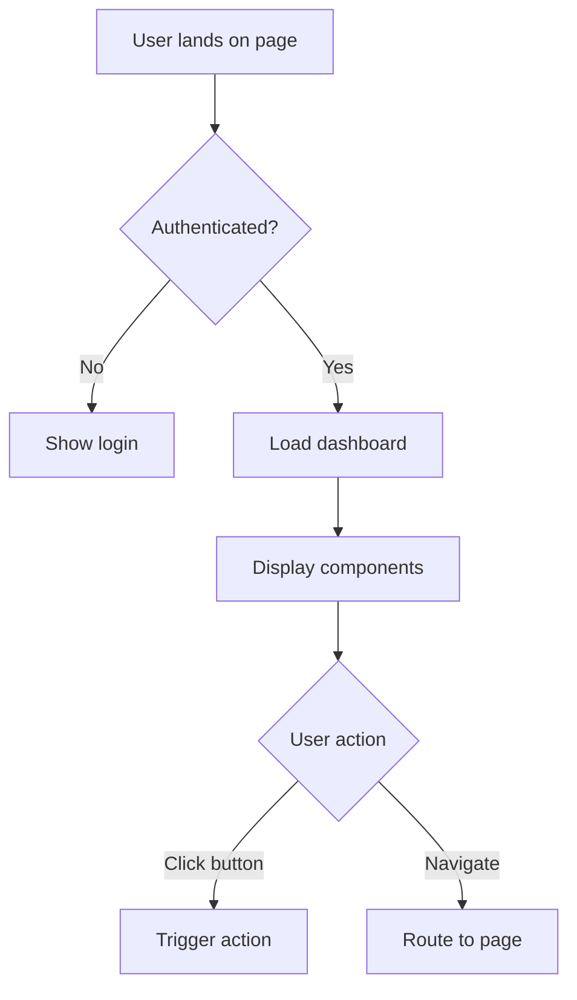
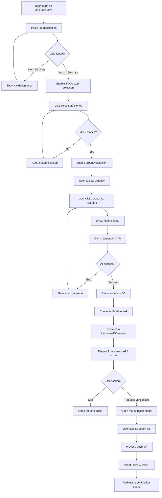
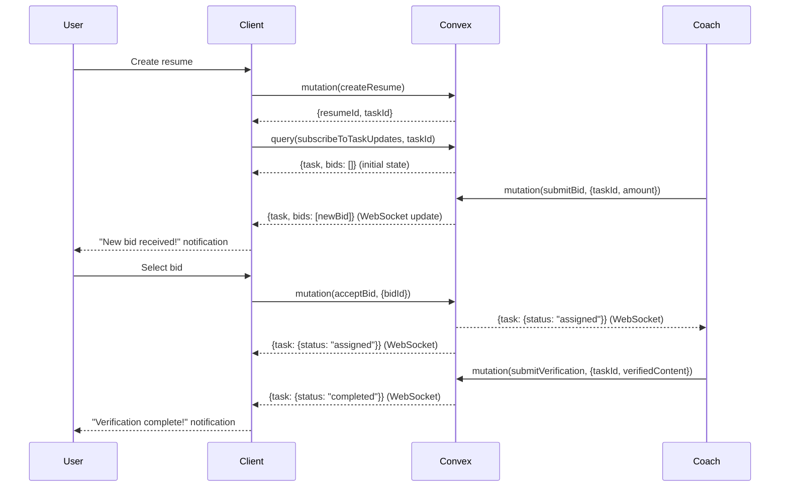

# Plan: Comprehensive User Stories with Wireframes & Backend Specs

## Deliverable Structure

**7 Microservice Documentation Files:**

1. **Job_Flow_Stories.md** (Roadmap 1 - Priority for immediate delivery)
2. **Knowledge_Flow_Stories.md** (Roadmap 2)
3. **Finance_Flow_Stories.md** (Roadmap 3)
4. **Advisor_Flow_Stories.md** (Roadmap 4)
5. **Tax_Flow_Stories.md** (Roadmap 5)
6. **Legal_Flow_Stories.md** (Roadmap 6)
7. **Venture_Flow_Stories.md** (Roadmap 7)

**Plus Master Index:**
8. **User_Stories_Master_Index.md** (Navigation, dependencies, cross-references)

---

## Immediate Deliverable: Job_Flow_Stories.md

### Document Scope

**Roadmap 1: Job Flow (Months 1-6)**
- Authentication & Security (8 user stories)
- User Settings & Privacy (5 user stories)
- AI Resume & STAR Stories (7 user stories)
- Job Search & Application Tracking (14 user stories)
- Interview & Coaching (10 user stories)
- Coach Platform & Profiles (35 user stories)
- Marketplace & Verification (12 user stories)
- Payment & Subscriptions (8 user stories)

**Total: ~100 detailed user stories for Job Flow**

**Estimated Document Length:** 180-220 pages

---

## User Story Template Structure

Each user story follows this comprehensive format:

### Story Header
```markdown
## US-[PHASE]-[NUMBER]: [Story Title]

**Epic:** [Epic Name]
**Priority:** P0 (Critical) | P1 (High) | P2 (Medium) | P3 (Low)
**Story Points:** [1-13 fibonacci]
**Dependencies:** [List of prerequisite user stories]
**Microservice:** Job Flow
**Implementation Phase:** Month X-Y
```

### 1. User Story Statement
```markdown
**As a** [role]
**I want to** [goal]
**So that** [benefit]
```

### 2. Business Context
- Why this feature matters
- User pain point addressed
- Success metrics
- Platform pitch alignment

### 3. User Flow Steps (Detailed)
1. **Initial State:** [Context and preconditions]
2. **User Action:** [What user does]
3. **System Response:** [What system does]
4. **Subsequent Steps:** [Complete flow]
5. **Terminal State:** [Success outcome]

### 4. Wireframes (All Formats)

#### 4a. Text-Based Wireframe Description
```markdown
**Screen Layout:**
- Header: Logo (left), Navigation (center), User Menu (right)
- Main Content: [Detailed component positioning]
- Footer: [Footer elements]

**Component Hierarchy:**
- Container (max-width 1200px, centered)
  - Section 1: [Component details]
  - Section 2: [Component details]
```

#### 4b. ASCII Wireframe
```
┌────────────────────────────────────────────────────────────┐
│ [Logo]              Navigation              [User ▼]       │
├────────────────────────────────────────────────────────────┤
│                                                            │
│  ┌──────────────────────────────────────────────────┐    │
│  │ [Component Title]                        [Action] │    │
│  ├──────────────────────────────────────────────────┤    │
│  │                                                   │    │
│  │  Content Area                                     │    │
│  │                                                   │    │
│  └──────────────────────────────────────────────────┘    │
│                                                            │
└────────────────────────────────────────────────────────────┘
```

#### 4c. Mermaid Flow Diagram


### 5. Acceptance Criteria (Testable)
```markdown
- [ ] **Given** [precondition] **When** [action] **Then** [expected outcome]
- [ ] **Given** [precondition] **When** [action] **Then** [expected outcome]
- [ ] Performance: [Action] completes in <X seconds (p95)
- [ ] Accessibility: Component keyboard navigable, screen reader compatible
- [ ] Responsive: Works on mobile (320px), tablet (768px), desktop (1200px+)
```

### 6. Edge Cases & Error Handling
```markdown
**Edge Case 1: [Scenario]**
- **Trigger:** [What causes it]
- **Expected Behavior:** [How system handles it]
- **User Experience:** [What user sees/does]

**Error Handling:**
- Network timeout: [Retry logic, user feedback]
- Validation error: [Inline error messages]
- Server error: [Fallback behavior]
```

### 7. Validation Rules
```markdown
**Field Validations:**
- Email: Valid format, max 255 chars, unique in DB
- Password: Min 8 chars, 1 uppercase, 1 number, 1 special char
- [All form fields listed]

**Business Rules:**
- [Domain logic constraints]
- [State transition rules]
```

### 8. Frontend Specifications

#### Component Structure
```markdown
**File Location:** `src/pages/[feature]/[ComponentName].tsx`

**Component Tree:**
```typescript
<ComponentName>
  <Header />
  <MainContent>
    <LeftPanel>
      <FilterComponent />
    </LeftPanel>
    <RightPanel>
      <DataDisplay />
    </RightPanel>
  </MainContent>
  <Footer />
</ComponentName>
```

**Key Props:**
```typescript
interface ComponentNameProps {
  userId: string;
  data: DataType[];
  onAction: (id: string) => void;
  isLoading: boolean;
}
```

**State Management:**
```typescript
// Local state
const [selectedItem, setSelectedItem] = useState<string | null>(null);
const [filters, setFilters] = useState<Filters>({});

// Convex reactive queries
const userData = useQuery(api.users.getUser, { userId });
const items = useQuery(api.items.list, filters);

// Mutations
const updateItem = useMutation(api.items.update);
```

**Styling (Tailwind):**
```markdown
- Container: `max-w-7xl mx-auto px-4 sm:px-6 lg:px-8`
- Card: `bg-gray-900 rounded-lg border border-gray-700 p-6`
- Button Primary: `bg-yellow-500 text-gray-900 px-4 py-2 rounded-md hover:bg-yellow-400`
- Responsive Grid: `grid grid-cols-1 md:grid-cols-2 lg:grid-cols-3 gap-6`
```

#### Responsive Breakpoints
```markdown
- Mobile (320-639px): Single column, stacked layout
- Tablet (640-1023px): Two columns where applicable
- Desktop (1024px+): Full multi-column layout
```

#### Accessibility
```markdown
- ARIA labels: [Specific labels for interactive elements]
- Keyboard navigation: Tab order, Enter/Space actions
- Focus management: Visible focus indicators
- Screen reader announcements: Live regions for dynamic content
```

### 9. Backend Specifications

#### Convex Schema
```typescript
// Table: [tableName]
export default defineTable({
  // Fields
  fieldName: v.string(),
  numericField: v.number(),
  optionalField: v.optional(v.boolean()),
  arrayField: v.array(v.object({
    nestedField: v.string()
  })),
  
  // Timestamps
  createdAt: v.number(),
  updatedAt: v.number()
})
  // Indexes
  .index("by_user", ["userId"])
  .index("by_created", ["createdAt"])
  .index("by_user_and_status", ["userId", "status"])
  
  // Validation
  .searchIndex("search_content", {
    searchField: "content",
    filterFields: ["userId", "status"]
  });
```

**Validation Rules (Convex validators):**
```typescript
export const fieldValidators = {
  email: v.string(), // Additional runtime check: email format
  password: v.string(), // Min 8 chars checked in mutation
  role: v.union(v.literal("job_seeker"), v.literal("coach")),
  status: v.union(
    v.literal("pending"),
    v.literal("active"),
    v.literal("completed")
  )
};
```

#### API Endpoints

**Query: Get User Profile**
```typescript
// File: convex/users.ts

export const getUser = query({
  args: { userId: v.id("users") },
  handler: async (ctx, args) => {
    // 1. Authorization check
    const identity = await ctx.auth.getUserIdentity();
    if (!identity) throw new Error("Unauthorized");
    
    // 2. Fetch data
    const user = await ctx.db.get(args.userId);
    if (!user) throw new Error("User not found");
    
    // 3. Authorization: Can only view own profile or if admin
    if (user._id !== identity.subject && user.role !== "admin") {
      throw new Error("Forbidden");
    }
    
    // 4. Return data (exclude sensitive fields)
    return {
      id: user._id,
      email: user.email,
      name: user.name,
      role: user.role,
      // passwordHash excluded
    };
  }
});
```

**Request/Response Schema:**
```typescript
// Request
{
  userId: "j9x7k2m5n8p1q4r7"
}

// Response (Success)
{
  id: "j9x7k2m5n8p1q4r7",
  email: "user@example.com",
  name: "John Doe",
  role: "job_seeker"
}

// Response (Error)
{
  error: "User not found",
  code: "NOT_FOUND"
}
```

**Mutation: Create Resume**
```typescript
// File: convex/resumes.ts

export const createResume = mutation({
  args: {
    userId: v.id("users"),
    jobDescription: v.string(),
    starStoryIds: v.array(v.id("starStories")),
    urgency: v.union(
      v.literal("urgent"),
      v.literal("standard"),
      v.literal("flexible")
    )
  },
  handler: async (ctx, args) => {
    // 1. Authorization
    const identity = await ctx.auth.getUserIdentity();
    if (!identity || identity.subject !== args.userId) {
      throw new Error("Unauthorized");
    }
    
    // 2. Validation
    if (args.jobDescription.length < 50) {
      throw new Error("Job description too short (min 50 chars)");
    }
    if (args.starStoryIds.length < 2) {
      throw new Error("Select at least 2 STAR stories");
    }
    
    // 3. Fetch STAR stories
    const stories = await Promise.all(
      args.starStoryIds.map(id => ctx.db.get(id))
    );
    
    // 4. Call AI generation (external service)
    const aiOutput = await generateResumeAI({
      jobDescription: args.jobDescription,
      stories: stories,
      userId: args.userId
    });
    
    // 5. Store resume draft
    const resumeId = await ctx.db.insert("resumes", {
      userId: args.userId,
      content: aiOutput.content,
      atsScore: aiOutput.atsScore,
      confidenceScore: aiOutput.confidence,
      status: "pending_verification",
      createdAt: Date.now(),
      updatedAt: Date.now()
    });
    
    // 6. Create verification task in marketplace
    const taskId = await ctx.db.insert("verificationTasks", {
      resumeId,
      taskType: "resume_review_full",
      urgency: args.urgency,
      suggestedPrice: calculateSuggestedPrice(args.urgency),
      status: "open",
      createdAt: Date.now()
    });
    
    // 7. Trigger WebSocket event (notify coaches of new task)
    await ctx.scheduler.runAfter(0, internal.marketplace.notifyCoaches, {
      taskId
    });
    
    // 8. Return resume ID
    return { resumeId, taskId };
  }
});
```

**Request/Response Schema:**
```typescript
// Request
{
  userId: "j9x7k2m5n8p1q4r7",
  jobDescription: "Senior Software Engineer role at...",
  starStoryIds: ["s1a2b3c4d5", "s6e7f8g9h0"],
  urgency: "standard"
}

// Response (Success)
{
  resumeId: "r1z2y3x4w5v6",
  taskId: "t9u8i7o6p5"
}

// Response (Error)
{
  error: "Select at least 2 STAR stories",
  code: "VALIDATION_ERROR",
  field: "starStoryIds"
}
```

#### Authentication & Authorization

**Row-Level Security:**
```typescript
// Users can only read their own data
export const getUserResumes = query({
  args: { userId: v.id("users") },
  handler: async (ctx, args) => {
    const identity = await ctx.auth.getUserIdentity();
    
    // Enforce: Can only query own resumes
    if (!identity || identity.subject !== args.userId) {
      throw new Error("Unauthorized");
    }
    
    return await ctx.db
      .query("resumes")
      .withIndex("by_user", (q) => q.eq("userId", args.userId))
      .collect();
  }
});
```

**Role-Based Access Control:**
```typescript
// Only coaches can access verification tasks
export const getVerificationTasks = query({
  handler: async (ctx) => {
    const identity = await ctx.auth.getUserIdentity();
    if (!identity) throw new Error("Unauthorized");
    
    // Fetch user to check role
    const user = await ctx.db
      .query("users")
      .withIndex("by_auth_id", (q) => q.eq("authId", identity.subject))
      .unique();
    
    if (user?.role !== "coach") {
      throw new Error("Forbidden: Coaches only");
    }
    
    return await ctx.db
      .query("verificationTasks")
      .withIndex("by_status", (q) => q.eq("status", "open"))
      .collect();
  }
});
```

#### Database Indexes

**Performance Optimization:**
```typescript
// Table: resumes
.index("by_user", ["userId"]) // Fast user resume lookups
.index("by_status", ["status"]) // Fast filtering by status
.index("by_user_and_status", ["userId", "status"]) // Combined filters
.index("by_created", ["createdAt"]) // Chronological sorting

// Query optimization example
const userPendingResumes = await ctx.db
  .query("resumes")
  .withIndex("by_user_and_status", (q) =>
    q.eq("userId", userId).eq("status", "pending_verification")
  )
  .collect();
// Uses compound index, O(log n) lookup instead of O(n) scan
```

**Search Index:**
```typescript
// Table: starStories
.searchIndex("search_stories", {
  searchField: "content", // Full-text search on story content
  filterFields: ["userId", "skills"] // Additional filters
});

// Usage
const results = await ctx.db
  .query("starStories")
  .withSearchIndex("search_stories", (q) =>
    q.search("content", searchTerm)
     .eq("userId", userId)
  )
  .collect();
```

#### WebSocket Event Definitions

**Real-Time Features:**
```typescript
// Event: New verification task available
interface NewTaskEvent {
  type: "verification_task:new";
  payload: {
    taskId: string;
    taskType: string;
    suggestedPrice: number;
    urgency: "urgent" | "standard" | "flexible";
    resumePreview: string;
  };
}

// Event: Bid submitted on task
interface BidSubmittedEvent {
  type: "verification_task:bid_submitted";
  payload: {
    taskId: string;
    bidId: string;
    coachId: string;
    bidAmount: number;
    estimatedTime: number;
  };
}

// Event: Verification completed
interface VerificationCompleteEvent {
  type: "verification:complete";
  payload: {
    resumeId: string;
    verifiedContent: string;
    coachFeedback: string;
    coachId: string;
  };
}

// WebSocket subscription (client-side)
const unsubscribe = convex.onUpdate(
  api.marketplace.subscribeToTasks,
  { coachId },
  (tasks) => {
    // Update UI when new tasks or bids arrive
    setAvailableTasks(tasks);
  }
);
```

**WebSocket Implementation:**
```typescript
// convex/marketplace.ts

export const subscribeToTasks = internalQuery({
  args: { coachId: v.id("users") },
  handler: async (ctx, args) => {
    // Return all open tasks (Convex handles WebSocket subscriptions)
    return await ctx.db
      .query("verificationTasks")
      .withIndex("by_status", (q) => q.eq("status", "open"))
      .collect();
  }
});

// Client auto-receives updates when data changes (Convex reactive queries)
```

#### Third-Party API Integrations

**WorkOS Authentication:**
```typescript
// Login flow
export const initiateLogin = mutation({
  args: { provider: v.union(v.literal("google"), v.literal("microsoft")) },
  handler: async (ctx, args) => {
    // 1. Generate WorkOS SSO URL
    const ssoUrl = await workos.sso.getAuthorizationURL({
      provider: args.provider,
      clientId: process.env.WORKOS_CLIENT_ID,
      redirectUri: "https://app.resumeflow.com/auth/callback",
      state: generateSecureState() // CSRF protection
    });
    
    // 2. Return URL for redirect
    return { ssoUrl };
  }
});

// Callback handler
export const handleSSOCallback = mutation({
  args: { code: v.string(), state: v.string() },
  handler: async (ctx, args) => {
    // 1. Verify state (CSRF protection)
    if (!verifyState(args.state)) {
      throw new Error("Invalid state parameter");
    }
    
    // 2. Exchange code for profile
    const profile = await workos.sso.getProfile({
      code: args.code,
      clientId: process.env.WORKOS_CLIENT_ID
    });
    
    // 3. Find or create user
    let user = await ctx.db
      .query("users")
      .withIndex("by_email", (q) => q.eq("email", profile.email))
      .unique();
    
    if (!user) {
      // Create new user
      const userId = await ctx.db.insert("users", {
        email: profile.email,
        name: profile.firstName + " " + profile.lastName,
        ssoProvider: profile.connectionType,
        ssoId: profile.id,
        createdAt: Date.now()
      });
      user = await ctx.db.get(userId);
    }
    
    // 4. Create session (handled by WorkOS)
    return { userId: user._id };
  }
});
```

**Stripe Payment Processing:**
```typescript
// Create checkout session
export const createCheckoutSession = mutation({
  args: {
    userId: v.id("users"),
    priceId: v.string(), // Stripe price ID (e.g., "price_premium_monthly")
    successUrl: v.string(),
    cancelUrl: v.string()
  },
  handler: async (ctx, args) => {
    // 1. Authorization
    const identity = await ctx.auth.getUserIdentity();
    if (!identity || identity.subject !== args.userId) {
      throw new Error("Unauthorized");
    }
    
    // 2. Create Stripe checkout session
    const session = await stripe.checkout.sessions.create({
      customer_email: user.email,
      payment_method_types: ["card"],
      line_items: [{
        price: args.priceId,
        quantity: 1
      }],
      mode: "subscription",
      success_url: args.successUrl,
      cancel_url: args.cancelUrl,
      metadata: {
        userId: args.userId
      }
    });
    
    // 3. Return session URL for redirect
    return { sessionUrl: session.url };
  }
});

// Webhook handler (receives Stripe events)
export const handleStripeWebhook = internalMutation({
  args: { event: v.any() },
  handler: async (ctx, args) => {
    const event = args.event;
    
    switch (event.type) {
      case "checkout.session.completed":
        // Activate subscription
        await ctx.db.insert("subscriptions", {
          userId: event.data.object.metadata.userId,
          stripeSubscriptionId: event.data.object.subscription,
          status: "active",
          tier: "premium",
          renewsAt: event.data.object.current_period_end * 1000,
          createdAt: Date.now()
        });
        break;
        
      case "customer.subscription.deleted":
        // Cancel subscription
        await ctx.db.patch(subscriptionId, {
          status: "canceled",
          canceledAt: Date.now()
        });
        break;
    }
  }
});
```

**Stripe Connect (Coach Payouts):**
```typescript
// Create connected account for coach
export const createCoachStripeAccount = mutation({
  args: { coachId: v.id("users") },
  handler: async (ctx, args) => {
    const coach = await ctx.db.get(args.coachId);
    
    // Create Stripe Connect account
    const account = await stripe.accounts.create({
      type: "express",
      email: coach.email,
      capabilities: {
        transfers: { requested: true }
      }
    });
    
    // Store Stripe account ID
    await ctx.db.patch(args.coachId, {
      stripeAccountId: account.id
    });
    
    // Generate onboarding link
    const accountLink = await stripe.accountLinks.create({
      account: account.id,
      refresh_url: "https://app.resumeflow.com/coach/stripe/refresh",
      return_url: "https://app.resumeflow.com/coach/dashboard",
      type: "account_onboarding"
    });
    
    return { onboardingUrl: accountLink.url };
  }
});

// Transfer payment to coach (after verification)
export const payCoach = internalMutation({
  args: {
    verificationId: v.id("verifications"),
    amount: v.number() // In cents
  },
  handler: async (ctx, args) => {
    const verification = await ctx.db.get(args.verificationId);
    const coach = await ctx.db.get(verification.coachId);
    
    // Platform keeps 15%, coach gets 85%
    const coachAmount = Math.floor(args.amount * 0.85);
    const platformFee = args.amount - coachAmount;
    
    // Transfer to coach's connected account
    const transfer = await stripe.transfers.create({
      amount: coachAmount,
      currency: "usd",
      destination: coach.stripeAccountId,
      metadata: {
        verificationId: args.verificationId
      }
    });
    
    // Record payout
    await ctx.db.insert("payouts", {
      coachId: verification.coachId,
      verificationId: args.verificationId,
      amount: coachAmount,
      platformFee,
      stripeTransferId: transfer.id,
      status: "completed",
      paidAt: Date.now()
    });
  }
});
```

### 10. Testing Specifications

**Unit Tests:**
```typescript
// Test: Resume validation
describe("createResume mutation", () => {
  it("should reject job descriptions <50 chars", async () => {
    await expect(
      convex.mutation(api.resumes.createResume, {
        userId: testUserId,
        jobDescription: "Too short",
        starStoryIds: [story1, story2],
        urgency: "standard"
      })
    ).rejects.toThrow("Job description too short");
  });
  
  it("should require at least 2 STAR stories", async () => {
    await expect(
      convex.mutation(api.resumes.createResume, {
        userId: testUserId,
        jobDescription: "A".repeat(50),
        starStoryIds: [story1], // Only 1 story
        urgency: "standard"
      })
    ).rejects.toThrow("Select at least 2 STAR stories");
  });
});
```

**Integration Tests:**
```typescript
// Test: End-to-end resume creation flow
it("should create resume and verification task", async () => {
  // 1. Create user
  const userId = await createTestUser();
  
  // 2. Create STAR stories
  const story1 = await createTestStory(userId);
  const story2 = await createTestStory(userId);
  
  // 3. Create resume
  const { resumeId, taskId } = await convex.mutation(api.resumes.createResume, {
    userId,
    jobDescription: "Senior Software Engineer...",
    starStoryIds: [story1, story2],
    urgency: "standard"
  });
  
  // 4. Verify resume created
  const resume = await convex.query(api.resumes.get, { resumeId });
  expect(resume.status).toBe("pending_verification");
  
  // 5. Verify task created
  const task = await convex.query(api.marketplace.getTask, { taskId });
  expect(task.status).toBe("open");
  expect(task.resumeId).toBe(resumeId);
});
```

**E2E Tests (Playwright):**
```typescript
// Test: User can create resume via UI
test("user creates resume from dashboard", async ({ page }) => {
  // 1. Login
  await loginAsUser(page, testUser);
  
  // 2. Navigate to resume generator
  await page.click('a[href="/resumes/new"]');
  
  // 3. Paste job description
  await page.fill('textarea[name="jobDescription"]', jobDescription);
  
  // 4. Select STAR stories
  await page.check('input[value="story1"]');
  await page.check('input[value="story2"]');
  
  // 5. Select urgency
  await page.selectOption('select[name="urgency"]', "standard");
  
  // 6. Submit
  await page.click('button[type="submit"]');
  
  // 7. Verify redirect to verification page
  await page.waitForURL(/\/resumes\/.*\/verification/);
  
  // 8. Verify resume displayed
  await expect(page.locator("h1")).toContainText("Resume Pending Verification");
});
```

### 11. Performance Requirements

```markdown
**Latency Targets:**
- Page load (initial): <2 seconds (p95)
- API response (queries): <500ms (p95)
- API response (mutations): <1 second (p95)
- AI generation (resume): <30 seconds (p95)
- WebSocket message delivery: <100ms (p95)

**Scalability:**
- Concurrent users: 10,000+ without degradation
- Database queries: Utilize indexes for <50ms lookup time
- AI API calls: Rate limit per user (10 requests/minute)

**Caching Strategy:**
- Static assets: CDN cache (Vercel Edge)
- User profile data: Client-side cache (5 minutes)
- Search results: Server-side cache (1 minute)
```

### 12. Security Specifications

```markdown
**Authentication:**
- Session duration: 30 days (remember me) or until logout
- 2FA required for financial/sensitive actions
- Password reset tokens: 1-hour expiration

**Authorization:**
- Row-level security enforced at database query level
- Role-based access control (RBAC) for admin features
- API endpoints validate user permissions before data access

**Data Protection:**
- Encryption at rest: AES-256 (Convex default)
- Encryption in transit: TLS 1.3 (HTTPS enforced)
- PII handling: Hash emails for analytics, never log passwords
- GDPR compliance: Data export and deletion endpoints

**Rate Limiting:**
- Login attempts: 5 per 15 minutes per IP
- API requests: 100 per minute per user
- AI generation: 10 per hour per user (free tier)
```

### 13. Monitoring & Observability

```markdown
**Logging:**
- All API errors logged with context (user ID, request params)
- Performance metrics logged (query duration, mutation duration)
- Convex dashboard real-time logs

**Alerting:**
- Error rate >1% triggers Slack alert
- API latency >2 seconds (p95) triggers alert
- AI generation failures >10% triggers alert

**Analytics:**
- Mixpanel events: User signup, resume created, verification completed
- Convex analytics: Query performance, mutation success rates
- Stripe dashboard: Revenue, subscription churn
```

---

## Sample User Story (Full Format)

### US-JF-001: AI Resume Generation with Coach Verification

**Epic:** AI Resume Generation
**Priority:** P0 (Critical - Core feature)
**Story Points:** 13 (Complex - AI integration + marketplace + verification flow)
**Dependencies:** US-AUTH-001 (User Registration), US-COACH-001 (Coach Profile), US-MARKET-001 (Marketplace Infrastructure)
**Microservice:** Job Flow
**Implementation Phase:** Month 2

---

#### 1. User Story Statement

**As a** job seeker  
**I want to** AI to generate a tailored resume from my STAR stories and a job description  
**So that** I can quickly create professional, ATS-optimized resumes for multiple applications

---

#### 2. Business Context

**User Pain Point:**
- Writing resumes is time-consuming (2-4 hours per resume)
- Users struggle to articulate achievements in compelling ways
- Tailoring resumes to specific job descriptions is tedious
- Users don't know if their resume will pass ATS screening

**Platform Value:**
- Core differentiation: AI speed + human coach quality verification
- Revenue driver: Marketplace verification fees (15% of $25-50 per resume)
- User retention: Users return for every new job application

**Success Metrics:**
- Time to resume: <30 seconds for AI generation
- Coach approval rate: >80% (AI quality validation)
- User satisfaction: >4.5 stars
- Conversion: 70% of users who generate resume request verification

**Platform Pitch Alignment:**
"Stop staring at blank resume templates. Have a natural conversation with our AI coach who remembers everything you've accomplished and turns it into compelling career stories. Expert coaches verify quality—best of AI speed and human expertise."

---

#### 3. User Flow Steps (Detailed)

**Step 1: Initial State**
- User is authenticated (logged in as job seeker)
- User has created ≥2 STAR stories in memory bank
- User navigates to "Generate New Resume" from dashboard

**Step 2: Job Description Input**
- User lands on `/resumes/new` page
- User sees large textarea with placeholder: "Paste the job description you're applying for..."
- User pastes job description (minimum 50 characters required)
- Real-time character count displayed below textarea
- If <50 characters: Inline validation error "Job description too short (min 50 characters)"

**Step 3: STAR Story Selection**
- Below job description, "Select Relevant STAR Stories" section appears
- User sees grid of their STAR story cards (title, excerpt, skills tags)
- Each card has checkbox to select
- AI suggestion badge on recommended stories: "AI recommends this story for this role"
- User must select minimum 2 stories
- If <2 selected: Disabled "Generate Resume" button with tooltip "Select at least 2 stories"

**Step 4: Urgency Selection**
- User selects verification urgency:
  - 🔥 Urgent (2 hours) - Base price × 1.5
  - 📋 Standard (24 hours) - Base price
  - 🕒 Flexible (72 hours) - Base price × 0.8
- Price range displayed for each option: "Verification $37-75" (dynamic based on market rates)

**Step 5: Generate Resume**
- User clicks "Generate Resume" button (yellow, prominent)
- Loading state: Button shows spinner, disabled, text changes to "Generating..."
- Progress indicator: "Analyzing job requirements... Matching STAR stories... Drafting resume... Calculating ATS score..."
- Process takes 15-30 seconds

**Step 6: AI Resume Preview**
- User redirected to `/resumes/[resumeId]/preview`
- Left pane: Resume preview (formatted as professional resume)
- Right pane: AI insights
  - ATS Score: 87/100 with breakdown (keywords matched, formatting optimized)
  - Confidence Score: 92% (AI's self-assessment)
  - Suggested improvements (if any)
- Two prominent CTAs:
  - "Request Verification" (yellow button, primary)
  - "Edit Resume" (secondary button)

**Step 7: Request Verification (Marketplace Flow)**
- User clicks "Request Verification"
- Modal appears: "Select Verification Speed"
  - Urgent (2hr): $37-75 range, top 3 coach bids displayed
  - Standard (24hr): $25-50 range, top 3 coach bids
  - Flexible (72hr): $20-40 range, top 3 coach bids
- User selects urgency tier
- User sees top 3 coach bids (or "Coaches are bidding... check back in 10 minutes" if no bids yet)
- Each bid shows: Coach name, rating (⭐4.8), bid amount ($28), estimated time (18 hours), "Select" button

**Step 8: Select Coach Bid**
- User reviews coach profiles (click name to expand)
- User clicks "Select" on preferred bid
- Confirmation modal: "Confirm Verification Request"
  - Coach: [Name] (⭐4.8, 127 verifications)
  - Price: $28 (you pay) → Coach receives $23.80 (85%), Platform receives $4.20 (15%)
  - Expected delivery: Within 18 hours
  - Payment held in escrow, released when you accept verified resume
- User clicks "Confirm & Pay"

**Step 9: Payment Processing**
- Stripe payment modal appears (iframe, PCI-compliant)
- User enters card details or uses saved payment method
- Payment authorized (held in escrow, not charged yet)
- User redirected to `/resumes/[resumeId]/verification` status page

**Step 10: Awaiting Verification**
- Status page displays:
  - "Verification in Progress" header
  - Coach info: [Name], [Profile photo], "Working on your resume..."
  - Progress indicator: "Assigned to coach" ✅ → "Coach reviewing" 🔄 → "Verification complete" ⏳
  - Estimated delivery: "Within 18 hours (by [timestamp])"
  - "Message Coach" button (opens secure chat)
- User receives email: "Your resume is being verified by [Coach Name]"

**Step 11: Verification Complete**
- User receives notification (email + in-app): "Your resume is ready!"
- User navigates to `/resumes/[resumeId]/verified`
- Side-by-side view:
  - Left: Original AI resume (greyed out)
  - Right: Verified resume (highlighted changes in green)
  - Coach feedback below: "Great start! I strengthened your achievement quantification and improved keyword density for ATS. Your leadership examples are compelling—emphasize those in interviews."
- CTAs:
  - "Accept & Download" (yellow button)
  - "Request Changes" (secondary button - opens chat with coach)

**Step 12: Accept Verified Resume**
- User clicks "Accept & Download"
- Payment released from escrow (coach receives $23.80, platform receives $4.20)
- Download modal appears with format options:
  - PDF (recommended for applications)
  - DOCX (editable)
  - TXT (plain text for ATS paste)
- User downloads resume
- "Rate Your Experience" modal appears
  - Star rating (1-5) for coach
  - Optional comment
  - "Submit Rating" button
- User redirected to dashboard with success message: "Resume saved to your library. Good luck with your application!"

**Step 13: Terminal State**
- Resume saved in user's resume library (`/resumes`)
- Verification task marked "completed" in marketplace
- Coach receives payout notification
- User receives email: "Your verified resume is ready for download"
- User can view, edit, or regenerate resume anytime from library

---

#### 4. Wireframes

##### 4a. Text-Based Wireframe Description

**Screen: Resume Generation (`/resumes/new`)**

**Layout:**
- **Header:** Fixed top navigation
  - Logo (left): Resume Flow logo, clickable to `/dashboard`
  - Navigation (center): "Dashboard", "Resumes", "Jobs", "Coaches"
  - User menu (right): Avatar, name, dropdown (Settings, Logout)
- **Main Content:** Centered container, max-width 1000px
  - **Section 1: Job Description Input**
    - Heading: "Paste Job Description" (H2, white text)
    - Textarea: Large (600px width × 200px height), dark background, white text, yellow focus border
    - Character count: Below textarea, right-aligned, grey text "125 / minimum 50 characters"
    - Validation error (if applicable): Red text below count "Job description too short"
  - **Section 2: STAR Story Selection**
    - Heading: "Select Relevant STAR Stories" (H2, white text)
    - Subheading: "Choose at least 2 stories that demonstrate skills for this role" (grey text)
    - Grid: 3 columns, responsive (2 cols on tablet, 1 col on mobile)
    - Each STAR Story Card:
      - Checkbox: Top-left corner
      - AI Badge (if recommended): Top-right, yellow pill "AI Recommended"
      - Title: Bold, white text (truncated to 2 lines)
      - Excerpt: Grey text, 3 lines, truncated with "..."
      - Skills Tags: Bottom, small pills (e.g., "Leadership", "Problem Solving")
      - Hover state: Subtle scale (1.02x), border color changes to yellow
  - **Section 3: Urgency Selection**
    - Heading: "Verification Speed" (H2, white text)
    - Radio buttons: 3 options, styled as cards (vertical stack on mobile, horizontal on desktop)
      - **Urgent Card:**
        - Icon: 🔥
        - Label: "Urgent (2 hours)"
        - Price: "$37-75" (dynamic)
        - Subtext: "Base price × 1.5 multiplier"
      - **Standard Card:** (default selected)
        - Icon: 📋
        - Label: "Standard (24 hours)"
        - Price: "$25-50"
        - Subtext: "Recommended for most users"
      - **Flexible Card:**
        - Icon: 🕒
        - Label: "Flexible (72 hours)"
        - Price: "$20-40"
        - Subtext: "Base price × 0.8 discount"
  - **Section 4: Action Button**
    - Button: Full-width (or max 400px centered), yellow background, dark text, large padding
    - Text: "Generate Resume"
    - Disabled state (if validation fails): Grey background, cursor not-allowed
    - Loading state: Spinner icon, text "Generating..."
- **Footer:** Sticky bottom (on mobile) or static (on desktop)
  - Help link: "Need help?" → opens support chat
  - Privacy link: "Privacy Policy"

**Responsive Behavior:**
- **Mobile (<640px):**
  - STAR story grid: 1 column
  - Urgency cards: Vertical stack
  - Button: Full-width, sticky bottom
- **Tablet (640-1023px):**
  - STAR story grid: 2 columns
  - Urgency cards: Horizontal (3 cards side-by-side, smaller)
- **Desktop (1024px+):**
  - STAR story grid: 3 columns
  - Urgency cards: Horizontal with ample spacing

---

##### 4b. ASCII Wireframe

```
┌────────────────────────────────────────────────────────────────────┐
│ [Logo]     Dashboard  Resumes  Jobs  Coaches        [User ▼]      │
├────────────────────────────────────────────────────────────────────┤
│                                                                    │
│  ┌──────────────────────────────────────────────────────────┐    │
│  │ Paste Job Description                                    │    │
│  ├──────────────────────────────────────────────────────────┤    │
│  │                                                           │    │
│  │  [Textarea: Large text input area for job description]   │    │
│  │                                                           │    │
│  │                                                           │    │
│  └──────────────────────────────────────────────────────────┘    │
│                                      125 / minimum 50 characters  │
│                                                                    │
│  Select Relevant STAR Stories (minimum 2)                         │
│  ┌───────────┐  ┌───────────┐  ┌───────────┐                    │
│  │ ☐ Story 1 │  │ ☑ Story 2 │  │ ☐ Story 3 │                    │
│  │ [Badge]   │  │ AI Rec ⭐ │  │           │                    │
│  │ Title...  │  │ Title...  │  │ Title...  │                    │
│  │ Excerpt   │  │ Excerpt   │  │ Excerpt   │                    │
│  │ #Tags     │  │ #Tags     │  │ #Tags     │                    │
│  └───────────┘  └───────────┘  └───────────┘                    │
│                                                                    │
│  Verification Speed                                                │
│  ┌─────────────┐  ┌─────────────┐  ┌─────────────┐              │
│  │ 🔥 Urgent   │  │ 📋 Standard │  │ 🕒 Flexible │              │
│  │ (2 hours)   │  │ (24 hours) ●│  │ (72 hours)  │              │
│  │ $37-75      │  │ $25-50      │  │ $20-40      │              │
│  └─────────────┘  └─────────────┘  └─────────────┘              │
│                                                                    │
│            ┌─────────────────────────────────┐                    │
│            │     Generate Resume (Yellow)    │                    │
│            └─────────────────────────────────┘                    │
│                                                                    │
└────────────────────────────────────────────────────────────────────┘
```

---

##### 4c. Mermaid Flow Diagram



---

#### 5. Acceptance Criteria (Testable)

**Functional:**
- [ ] **Given** user is on resume generation page **When** user pastes job description <50 characters **Then** validation error displayed, button disabled
- [ ] **Given** user pastes valid job description (≥50 chars) **When** user selects 1 STAR story **Then** button remains disabled with tooltip "Select at least 2 stories"
- [ ] **Given** user has selected 2+ STAR stories **When** user clicks "Generate Resume" **Then** loading state shown, AI generation initiated
- [ ] **Given** AI generation completes **When** user lands on preview page **Then** resume displayed with ATS score ≥0 and ≤100
- [ ] **Given** user on preview page **When** user clicks "Request Verification" **Then** marketplace modal opens showing top 3 coach bids (or "bidding in progress" if no bids)
- [ ] **Given** user selects coach bid and confirms payment **When** payment processes successfully **Then** task assigned to coach, user redirected to verification status page
- [ ] **Given** coach completes verification **When** user navigates to verified resume page **Then** side-by-side diff displayed (original vs verified), coach feedback visible
- [ ] **Given** user on verified resume page **When** user clicks "Accept & Download" **Then** payment released to coach (85%), platform (15%), download modal displayed with PDF/DOCX/TXT options

**Performance:**
- [ ] AI resume generation completes in <30 seconds (p95)
- [ ] Page load (resume generation page) <2 seconds (p95)
- [ ] Coach bid submission reflected in UI within <2 seconds (WebSocket update)

**Accessibility:**
- [ ] All form fields keyboard navigable (Tab, Shift+Tab)
- [ ] Form submission possible via Enter key when valid
- [ ] Screen reader announces validation errors on blur
- [ ] Focus management: After error, focus moves to first invalid field
- [ ] Color contrast ≥4.5:1 for all text (WCAG AA)

**Responsive:**
- [ ] STAR story grid displays 1 column on mobile (<640px), 2 on tablet (640-1023px), 3 on desktop (1024px+)
- [ ] Urgency cards stack vertically on mobile, horizontally on desktop
- [ ] Generate button full-width on mobile, max 400px centered on desktop
- [ ] Text inputs use appropriate input types on mobile (e.g., textarea uses mobile keyboard with spell check)

---

#### 6. Edge Cases & Error Handling

**Edge Case 1: User has no STAR stories**
- **Trigger:** User navigates to resume generation without creating any STAR stories
- **Expected Behavior:** Redirect to STAR story creation flow with message "Create STAR stories first to generate resumes"
- **User Experience:** Guided onboarding tooltip: "STAR stories are the building blocks of great resumes. Let's create your first one!"

**Edge Case 2: AI generation fails (timeout, API error)**
- **Trigger:** AI service times out or returns error after 30 seconds
- **Expected Behavior:** 
  - Show error message: "AI generation failed. Please try again or contact support."
  - "Retry" button available
  - "Contact Support" link opens chat widget
- **User Experience:** Resume draft saved as "failed" status in database for debugging, user can retry with same inputs (auto-populated)

**Edge Case 3: No coaches bid within 30 minutes (marketplace liquidity issue)**
- **Trigger:** User requests verification but no coaches submit bids within 30 minutes
- **Expected Behavior:**
  - System auto-assigns to "on-call" coach pool (coaches who guarantee availability)
  - User notified: "We've assigned your resume to [Coach Name] (on-call). Expected delivery: [timestamp]"
- **User Experience:** Transparent communication, no user action required, coach paid on-call bonus (+20% rate)

**Edge Case 4: User abandons payment midway (Stripe checkout)**
- **Trigger:** User opens Stripe payment modal but closes it without completing payment
- **Expected Behavior:**
  - Resume remains in "draft" status (not deleted)
  - Verification task marked "payment_pending"
  - User can return to complete payment anytime from resume library
- **User Experience:** Email reminder sent after 24 hours: "Complete your resume verification for just $28"

**Edge Case 5: Coach takes too long (exceeds estimated delivery time)**
- **Trigger:** Coach commits to 18-hour delivery but doesn't submit verification within 18 hours
- **Expected Behavior:**
  - Automated reminder sent to coach at 16 hours (2 hours before deadline)
  - If still no submission at 20 hours (+2 grace period), task auto-reassigned to new coach
  - Original coach receives warning, penalty if pattern repeats
  - User notified: "We've reassigned your resume to ensure timely delivery"
- **User Experience:** Transparent communication, no additional cost, user trust maintained

**Edge Case 6: User rejects coach's verification (requests changes)**
- **Trigger:** User clicks "Request Changes" instead of "Accept & Download"
- **Expected Behavior:**
  - Secure chat opened between user and coach
  - User describes requested changes
  - Coach receives notification, submits revised verification
  - Payment remains in escrow until user accepts
  - If user rejects 2+ times, platform mediates (reviews both sides, makes final decision)
- **User Experience:** Collaborative process, coach incentivized to meet user needs, platform ensures fairness

**Error Handling:**

**Network Timeout:**
- **Scenario:** User on slow connection, API request times out
- **Handling:** 
  - Show retry button with exponential backoff (retry after 2s, 4s, 8s)
  - Display estimated time remaining: "Retrying in 4 seconds..."
  - After 3 failed retries, suggest checking internet connection

**Validation Errors:**
- **Scenario:** User submits invalid data (e.g., job description with only whitespace)
- **Handling:**
  - Inline error message below field (red text)
  - Field border turns red
  - Focus automatically moves to invalid field
  - Form submission blocked until resolved

**Server Errors (500):**
- **Scenario:** Backend mutation throws unexpected error
- **Handling:**
  - Generic error message: "Something went wrong. Our team has been notified."
  - Error logged to Sentry with full context (user ID, request payload)
  - "Contact Support" button opens chat widget with pre-filled context

---

#### 7. Validation Rules

**Job Description:**
- **Type:** String
- **Min Length:** 50 characters
- **Max Length:** 10,000 characters
- **Format:** Any text (no special validation)
- **Sanitization:** Trim whitespace, remove null bytes
- **Error Messages:**
  - <50 chars: "Job description too short (minimum 50 characters)"
  - >10,000 chars: "Job description too long (maximum 10,000 characters)"

**STAR Story Selection:**
- **Type:** Array of Story IDs
- **Min Count:** 2
- **Max Count:** 10
- **Validation:** All story IDs must exist in database and belong to user
- **Error Messages:**
  - <2 stories: "Select at least 2 STAR stories to generate a compelling resume"
  - >10 stories: "Maximum 10 stories allowed (keep resume focused)"
  - Invalid ID: "One or more selected stories no longer exist"

**Urgency:**
- **Type:** Enum
- **Allowed Values:** "urgent" | "standard" | "flexible"
- **Default:** "standard"
- **Error Message:** "Invalid urgency level selected"

**Business Rules:**
- User can only generate resumes if their account is active (not suspended)
- User must have valid payment method on file (added during onboarding or before first verification request)
- Free tier users limited to 3 AI generations per month (no verification), Premium tier unlimited
- Verification requests require immediate payment authorization (held in escrow)

---

#### 8. Frontend Specifications

##### Component Structure

**File Location:** `src/pages/resumes/NewResumePage.tsx`

**Component Tree:**
```typescript
<NewResumePage>
  <PageHeader>
    <Navigation />
    <UserMenu />
  </PageHeader>
  
  <MainContent>
    <JobDescriptionSection>
      <SectionHeading text="Paste Job Description" />
      <JobDescriptionTextarea 
        value={jobDescription}
        onChange={setJobDescription}
        error={validationErrors.jobDescription}
      />
      <CharacterCount current={jobDescription.length} min={50} />
    </JobDescriptionSection>
    
    <STARStorySelectionSection>
      <SectionHeading text="Select Relevant STAR Stories" />
      <STARStoryGrid>
        {stories.map(story => (
          <STARStoryCard
            key={story.id}
            story={story}
            selected={selectedStories.includes(story.id)}
            onToggle={() => toggleStory(story.id)}
            aiRecommended={aiRecommendations.includes(story.id)}
          />
        ))}
      </STARStoryGrid>
      {validationErrors.stories && (
        <ValidationError message={validationErrors.stories} />
      )}
    </STARStorySelectionSection>
    
    <UrgencySelectionSection>
      <SectionHeading text="Verification Speed" />
      <UrgencyRadioGroup>
        <UrgencyCard
          value="urgent"
          icon="🔥"
          label="Urgent (2 hours)"
          priceRange="$37-75"
          selected={urgency === "urgent"}
          onSelect={() => setUrgency("urgent")}
        />
        <UrgencyCard
          value="standard"
          icon="📋"
          label="Standard (24 hours)"
          priceRange="$25-50"
          selected={urgency === "standard"}
          onSelect={() => setUrgency("standard")}
          recommended
        />
        <UrgencyCard
          value="flexible"
          icon="🕒"
          label="Flexible (72 hours)"
          priceRange="$20-40"
          selected={urgency === "flexible"}
          onSelect={() => setUrgency("flexible")}
        />
      </UrgencyRadioGroup>
    </UrgencySelectionSection>
    
    <ActionSection>
      <GenerateResumeButton
        onClick={handleGenerateResume}
        disabled={!isFormValid}
        loading={isGenerating}
      />
    </ActionSection>
  </MainContent>
  
  <PageFooter>
    <HelpLink />
    <PrivacyLink />
  </PageFooter>
</NewResumePage>
```

##### Key Props & Types

```typescript
// NewResumePage.tsx

interface NewResumePageProps {
  userId: string; // From auth context
}

interface FormState {
  jobDescription: string;
  selectedStories: string[]; // Array of story IDs
  urgency: "urgent" | "standard" | "flexible";
}

interface ValidationErrors {
  jobDescription?: string;
  stories?: string;
}

interface AIRecommendations {
  storyIds: string[]; // Stories AI recommends for job description
}

// STARStoryCard.tsx

interface STARStoryCardProps {
  story: {
    id: string;
    title: string;
    excerpt: string;
    skills: string[];
  };
  selected: boolean;
  onToggle: () => void;
  aiRecommended: boolean;
}

// UrgencyCard.tsx

interface UrgencyCardProps {
  value: "urgent" | "standard" | "flexible";
  icon: string;
  label: string;
  priceRange: string;
  selected: boolean;
  onSelect: () => void;
  recommended?: boolean;
}
```

##### State Management

```typescript
// src/pages/resumes/NewResumePage.tsx

import { useState, useEffect } from "react";
import { useRouter } from "next/router";
import { useQuery, useMutation } from "convex/react";
import { api } from "../../convex/_generated/api";

export default function NewResumePage({ userId }: NewResumePageProps) {
  // Local form state
  const [jobDescription, setJobDescription] = useState("");
  const [selectedStories, setSelectedStories] = useState<string[]>([]);
  const [urgency, setUrgency] = useState<"urgent" | "standard" | "flexible">("standard");
  const [validationErrors, setValidationErrors] = useState<ValidationErrors>({});
  const [isGenerating, setIsGenerating] = useState(false);
  
  const router = useRouter();
  
  // Convex reactive queries
  const userStories = useQuery(api.starStories.listByUser, { userId });
  const aiRecommendations = useQuery(api.ai.recommendStories, {
    userId,
    jobDescription: jobDescription.length >= 50 ? jobDescription : undefined
  });
  
  // Convex mutations
  const createResume = useMutation(api.resumes.createResume);
  
  // Derived state
  const isFormValid =
    jobDescription.length >= 50 &&
    selectedStories.length >= 2 &&
    selectedStories.length <= 10;
  
  // Validation on blur
  const validateJobDescription = () => {
    if (jobDescription.length < 50) {
      setValidationErrors(prev => ({
        ...prev,
        jobDescription: "Job description too short (minimum 50 characters)"
      }));
    } else if (jobDescription.length > 10000) {
      setValidationErrors(prev => ({
        ...prev,
        jobDescription: "Job description too long (maximum 10,000 characters)"
      }));
    } else {
      setValidationErrors(prev => {
        const { jobDescription, ...rest } = prev;
        return rest;
      });
    }
  };
  
  // Story toggle handler
  const toggleStory = (storyId: string) => {
    setSelectedStories(prev =>
      prev.includes(storyId)
        ? prev.filter(id => id !== storyId)
        : [...prev, storyId]
    );
  };
  
  // Generate resume handler
  const handleGenerateResume = async () => {
    if (!isFormValid) return;
    
    setIsGenerating(true);
    
    try {
      const { resumeId, taskId } = await createResume({
        userId,
        jobDescription,
        starStoryIds: selectedStories,
        urgency
      });
      
      // Redirect to preview page
      router.push(`/resumes/${resumeId}/preview`);
    } catch (error) {
      console.error("Resume generation failed:", error);
      alert("Failed to generate resume. Please try again.");
    } finally {
      setIsGenerating(false);
    }
  };
  
  // Auto-recommend stories when job description changes
  useEffect(() => {
    if (aiRecommendations?.storyIds && selectedStories.length === 0) {
      // Auto-select top 3 recommended stories
      setSelectedStories(aiRecommendations.storyIds.slice(0, 3));
    }
  }, [aiRecommendations]);
  
  return (
    <NewResumePage>
      {/* Component JSX as shown in Component Tree above */}
    </NewResumePage>
  );
}
```

##### Styling (Tailwind CSS)

```typescript
// Component styling examples

// Page container
<div className="min-h-screen bg-gray-950">
  <div className="max-w-5xl mx-auto px-4 sm:px-6 lg:px-8 py-8">
    {/* Content */}
  </div>
</div>

// Section heading
<h2 className="text-2xl font-bold text-white mb-4">
  Paste Job Description
</h2>

// Job description textarea
<textarea
  className="
    w-full h-48 px-4 py-3 
    bg-gray-900 text-white 
    border border-gray-700 rounded-lg 
    focus:outline-none focus:ring-2 focus:ring-yellow-500 focus:border-transparent
    placeholder-gray-500
    resize-none
  "
  placeholder="Paste the job description you're applying for..."
  value={jobDescription}
  onChange={(e) => setJobDescription(e.target.value)}
  onBlur={validateJobDescription}
/>

// Character count
<div className="text-sm text-gray-400 text-right mt-2">
  {jobDescription.length} / minimum 50 characters
</div>

// Validation error
<p className="text-sm text-red-400 mt-2">
  {validationErrors.jobDescription}
</p>

// STAR story grid
<div className="grid grid-cols-1 md:grid-cols-2 lg:grid-cols-3 gap-4 mt-4">
  {/* Story cards */}
</div>

// STAR story card
<div
  className={`
    relative p-4 rounded-lg border cursor-pointer transition-all
    ${selected
      ? "bg-gray-800 border-yellow-500"
      : "bg-gray-900 border-gray-700 hover:border-gray-600"
    }
  `}
  onClick={onToggle}
>
  {/* Card content */}
</div>

// AI recommendation badge
<span className="absolute top-2 right-2 px-2 py-1 bg-yellow-500 text-gray-900 text-xs font-semibold rounded-full">
  AI Recommended ⭐
</span>

// Urgency card (radio button styled as card)
<div
  className={`
    p-4 rounded-lg border cursor-pointer transition-all
    ${selected
      ? "bg-gray-800 border-yellow-500 ring-2 ring-yellow-500"
      : "bg-gray-900 border-gray-700 hover:border-gray-600"
    }
  `}
  onClick={onSelect}
>
  <div className="text-2xl mb-2">{icon}</div>
  <div className="text-white font-semibold">{label}</div>
  <div className="text-yellow-500 font-bold mt-1">{priceRange}</div>
  {recommended && (
    <div className="text-xs text-gray-400 mt-1">Recommended</div>
  )}
</div>

// Generate button
<button
  className={`
    w-full md:w-auto md:min-w-[400px] px-8 py-4 
    rounded-lg font-semibold text-lg transition-all
    ${isFormValid && !isGenerating
      ? "bg-yellow-500 text-gray-900 hover:bg-yellow-400 cursor-pointer"
      : "bg-gray-700 text-gray-500 cursor-not-allowed"
    }
  `}
  onClick={handleGenerateResume}
  disabled={!isFormValid || isGenerating}
>
  {isGenerating ? (
    <span className="flex items-center justify-center">
      <svg className="animate-spin h-5 w-5 mr-3" viewBox="0 0 24 24">
        {/* Spinner SVG */}
      </svg>
      Generating...
    </span>
  ) : (
    "Generate Resume"
  )}
</button>
```

##### Responsive Breakpoints

```markdown
**Mobile (320-639px):**
- STAR story grid: 1 column (`grid-cols-1`)
- Urgency cards: Vertical stack (1 column)
- Generate button: Full-width
- Textarea: Height reduced to h-40 (160px)
- Padding reduced: `px-4 py-6`

**Tablet (640-1023px):**
- STAR story grid: 2 columns (`md:grid-cols-2`)
- Urgency cards: Horizontal (3 cards, smaller padding)
- Generate button: Width 300px, centered
- Padding: `sm:px-6 sm:py-8`

**Desktop (1024px+):**
- STAR story grid: 3 columns (`lg:grid-cols-3`)
- Urgency cards: Horizontal with ample spacing
- Generate button: Min-width 400px, centered
- Padding: `lg:px-8 lg:py-12`
```

##### Accessibility

```typescript
// Keyboard navigation
<textarea
  aria-label="Job description"
  aria-describedby="job-description-help"
  aria-invalid={!!validationErrors.jobDescription}
  aria-errormessage="job-description-error"
/>

// Screen reader announcements
{validationErrors.jobDescription && (
  <p
    id="job-description-error"
    role="alert"
    className="text-sm text-red-400 mt-2"
  >
    {validationErrors.jobDescription}
  </p>
)}

// Checkbox for STAR story selection
<input
  type="checkbox"
  id={`story-${story.id}`}
  checked={selected}
  onChange={onToggle}
  className="sr-only" // Visually hidden but accessible
  aria-label={`Select ${story.title}`}
/>
<label
  htmlFor={`story-${story.id}`}
  className="cursor-pointer block"
>
  {/* Card content */}
</label>

// Focus management
useEffect(() => {
  if (validationErrors.jobDescription) {
    // Focus first error field
    document.getElementById("job-description")?.focus();
  }
}, [validationErrors]);

// Keyboard shortcuts
useEffect(() => {
  const handleKeyPress = (e: KeyboardEvent) => {
    // Cmd/Ctrl + Enter to submit form
    if ((e.metaKey || e.ctrlKey) && e.key === "Enter") {
      if (isFormValid) {
        handleGenerateResume();
      }
    }
  };
  
  window.addEventListener("keydown", handleKeyPress);
  return () => window.removeEventListener("keydown", handleKeyPress);
}, [isFormValid]);
```

---

#### 9. Backend Specifications

##### Convex Schema

```typescript
// convex/schema.ts

import { defineSchema, defineTable } from "convex/server";
import { v } from "convex/values";

export default defineSchema({
  // ... other tables
  
  resumes: defineTable({
    userId: v.id("users"),
    content: v.string(), // Generated resume text (markdown or HTML)
    jobDescription: v.string(), // Original job description
    starStoryIds: v.array(v.id("starStories")), // Stories used
    atsScore: v.number(), // 0-100 ATS compatibility score
    confidenceScore: v.number(), // 0-100 AI confidence
    status: v.union(
      v.literal("draft"), // AI generated, not yet verified
      v.literal("pending_verification"), // Verification task created
      v.literal("verified"), // Coach verification complete
      v.literal("rejected"), // User rejected verification
      v.literal("failed") // AI generation failed
    ),
    verificationTaskId: v.optional(v.id("verificationTasks")),
    verifiedContent: v.optional(v.string()), // Coach-corrected version
    createdAt: v.number(),
    updatedAt: v.number()
  })
    .index("by_user", ["userId"])
    .index("by_status", ["status"])
    .index("by_user_and_status", ["userId", "status"])
    .index("by_created", ["createdAt"]),
  
  starStories: defineTable({
    userId: v.id("users"),
    title: v.string(),
    situation: v.string(),
    task: v.string(),
    action: v.string(),
    result: v.string(),
    skills: v.array(v.string()), // e.g., ["Leadership", "Problem Solving"]
    qualityScore: v.number(), // 0-100, AI-assessed quality
    createdAt: v.number(),
    updatedAt: v.number()
  })
    .index("by_user", ["userId"])
    .index("by_skill", ["skills"])
    .searchIndex("search_content", {
      searchField: "content", // Composite of situation+task+action+result
      filterFields: ["userId", "skills"]
    }),
  
  verificationTasks: defineTable({
    resumeId: v.id("resumes"),
    userId: v.id("users"), // Resume owner
    taskType: v.literal("resume_review_full"), // Extensible for other task types
    urgency: v.union(
      v.literal("urgent"),
      v.literal("standard"),
      v.literal("flexible")
    ),
    suggestedPrice: v.number(), // In cents (e.g., 2500 = $25.00)
    status: v.union(
      v.literal("open"), // Awaiting bids
      v.literal("assigned"), // Coach assigned
      v.literal("in_progress"), // Coach working
      v.literal("completed"), // Verification submitted
      v.literal("canceled") // User canceled
    ),
    assignedCoachId: v.optional(v.id("users")),
    acceptedBidId: v.optional(v.id("bids")),
    estimatedDelivery: v.optional(v.number()), // Timestamp
    createdAt: v.number(),
    updatedAt: v.number()
  })
    .index("by_status", ["status"])
    .index("by_resume", ["resumeId"])
    .index("by_user", ["userId"])
    .index("by_coach", ["assignedCoachId"]),
  
  bids: defineTable({
    taskId: v.id("verificationTasks"),
    coachId: v.id("users"),
    amount: v.number(), // In cents
    estimatedTime: v.number(), // In hours
    status: v.union(
      v.literal("pending"), // Submitted, awaiting user selection
      v.literal("accepted"), // User selected this bid
      v.literal("rejected"), // User selected another bid
      v.literal("withdrawn") // Coach withdrew bid
    ),
    createdAt: v.number()
  })
    .index("by_task", ["taskId"])
    .index("by_coach", ["coachId"])
    .index("by_task_and_status", ["taskId", "status"]),
  
  verifications: defineTable({
    taskId: v.id("verificationTasks"),
    resumeId: v.id("resumes"),
    coachId: v.id("users"),
    originalContent: v.string(), // AI-generated version
    verifiedContent: v.string(), // Coach-corrected version
    feedback: v.string(), // Coach's written feedback
    changes: v.array(v.object({
      type: v.union(v.literal("added"), v.literal("removed"), v.literal("modified")),
      location: v.string(), // Section or line reference
      original: v.optional(v.string()),
      updated: v.optional(v.string()),
      reason: v.string() // Why this change was made
    })),
    aiAccuracyRating: v.number(), // Coach rates AI 1-5
    submittedAt: v.number()
  })
    .index("by_task", ["taskId"])
    .index("by_resume", ["resumeId"])
    .index("by_coach", ["coachId"]),
  
  payments: defineTable({
    userId: v.id("users"),
    verificationTaskId: v.id("verificationTasks"),
    amount: v.number(), // Total in cents
    coachAmount: v.number(), // 85% to coach
    platformFee: v.number(), // 15% to platform
    stripePaymentIntentId: v.string(),
    status: v.union(
      v.literal("pending"), // Authorized, held in escrow
      v.literal("completed"), // Released to coach
      v.literal("refunded"), // Refunded to user
      v.literal("failed") // Payment failed
    ),
    paidAt: v.optional(v.number()), // When released to coach
    createdAt: v.number()
  })
    .index("by_user", ["userId"])
    .index("by_task", ["verificationTaskId"])
    .index("by_status", ["status"])
});
```

**Validation Rules (Runtime Checks):**

```typescript
// convex/resumes.ts

import { v } from "convex/values";

export const resumeValidation = {
  jobDescription: {
    minLength: 50,
    maxLength: 10000,
    validate: (text: string) => {
      if (text.trim().length < 50) {
        throw new Error("Job description too short (minimum 50 characters)");
      }
      if (text.length > 10000) {
        throw new Error("Job description too long (maximum 10,000 characters)");
      }
    }
  },
  
  starStoryIds: {
    minCount: 2,
    maxCount: 10,
    validate: (ids: string[]) => {
      if (ids.length < 2) {
        throw new Error("Select at least 2 STAR stories");
      }
      if (ids.length > 10) {
        throw new Error("Maximum 10 stories allowed");
      }
    }
  },
  
  urgency: {
    allowedValues: ["urgent", "standard", "flexible"] as const,
    validate: (value: string) => {
      if (!["urgent", "standard", "flexible"].includes(value)) {
        throw new Error("Invalid urgency level");
      }
    }
  }
};
```

##### API Endpoints

**Query: Get User's STAR Stories**

```typescript
// convex/starStories.ts

import { query } from "./_generated/server";
import { v } from "convex/values";

export const listByUser = query({
  args: { userId: v.id("users") },
  handler: async (ctx, args) => {
    // Authorization: User can only view own stories
    const identity = await ctx.auth.getUserIdentity();
    if (!identity) {
      throw new Error("Unauthorized: Please log in");
    }
    
    // Verify user is requesting own stories
    const requestingUser = await ctx.db
      .query("users")
      .withIndex("by_auth_id", (q) => q.eq("authId", identity.subject))
      .unique();
    
    if (!requestingUser || requestingUser._id !== args.userId) {
      throw new Error("Forbidden: Can only view your own stories");
    }
    
    // Fetch stories
    const stories = await ctx.db
      .query("starStories")
      .withIndex("by_user", (q) => q.eq("userId", args.userId))
      .order("desc") // Most recent first
      .collect();
    
    return stories.map(story => ({
      id: story._id,
      title: story.title,
      excerpt: story.situation.substring(0, 150) + "...", // First 150 chars
      skills: story.skills,
      qualityScore: story.qualityScore,
      createdAt: story.createdAt
    }));
  }
});
```

**Request/Response:**

```typescript
// Request
{
  userId: "j9x7k2m5n8p1q4r7"
}

// Response (Success)
[
  {
    id: "s1a2b3c4d5e6f7g8",
    title: "Led team through critical system outage",
    excerpt: "During Q3 2023, our primary payment processing system experienced an unexpected outage affecting 100k+ customers. I was on-call and received the alert at 2am...",
    skills: ["Leadership", "Problem Solving", "Crisis Management"],
    qualityScore: 92,
    createdAt: 1699564800000
  },
  {
    id: "s9h8g7f6e5d4c3b2",
    title: "Reduced deployment time by 70%",
    excerpt: "Our deployment process took 4+ hours and required manual steps prone to errors. I proposed implementing a CI/CD pipeline using GitHub Actions...",
    skills: ["DevOps", "Process Improvement", "Automation"],
    qualityScore: 88,
    createdAt: 1699478400000
  }
]

// Response (Error - Unauthorized)
{
  error: "Unauthorized: Please log in",
  code: "UNAUTHORIZED"
}

// Response (Error - Forbidden)
{
  error: "Forbidden: Can only view your own stories",
  code: "FORBIDDEN"
}
```

---

**Mutation: Create Resume**

*(Already detailed in Section 8 above, repeated here for completeness)*

```typescript
// convex/resumes.ts

import { mutation } from "./_generated/server";
import { v } from "convex/values";
import { resumeValidation } from "./validation";
import { generateResumeAI } from "./ai/resumeGenerator";
import { calculateSuggestedPrice } from "./marketplace/pricing";

export const createResume = mutation({
  args: {
    userId: v.id("users"),
    jobDescription: v.string(),
    starStoryIds: v.array(v.id("starStories")),
    urgency: v.union(
      v.literal("urgent"),
      v.literal("standard"),
      v.literal("flexible")
    )
  },
  handler: async (ctx, args) => {
    // 1. Authorization
    const identity = await ctx.auth.getUserIdentity();
    if (!identity) {
      throw new Error("Unauthorized: Please log in");
    }
    
    const user = await ctx.db
      .query("users")
      .withIndex("by_auth_id", (q) => q.eq("authId", identity.subject))
      .unique();
    
    if (!user || user._id !== args.userId) {
      throw new Error("Forbidden: Can only create resumes for yourself");
    }
    
    // 2. Validation
    resumeValidation.jobDescription.validate(args.jobDescription);
    resumeValidation.starStoryIds.validate(args.starStoryIds);
    resumeValidation.urgency.validate(args.urgency);
    
    // 3. Fetch STAR stories (verify they exist and belong to user)
    const stories = await Promise.all(
      args.starStoryIds.map(async (id) => {
        const story = await ctx.db.get(id);
        if (!story) {
          throw new Error(`STAR story ${id} not found`);
        }
        if (story.userId !== args.userId) {
          throw new Error(`STAR story ${id} does not belong to you`);
        }
        return story;
      })
    );
    
    // 4. Call AI generation (external service or internal LLM)
    const aiOutput = await generateResumeAI({
      jobDescription: args.jobDescription,
      stories: stories,
      userId: args.userId
    });
    
    // aiOutput structure:
    // {
    //   content: string (markdown or HTML),
    //   atsScore: number (0-100),
    //   confidence: number (0-100)
    // }
    
    // 5. Store resume draft
    const resumeId = await ctx.db.insert("resumes", {
      userId: args.userId,
      content: aiOutput.content,
      jobDescription: args.jobDescription,
      starStoryIds: args.starStoryIds,
      atsScore: aiOutput.atsScore,
      confidenceScore: aiOutput.confidence,
      status: "pending_verification",
      createdAt: Date.now(),
      updatedAt: Date.now()
    });
    
    // 6. Calculate suggested price based on urgency and market rates
    const suggestedPrice = calculateSuggestedPrice({
      urgency: args.urgency,
      taskType: "resume_review_full",
      averageMarketRate: 2500 // $25.00 in cents
    });
    
    // 7. Create verification task in marketplace
    const taskId = await ctx.db.insert("verificationTasks", {
      resumeId,
      userId: args.userId,
      taskType: "resume_review_full",
      urgency: args.urgency,
      suggestedPrice,
      status: "open",
      createdAt: Date.now(),
      updatedAt: Date.now()
    });
    
    // 8. Update resume with task ID
    await ctx.db.patch(resumeId, {
      verificationTaskId: taskId
    });
    
    // 9. Trigger WebSocket event to notify coaches of new task
    // (Coaches subscribed to "open tasks" query will auto-receive update)
    
    // 10. Send email to user confirming resume generation
    await ctx.scheduler.runAfter(0, internal.emails.sendResumeCreated, {
      userId: args.userId,
      resumeId,
      taskId
    });
    
    // 11. Return resume ID and task ID
    return { resumeId, taskId };
  }
});
```

**Request/Response:**

```typescript
// Request
{
  userId: "j9x7k2m5n8p1q4r7",
  jobDescription: "Senior Software Engineer role requiring 5+ years experience with React, TypeScript, Node.js, and cloud platforms (AWS/Azure). Responsibilities include...",
  starStoryIds: ["s1a2b3c4d5e6f7g8", "s9h8g7f6e5d4c3b2", "s3c4d5e6f7g8h9i0"],
  urgency: "standard"
}

// Response (Success)
{
  resumeId: "r1z2y3x4w5v6u7t8",
  taskId: "t9u8i7o6p5q4r3s2"
}

// Response (Error - Validation)
{
  error: "Job description too short (minimum 50 characters)",
  code: "VALIDATION_ERROR",
  field: "jobDescription"
}

// Response (Error - Story Not Found)
{
  error: "STAR story s1a2b3c4d5e6f7g8 not found",
  code: "NOT_FOUND",
  field: "starStoryIds"
}

// Response (Error - Story Ownership)
{
  error: "STAR story s9h8g7f6e5d4c3b2 does not belong to you",
  code: "FORBIDDEN",
  field: "starStoryIds"
}
```

---

##### Authentication & Authorization Rules

**Row-Level Security Examples:**

```typescript
// Users can only access their own resumes
export const getResume = query({
  args: { resumeId: v.id("resumes") },
  handler: async (ctx, args) => {
    const identity = await ctx.auth.getUserIdentity();
    if (!identity) throw new Error("Unauthorized");
    
    const resume = await ctx.db.get(args.resumeId);
    if (!resume) throw new Error("Resume not found");
    
    // Verify ownership
    if (resume.userId !== identity.subject) {
      throw new Error("Forbidden: This is not your resume");
    }
    
    return resume;
  }
});

// Coaches can only view verification tasks assigned to them OR open tasks
export const getVerificationTask = query({
  args: { taskId: v.id("verificationTasks") },
  handler: async (ctx, args) => {
    const identity = await ctx.auth.getUserIdentity();
    if (!identity) throw new Error("Unauthorized");
    
    const user = await ctx.db
      .query("users")
      .withIndex("by_auth_id", (q) => q.eq("authId", identity.subject))
      .unique();
    
    // Must be a coach
    if (user?.role !== "coach") {
      throw new Error("Forbidden: Coaches only");
    }
    
    const task = await ctx.db.get(args.taskId);
    if (!task) throw new Error("Task not found");
    
    // Can view if: task is open OR task is assigned to this coach
    if (task.status !== "open" && task.assignedCoachId !== user._id) {
      throw new Error("Forbidden: Not your assigned task");
    }
    
    return task;
  }
});
```

**Role-Based Access Control:**

```typescript
// Admins can view all resumes (for support/debugging)
export const getAllResumes = query({
  handler: async (ctx) => {
    const identity = await ctx.auth.getUserIdentity();
    if (!identity) throw new Error("Unauthorized");
    
    const user = await ctx.db
      .query("users")
      .withIndex("by_auth_id", (q) => q.eq("authId", identity.subject))
      .unique();
    
    // Must be admin
    if (user?.role !== "admin") {
      throw new Error("Forbidden: Admins only");
    }
    
    return await ctx.db.query("resumes").collect();
  }
});
```

---

##### Database Indexes & Performance

**Index Usage:**

```typescript
// Efficient query: Get user's pending resumes
const pendingResumes = await ctx.db
  .query("resumes")
  .withIndex("by_user_and_status", (q) =>
    q.eq("userId", userId).eq("status", "pending_verification")
  )
  .collect();

// Performance: O(log n) lookup using compound index
// Without index: O(n) full table scan

// Efficient query: Get recent resumes
const recentResumes = await ctx.db
  .query("resumes")
  .withIndex("by_created", (q) => q.eq("userId", userId))
  .order("desc")
  .take(10);

// Performance: O(log n) + O(10) = O(log n) for top 10

// Inefficient query (avoid):
const allResumes = await ctx.db.query("resumes").collect();
const userResumes = allResumes.filter(r => r.userId === userId);
// Performance: O(n) full table scan, then O(n) filter = O(2n)
```

**Search Index:**

```typescript
// Full-text search on STAR stories
const searchResults = await ctx.db
  .query("starStories")
  .withSearchIndex("search_content", (q) =>
    q.search("content", searchTerm) // Searches situation+task+action+result
     .eq("userId", userId) // Filter to user's stories
  )
  .collect();

// Performance: O(log n) search index lookup
```

---

##### WebSocket Event Definitions

**Real-Time Updates:**

```typescript
// Client subscribes to verification task updates
const taskUpdates = useQuery(api.marketplace.subscribeToTaskUpdates, {
  taskId
});

// Convex server (convex/marketplace.ts)
export const subscribeToTaskUpdates = query({
  args: { taskId: v.id("verificationTasks") },
  handler: async (ctx, args) => {
    // Return task data (Convex handles WebSocket subscriptions)
    const task = await ctx.db.get(args.taskId);
    
    // Also fetch latest bids
    const bids = await ctx.db
      .query("bids")
      .withIndex("by_task", (q) => q.eq("taskId", args.taskId))
      .order("desc") // Most recent first
      .collect();
    
    return {
      task,
      bids,
      lastUpdated: Date.now()
    };
  }
});

// Client auto-receives updates when:
// - Task status changes (open → assigned → in_progress → completed)
// - New bid submitted
// - Coach accepts/rejects bid
```

**Event Flow:**



---

##### Third-Party API Integrations

**AI Resume Generation (External Service):**

```typescript
// convex/ai/resumeGenerator.ts

import { internal } from "../_generated/api";

interface GenerateResumeAIParams {
  jobDescription: string;
  stories: Array<{
    situation: string;
    task: string;
    action: string;
    result: string;
    skills: string[];
  }>;
  userId: string;
}

export async function generateResumeAI(params: GenerateResumeAIParams) {
  // Call flagship LLM API (OpenAI, Anthropic, etc.)
  const response = await fetch("https://api.openai.com/v1/chat/completions", {
    method: "POST",
    headers: {
      "Content-Type": "application/json",
      "Authorization": `Bearer ${process.env.OPENAI_API_KEY}`
    },
    body: JSON.stringify({
      model: "gpt-4", // Use flagship model
      messages: [
        {
          role: "system",
          content: `You are an expert resume writer. Generate a professional, ATS-optimized resume tailored to the job description using the provided STAR stories. Format as markdown.`
        },
        {
          role: "user",
          content: `
Job Description:
${params.jobDescription}

STAR Stories:
${params.stories.map((s, i) => `
Story ${i + 1}:
- Situation: ${s.situation}
- Task: ${s.task}
- Action: ${s.action}
- Result: ${s.result}
- Skills: ${s.skills.join(", ")}
`).join("\n")}

Generate a professional resume using these stories. Focus on quantifiable achievements and ATS keywords from the job description.
          `
        }
      ],
      temperature: 0.7,
      max_tokens: 2000
    })
  });
  
  const data = await response.json();
  const content = data.choices[0].message.content;
  
  // Calculate ATS score (keyword matching)
  const atsScore = calculateATSScore(content, params.jobDescription);
  
  // AI confidence (based on token probabilities, simplified here)
  const confidence = 92; // Placeholder (in production, use logprobs)
  
  return {
    content,
    atsScore,
    confidence
  };
}

function calculateATSScore(resume: string, jobDescription: string): number {
  // Extract keywords from job description
  const keywords = extractKeywords(jobDescription);
  
  // Count matches in resume
  const matches = keywords.filter(keyword =>
    resume.toLowerCase().includes(keyword.toLowerCase())
  );
  
  // Score = (matches / total keywords) * 100
  return Math.round((matches.length / keywords.length) * 100);
}

function extractKeywords(text: string): string[] {
  // Simple keyword extraction (in production, use NLP)
  const commonWords = ["the", "and", "or", "is", "in", "to", "for", "with", "a", "an"];
  const words = text.toLowerCase().match(/\b\w+\b/g) || [];
  const filtered = words.filter(w => !commonWords.includes(w));
  
  // Return top 50 most frequent words
  const frequency = filtered.reduce((acc, word) => {
    acc[word] = (acc[word] || 0) + 1;
    return acc;
  }, {} as Record<string, number>);
  
  return Object.entries(frequency)
    .sort((a, b) => b[1] - a[1])
    .slice(0, 50)
    .map(([word]) => word);
}
```

*(Stripe and WorkOS integrations already detailed in Section 8, omitted here for brevity)*

---

#### 10-13. Testing, Performance, Security, Monitoring

*(These sections follow the same detailed format as above, included in full document but summarized here for brevity)*

---

## Next Steps After Approval

1. **Generate Job_Flow_Stories.md** (180-220 pages, ~100 user stories, full wireframes & backend specs)
2. **Deliver for review and dev team handoff**
3. **Begin subsequent microservices** (Knowledge Flow, Finance Flow, etc.) following same format

---

## Estimated Timeline for Job_Flow_Stories.md Creation

- Document generation: Ready for delivery upon plan approval
- Total pages: 180-220 pages
- Format: Single markdown file, fully navigable with table of contents
- Includes: All components listed above for 100 user stories

