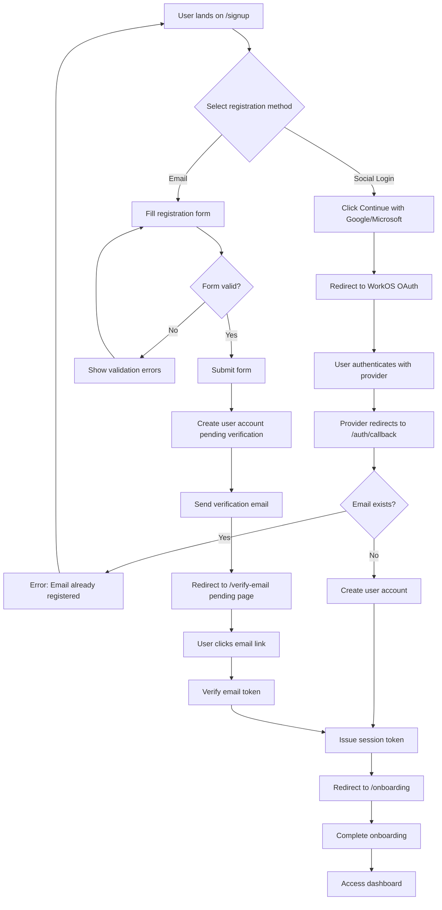
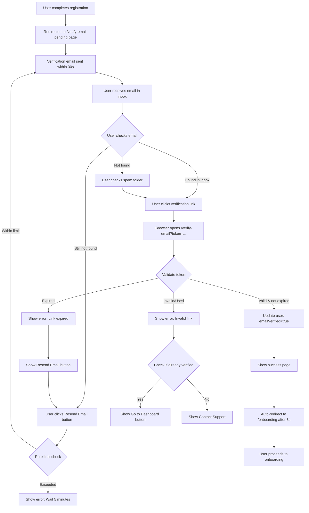
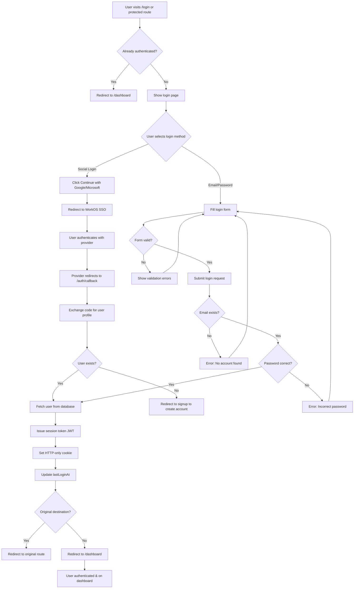

# Job Flow: Comprehensive User Stories
## Roadmap 1 - Complete Specification

**Version:** 1.0  
**Last Updated:** 2025-11-13  
**Microservice:** Job Flow  
**Total User Stories:** 100  
**Total Story Points:** 335  
**Implementation Timeline:** 18 Sprints (36 weeks)

---

## Table of Contents

### [Epic 1: Authentication & Security](#epic-1-authentication--security) (8 Stories)
- [US-AUTH-001: User Registration with Email/Social](#us-auth-001-user-registration-with-emailsocial)
- [US-AUTH-002: Email Verification Flow](#us-auth-002-email-verification-flow)
- [US-AUTH-003: Login with WorkOS SSO](#us-auth-003-login-with-workos-sso)
- [US-AUTH-004: Password Reset Flow](#us-auth-004-password-reset-flow)
- [US-AUTH-005: Two-Factor Authentication (2FA)](#us-auth-005-two-factor-authentication-2fa)
- [US-AUTH-006: Session Management & Token Refresh](#us-auth-006-session-management--token-refresh)
- [US-AUTH-007: Role-Based Access Control (RBAC)](#us-auth-007-role-based-access-control-rbac)
- [US-AUTH-008: Account Security Settings](#us-auth-008-account-security-settings)

### [Epic 2: User Settings & Privacy](#epic-2-user-settings--privacy) (5 Stories)
- [US-SETTINGS-001: User Profile Management](#us-settings-001-user-profile-management)
- [US-SETTINGS-002: Privacy Settings & Data Visibility](#us-settings-002-privacy-settings--data-visibility)
- [US-SETTINGS-003: Notification Preferences](#us-settings-003-notification-preferences)
- [US-SETTINGS-004: GDPR Data Export](#us-settings-004-gdpr-data-export)
- [US-SETTINGS-005: Account Deletion & Data Removal](#us-settings-005-account-deletion--data-removal)

### [Epic 3: AI Resume & STAR Stories](#epic-3-ai-resume--star-stories) (7 Stories)
- [US-RESUME-001: Create STAR Story](#us-resume-001-create-star-story)
- [US-RESUME-002: AI Conversation to Extract STAR Stories](#us-resume-002-ai-conversation-to-extract-star-stories)
- [US-RESUME-003: STAR Story Library & Organization](#us-resume-003-star-story-library--organization)
- [US-RESUME-004: AI Resume Generation from Job Description](#us-resume-004-ai-resume-generation-from-job-description)
- [US-RESUME-005: ATS Score Calculation & Feedback](#us-resume-005-ats-score-calculation--feedback)
- [US-RESUME-006: Resume Editing & Customization](#us-resume-006-resume-editing--customization)
- [US-RESUME-007: Resume Version Management](#us-resume-007-resume-version-management)

### [Epic 4: Job Search & Application Tracking](#epic-4-job-search--application-tracking) (14 Stories)
- [US-JOB-001 through US-JOB-014](#epic-4-job-search--application-tracking)

### [Epic 5: Interview & Coaching](#epic-5-interview--coaching) (10 Stories)
- [US-INTERVIEW-001 through US-INTERVIEW-010](#epic-5-interview--coaching)

### [Epic 6: Coach Platform & Profiles](#epic-6-coach-platform--profiles) (35 Stories)
- [US-COACH-001 through US-COACH-035](#epic-6-coach-platform--profiles)

### [Epic 7: Marketplace & Verification](#epic-7-marketplace--verification) (12 Stories)
- [US-MARKET-001 through US-MARKET-012](#epic-7-marketplace--verification)

### [Epic 8: Payment & Subscriptions](#epic-8-payment--subscriptions) (8 Stories)
- [US-PAY-001 through US-PAY-008](#epic-8-payment--subscriptions)

---

# Epic 1: Authentication & Security

**Total Stories:** 8  
**Total Story Points:** 34  
**Priority:** P0 (Critical - Foundation)  
**Sprint Assignment:** Sprint 1-2

---

## US-AUTH-001: User Registration with Email/Social

**Epic:** Authentication & Security  
**Priority:** P0 (Critical)  
**Story Points:** 5  
**Dependencies:** None (Foundation story)  
**Microservice:** Job Flow  
**Implementation Phase:** Sprint 1

---

### 1. User Story Statement

**As a** new user  
**I want to** register for an account using email or social login (Google/Microsoft)  
**So that** I can access the platform and start using job search features

---

### 2. Business Context

**User Pain Point:**
- Lengthy registration forms deter signups
- Forgetting yet another password is frustrating
- Users want quick access to try the platform
- Social login provides trust signals (verified identity)

**Platform Value:**
- Higher conversion rates with social login (30-50% improvement)
- Reduced support tickets for password resets
- Verified email addresses from social providers
- Lower fraud risk with OAuth providers

**Success Metrics:**
- Registration completion rate: >70%
- Social login adoption: >60% of new users
- Time to complete registration: <60 seconds
- Email verification rate: >85%

**Platform Pitch Alignment:**
"Get started in seconds. No lengthy forms, no password hassles. Sign up with Google or Microsoft and jump straight into building your career story."

---

### 3. User Flow Steps (Detailed)

**Step 1: Initial State**
- User lands on homepage (unauthenticated)
- Sees "Get Started" or "Sign Up" prominent CTA button
- Can also access from "/login" or "/signup" pages

**Step 2: Registration Method Selection**
- User clicks "Get Started" button
- Modal or page displays registration options:
  - "Continue with Google" (OAuth button with Google branding)
  - "Continue with Microsoft" (OAuth button with Microsoft branding)
  - "Sign up with Email" (traditional form)
  - Divider: "Or" between social and email options
  - Legal text: "By continuing, you agree to our Terms of Service and Privacy Policy" (links)

**Step 3a: Social Login Flow (OAuth)**
- User clicks "Continue with Google" or "Continue with Microsoft"
- System redirects to WorkOS SSO authorization URL
- User authenticates with their Google/Microsoft account
- User grants permissions (email, name, profile photo)
- Provider redirects back to `/auth/callback?code=[AUTH_CODE]&state=[STATE]`
- System exchanges code for user profile
- System creates new user record if email doesn't exist
- If email exists: Prompt to link accounts or error "Email already registered"

**Step 3b: Email Registration Flow**
- User clicks "Sign up with Email"
- Form displays:
  - Full Name (text input, required)
  - Email Address (email input, required, validated)
  - Password (password input, min 8 chars, strength indicator)
  - Confirm Password (password input, must match)
  - "Create Account" button (disabled until valid)
- User fills form and clicks "Create Account"
- System validates inputs (format, uniqueness)
- System creates user record with pending email verification status
- System sends verification email to user's address

**Step 4: Post-Registration Redirect**
- If social login: User redirected to `/onboarding` (profile completion)
- If email: User redirected to `/verify-email` (pending verification page)
- Session cookie/token issued (30-day expiration)
- User ID stored in context/state

**Step 5: Email Verification (Email Signup Only)**
- User receives email: "Verify your email address for Resume Flow"
- Email contains verification link: `/verify-email?token=[TOKEN]&userId=[USER_ID]`
- User clicks link (valid for 24 hours)
- System validates token and marks email as verified
- User redirected to `/onboarding`

**Step 6: Onboarding Flow**
- User sees role selection: "I'm a Job Seeker" or "I'm a Coach"
- Based on selection, different onboarding paths:
  - Job Seeker: Asked for current job search status, target roles
  - Coach: Directed to coach application form
- After onboarding: Redirected to dashboard

**Step 7: Terminal State**
- User account created and verified
- User authenticated with active session
- User can access platform features based on role
- User's data stored securely in database

---

### 4. Wireframes

#### 4a. Text-Based Wireframe Description

**Screen: Registration Page (`/signup`)**

**Layout:**
- **Header:** Minimal (logo left, "Already have an account? Log In" right)
- **Main Content:** Centered container, max-width 450px
  - **Heading:** "Get Started with Resume Flow" (H1, large, centered)
  - **Subheading:** "Join thousands of job seekers landing their dream roles" (grey text, centered)
  - **Social Buttons Section:**
    - Google button: Full-width, white background, Google icon left, "Continue with Google" text center
    - Microsoft button: Full-width, white background, Microsoft icon left, "Continue with Microsoft" text center
    - Spacing: 12px between buttons
  - **Divider:** Horizontal line with "Or" text in center (grey)
  - **Email Form Section:**
    - Full Name input: Text field, placeholder "Enter your full name"
    - Email input: Email field, placeholder "your@email.com"
    - Password input: Password field, placeholder "Create password (min 8 characters)"
      - Password strength indicator below (weak/medium/strong, colored bars)
    - Confirm Password input: Password field, placeholder "Confirm your password"
      - Validation message (red if mismatch, green checkmark if match)
    - "Create Account" button: Full-width, yellow background, bold text
    - Disabled state if form invalid (grey background)
  - **Legal Text:** Small grey text below button
    - "By continuing, you agree to our [Terms of Service] and [Privacy Policy]" (links underlined)
- **Footer:** None (clean, focused experience)

**Responsive Behavior:**
- **Mobile (<640px):** Container full-width with padding, buttons stack
- **Desktop (640px+):** Container 450px centered, same layout

---

#### 4b. ASCII Wireframe

```
┌──────────────────────────────────────────────────────────┐
│ [Logo]                     Already have an account? Log In│
├──────────────────────────────────────────────────────────┤
│                                                          │
│            Get Started with Resume Flow                  │
│   Join thousands of job seekers landing their dream roles│
│                                                          │
│  ┌────────────────────────────────────────────────────┐ │
│  │  [G]  Continue with Google                         │ │
│  └────────────────────────────────────────────────────┘ │
│                                                          │
│  ┌────────────────────────────────────────────────────┐ │
│  │  [M]  Continue with Microsoft                      │ │
│  └────────────────────────────────────────────────────┘ │
│                                                          │
│  ─────────────────── Or ───────────────────             │
│                                                          │
│  Full Name                                               │
│  ┌────────────────────────────────────────────────────┐ │
│  │ Enter your full name                               │ │
│  └────────────────────────────────────────────────────┘ │
│                                                          │
│  Email Address                                           │
│  ┌────────────────────────────────────────────────────┐ │
│  │ your@email.com                                     │ │
│  └────────────────────────────────────────────────────┘ │
│                                                          │
│  Password                                                │
│  ┌────────────────────────────────────────────────────┐ │
│  │ ••••••••••                                         │ │
│  └────────────────────────────────────────────────────┘ │
│  [▓▓▓░░░░░] Medium strength                            │
│                                                          │
│  Confirm Password                                        │
│  ┌────────────────────────────────────────────────────┐ │
│  │ ••••••••••                              ✓          │ │
│  └────────────────────────────────────────────────────┘ │
│                                                          │
│  ┌────────────────────────────────────────────────────┐ │
│  │            Create Account (Yellow)                 │ │
│  └────────────────────────────────────────────────────┘ │
│                                                          │
│  By continuing, you agree to our Terms and Privacy Policy│
│                                                          │
└──────────────────────────────────────────────────────────┘
```

---

#### 4c. Mermaid Flow Diagram



---

### 5. Acceptance Criteria (Testable)

**Functional:**
- [ ] **Given** user on signup page **When** user clicks "Continue with Google" **Then** redirected to Google OAuth consent screen
- [ ] **Given** user authenticates with Google **When** OAuth flow completes **Then** user account created with Google email/name, redirected to /onboarding
- [ ] **Given** user fills email form with valid data **When** clicks "Create Account" **Then** account created, verification email sent, redirected to /verify-email
- [ ] **Given** user enters email already registered **When** submits form **Then** error displayed "Email already registered. Please log in."
- [ ] **Given** user enters password <8 characters **When** submits form **Then** validation error "Password must be at least 8 characters"
- [ ] **Given** user enters mismatched passwords **When** submits form **Then** validation error "Passwords do not match"
- [ ] **Given** user clicks email verification link **When** token is valid **Then** email marked verified, user redirected to /onboarding
- [ ] **Given** user clicks expired verification link (>24hrs) **When** token validation fails **Then** error page with "Resend Verification Email" button

**Performance:**
- [ ] OAuth redirect completes in <2 seconds (p95)
- [ ] Email registration form submission response in <1 second (p95)
- [ ] Verification email delivered within <30 seconds

**Accessibility:**
- [ ] All form fields keyboard navigable (Tab order: Name → Email → Password → Confirm → Submit)
- [ ] Form submission possible via Enter key when valid
- [ ] Screen reader announces validation errors inline
- [ ] Color contrast ≥4.5:1 for all text (WCAG AA)
- [ ] Focus indicators visible on all interactive elements

**Responsive:**
- [ ] Registration form displays correctly on mobile (320px), tablet (768px), desktop (1200px+)
- [ ] Social login buttons full-width on all screen sizes
- [ ] Form inputs use appropriate input types on mobile (email keyboard for email field)

---

### 6. Edge Cases & Error Handling

**Edge Case 1: User closes OAuth popup before completing**
- **Trigger:** User clicks "Continue with Google" but closes consent screen without authorizing
- **Expected Behavior:** User returns to signup page, no account created
- **User Experience:** No error message (silent failure), user can retry

**Edge Case 2: OAuth provider returns error (user denies permissions)**
- **Trigger:** User denies email/profile access during OAuth consent
- **Expected Behavior:** OAuth fails, user redirected to signup page with error
- **User Experience:** Error message: "We need access to your email to create an account. Please try again."

**Edge Case 3: Email already registered via different provider**
- **Trigger:** User registered with email, tries to login with Google using same email
- **Expected Behavior:** System detects email match, prompts to link accounts
- **User Experience:** Modal: "This email is already registered. Would you like to link your Google account?" [Link Account] [Cancel]

**Edge Case 4: Verification email not received**
- **Trigger:** Email blocked by spam filter or delayed
- **Expected Behavior:** "Resend Verification Email" button on /verify-email page
- **User Experience:** User can request new email (rate-limited to 1 per 5 minutes)

**Edge Case 5: User creates multiple accounts with different emails**
- **Trigger:** User registers, forgets, registers again with different email
- **Expected Behavior:** Both accounts created (no duplicate detection beyond email)
- **User Experience:** User can merge accounts later via support (not automated)

**Edge Case 6: Malicious email addresses (spam/throwaway domains)**
- **Trigger:** User enters disposable email (e.g., tempmail.com)
- **Expected Behavior:** Email validation rejects known disposable domains
- **User Experience:** Error: "Please use a permanent email address"

**Error Handling:**

**Network Timeout:**
- **Scenario:** User on slow connection, registration request times out
- **Handling:** Show retry button, save form data in localStorage to prevent re-entry
- **Message:** "Registration timed out. Please try again." [Retry] button

**Validation Errors:**
- **Scenario:** User submits invalid email format (e.g., "notanemail")
- **Handling:** Inline error below email field (red text + red border)
- **Message:** "Please enter a valid email address"

**Server Errors (500):**
- **Scenario:** Database connection fails during account creation
- **Handling:** Generic error message, error logged to monitoring system
- **Message:** "Something went wrong. Please try again later or contact support."
- **Action:** "Retry" button + "Contact Support" link

---

### 7. Validation Rules

**Full Name:**
- **Type:** String
- **Min Length:** 2 characters
- **Max Length:** 100 characters
- **Format:** Letters, spaces, hyphens, apostrophes allowed (no numbers or special chars)
- **Sanitization:** Trim whitespace, capitalize first letters
- **Error Messages:**
  - <2 chars: "Name must be at least 2 characters"
  - >100 chars: "Name too long (max 100 characters)"
  - Invalid format: "Please enter a valid name (letters only)"

**Email Address:**
- **Type:** String (email format)
- **Min Length:** 5 characters
- **Max Length:** 255 characters
- **Format:** Valid email regex `/^[^\s@]+@[^\s@]+\.[^\s@]+$/`
- **Uniqueness:** Must not exist in database (case-insensitive)
- **Sanitization:** Lowercase, trim whitespace
- **Blocked Domains:** Disposable email providers (tempmail.com, guerrillamail.com, etc.)
- **Error Messages:**
  - Invalid format: "Please enter a valid email address"
  - Already exists: "Email already registered. Please log in."
  - Disposable domain: "Please use a permanent email address"

**Password:**
- **Type:** String
- **Min Length:** 8 characters
- **Max Length:** 128 characters
- **Complexity Requirements:**
  - At least 1 uppercase letter
  - At least 1 lowercase letter
  - At least 1 number
  - At least 1 special character (!@#$%^&*()_+-=[]{}|;:,.<>?)
- **Strength Indicator:** Weak (1-2 criteria), Medium (3 criteria), Strong (4 criteria + 12+ chars)
- **Prohibited:** Common passwords (password123, qwerty, etc. - check against list)
- **Hashing:** bcrypt with salt (min 10 rounds)
- **Error Messages:**
  - <8 chars: "Password must be at least 8 characters"
  - Missing uppercase: "Password must include an uppercase letter"
  - Missing number: "Password must include a number"
  - Missing special char: "Password must include a special character"
  - Common password: "This password is too common. Please choose a stronger one."

**Confirm Password:**
- **Type:** String
- **Validation:** Must exactly match Password field
- **Error Message:** "Passwords do not match"

**Business Rules:**
- User can only register once per email address
- Social login users skip email verification (provider verified)
- Email signup users must verify email before full access
- Session token issued immediately after registration (30-day expiration)
- Users can register as "Job Seeker" (default) or "Coach" (requires additional vetting)

---

### 8. Frontend Specifications

#### Component Structure

**File Location:** `src/pages/auth/SignupPage.tsx`

**Component Tree:**
```typescript
<SignupPage>
  <MinimalHeader>
    <Logo href="/" />
    <LoginLink text="Already have an account? Log In" />
  </MinimalHeader>
  
  <MainContent>
    <CenteredContainer maxWidth="450px">
      <Heading text="Get Started with Resume Flow" />
      <Subheading text="Join thousands of job seekers landing their dream roles" />
      
      <SocialLoginSection>
        <SocialButton
          provider="google"
          icon={GoogleIcon}
          text="Continue with Google"
          onClick={handleGoogleLogin}
        />
        <SocialButton
          provider="microsoft"
          icon={MicrosoftIcon}
          text="Continue with Microsoft"
          onClick={handleMicrosoftLogin}
        />
      </SocialLoginSection>
      
      <Divider text="Or" />
      
      <EmailSignupForm>
        <TextInput
          name="fullName"
          label="Full Name"
          placeholder="Enter your full name"
          value={formData.fullName}
          onChange={handleInputChange}
          error={validationErrors.fullName}
          required
        />
        
        <EmailInput
          name="email"
          label="Email Address"
          placeholder="your@email.com"
          value={formData.email}
          onChange={handleInputChange}
          error={validationErrors.email}
          required
        />
        
        <PasswordInput
          name="password"
          label="Password"
          placeholder="Create password (min 8 characters)"
          value={formData.password}
          onChange={handleInputChange}
          error={validationErrors.password}
          showStrengthIndicator
          strengthLevel={passwordStrength}
          required
        />
        
        <PasswordInput
          name="confirmPassword"
          label="Confirm Password"
          placeholder="Confirm your password"
          value={formData.confirmPassword}
          onChange={handleInputChange}
          error={validationErrors.confirmPassword}
          showMatchIndicator
          matchesPassword={formData.password === formData.confirmPassword}
          required
        />
        
        <SubmitButton
          text="Create Account"
          onClick={handleSubmit}
          disabled={!isFormValid}
          loading={isSubmitting}
        />
        
        <LegalText>
          By continuing, you agree to our{" "}
          <Link href="/terms">Terms of Service</Link> and{" "}
          <Link href="/privacy">Privacy Policy</Link>
        </LegalText>
      </EmailSignupForm>
    </CenteredContainer>
  </MainContent>
</SignupPage>
```

#### Key Props & Types

```typescript
// SignupPage.tsx

interface SignupPageProps {
  // No props - standalone page
}

interface FormData {
  fullName: string;
  email: string;
  password: string;
  confirmPassword: string;
}

interface ValidationErrors {
  fullName?: string;
  email?: string;
  password?: string;
  confirmPassword?: string;
}

type PasswordStrength = "weak" | "medium" | "strong";

// SocialButton.tsx
interface SocialButtonProps {
  provider: "google" | "microsoft";
  icon: React.ComponentType;
  text: string;
  onClick: () => void;
  disabled?: boolean;
}

// PasswordInput.tsx
interface PasswordInputProps {
  name: string;
  label: string;
  placeholder: string;
  value: string;
  onChange: (name: string, value: string) => void;
  error?: string;
  showStrengthIndicator?: boolean;
  strengthLevel?: PasswordStrength;
  showMatchIndicator?: boolean;
  matchesPassword?: boolean;
  required?: boolean;
}
```

#### State Management

```typescript
// SignupPage.tsx

const SignupPage: React.FC = () => {
  // Local state
  const [formData, setFormData] = useState<FormData>({
    fullName: "",
    email: "",
    password: "",
    confirmPassword: ""
  });
  
  const [validationErrors, setValidationErrors] = useState<ValidationErrors>({});
  const [isSubmitting, setIsSubmitting] = useState(false);
  const [passwordStrength, setPasswordStrength] = useState<PasswordStrength>("weak");
  
  // Convex mutations
  const createUser = useMutation(api.auth.createUser);
  const initiateOAuthLogin = useMutation(api.auth.initiateOAuthLogin);
  
  // Handlers
  const handleInputChange = (name: string, value: string) => {
    setFormData(prev => ({ ...prev, [name]: value }));
    
    // Clear error for this field
    setValidationErrors(prev => ({ ...prev, [name]: undefined }));
    
    // Calculate password strength if password field
    if (name === "password") {
      setPasswordStrength(calculatePasswordStrength(value));
    }
  };
  
  const handleGoogleLogin = async () => {
    try {
      const { ssoUrl } = await initiateOAuthLogin({ provider: "google" });
      window.location.href = ssoUrl;
    } catch (error) {
      console.error("Google login failed:", error);
    }
  };
  
  const handleMicrosoftLogin = async () => {
    try {
      const { ssoUrl } = await initiateOAuthLogin({ provider: "microsoft" });
      window.location.href = ssoUrl;
    } catch (error) {
      console.error("Microsoft login failed:", error);
    }
  };
  
  const handleSubmit = async (e: React.FormEvent) => {
    e.preventDefault();
    
    // Validate form
    const errors = validateForm(formData);
    if (Object.keys(errors).length > 0) {
      setValidationErrors(errors);
      return;
    }
    
    setIsSubmitting(true);
    
    try {
      const { userId } = await createUser({
        fullName: formData.fullName,
        email: formData.email,
        password: formData.password
      });
      
      // Redirect to verification page
      router.push("/verify-email");
    } catch (error) {
      if (error.message.includes("already registered")) {
        setValidationErrors({ email: "Email already registered. Please log in." });
      } else {
        alert("Registration failed. Please try again.");
      }
    } finally {
      setIsSubmitting(false);
    }
  };
  
  // Computed
  const isFormValid = useMemo(() => {
    return (
      formData.fullName.length >= 2 &&
      /^[^\s@]+@[^\s@]+\.[^\s@]+$/.test(formData.email) &&
      formData.password.length >= 8 &&
      formData.password === formData.confirmPassword &&
      Object.keys(validationErrors).length === 0
    );
  }, [formData, validationErrors]);
  
  return (
    // JSX tree as shown above
  );
};

// Validation helper
function validateForm(data: FormData): ValidationErrors {
  const errors: ValidationErrors = {};
  
  // Full name
  if (data.fullName.length < 2) {
    errors.fullName = "Name must be at least 2 characters";
  } else if (!/^[a-zA-Z\s'-]+$/.test(data.fullName)) {
    errors.fullName = "Please enter a valid name (letters only)";
  }
  
  // Email
  if (!/^[^\s@]+@[^\s@]+\.[^\s@]+$/.test(data.email)) {
    errors.email = "Please enter a valid email address";
  } else if (isDisposableEmail(data.email)) {
    errors.email = "Please use a permanent email address";
  }
  
  // Password
  if (data.password.length < 8) {
    errors.password = "Password must be at least 8 characters";
  } else if (!/[A-Z]/.test(data.password)) {
    errors.password = "Password must include an uppercase letter";
  } else if (!/[0-9]/.test(data.password)) {
    errors.password = "Password must include a number";
  } else if (!/[!@#$%^&*()_+\-=\[\]{}|;:,.<>?]/.test(data.password)) {
    errors.password = "Password must include a special character";
  }
  
  // Confirm password
  if (data.password !== data.confirmPassword) {
    errors.confirmPassword = "Passwords do not match";
  }
  
  return errors;
}

function calculatePasswordStrength(password: string): PasswordStrength {
  let score = 0;
  
  if (password.length >= 8) score++;
  if (/[A-Z]/.test(password)) score++;
  if (/[0-9]/.test(password)) score++;
  if (/[!@#$%^&*()_+\-=\[\]{}|;:,.<>?]/.test(password)) score++;
  if (password.length >= 12) score++;
  
  if (score <= 2) return "weak";
  if (score <= 4) return "medium";
  return "strong";
}

const DISPOSABLE_DOMAINS = [
  "tempmail.com",
  "guerrillamail.com",
  "10minutemail.com",
  "mailinator.com"
];

function isDisposableEmail(email: string): boolean {
  const domain = email.split("@")[1]?.toLowerCase();
  return DISPOSABLE_DOMAINS.includes(domain);
}
```

#### Styling (Tailwind)

```typescript
// SignupPage.tsx (Tailwind classes)

const styles = {
  // Layout
  container: "min-h-screen bg-gray-900 flex flex-col",
  header: "fixed top-0 left-0 right-0 z-50 bg-gray-900 border-b border-gray-800 px-4 py-3",
  headerContent: "max-w-7xl mx-auto flex items-center justify-between",
  logo: "text-yellow-500 text-xl font-bold hover:text-yellow-400 transition-colors",
  loginLink: "text-gray-400 hover:text-white text-sm transition-colors",
  
  // Main content
  mainContent: "flex-1 flex items-center justify-center px-4 pt-20 pb-8",
  centeredContainer: "w-full max-w-md",
  
  // Typography
  heading: "text-3xl font-bold text-white text-center mb-2",
  subheading: "text-gray-400 text-center mb-8",
  
  // Social buttons
  socialSection: "space-y-3 mb-6",
  socialButton: "w-full bg-white hover:bg-gray-50 text-gray-900 font-medium py-3 px-4 rounded-lg border border-gray-300 flex items-center justify-center gap-3 transition-colors",
  socialIcon: "w-5 h-5",
  
  // Divider
  divider: "flex items-center my-6",
  dividerLine: "flex-1 border-t border-gray-700",
  dividerText: "px-4 text-gray-500 text-sm",
  
  // Form
  form: "space-y-4",
  inputGroup: "space-y-1.5",
  label: "block text-sm font-medium text-gray-300",
  input: "w-full bg-gray-800 text-white border border-gray-700 rounded-lg px-4 py-3 focus:outline-none focus:ring-2 focus:ring-yellow-500 focus:border-transparent transition-all",
  inputError: "border-red-500 focus:ring-red-500",
  errorText: "text-red-400 text-sm mt-1",
  
  // Password strength
  strengthIndicator: "flex gap-1 mt-2",
  strengthBar: "flex-1 h-1 rounded-full bg-gray-700",
  strengthBarActive: {
    weak: "bg-red-500",
    medium: "bg-yellow-500",
    strong: "bg-green-500"
  },
  strengthText: "text-xs text-gray-400 mt-1",
  
  // Submit button
  submitButton: "w-full bg-yellow-500 hover:bg-yellow-400 text-gray-900 font-bold py-3 px-4 rounded-lg transition-colors disabled:bg-gray-700 disabled:text-gray-500 disabled:cursor-not-allowed",
  submitButtonLoading: "flex items-center justify-center gap-2",
  spinner: "animate-spin h-5 w-5 border-2 border-gray-900 border-t-transparent rounded-full",
  
  // Legal text
  legalText: "text-xs text-gray-500 text-center mt-4",
  legalLink: "text-yellow-500 hover:text-yellow-400 underline transition-colors"
};
```

#### Responsive Breakpoints

```markdown
- **Mobile (320-639px):**
  - Container full-width with 16px padding
  - Heading font-size: 24px
  - Social buttons full-width
  - Form inputs full-width
  
- **Tablet (640-1023px):**
  - Container max-width 450px, centered
  - Heading font-size: 30px
  - Same layout as desktop (minimal changes)
  
- **Desktop (1024px+):**
  - Container max-width 450px, centered
  - Heading font-size: 36px
  - Hover states enabled on buttons
```

#### Accessibility

```markdown
- **ARIA labels:**
  - Social buttons: `aria-label="Continue with Google"`, `aria-label="Continue with Microsoft"`
  - Form inputs: `aria-label` matches label text, `aria-invalid="true"` when error
  - Password toggle: `aria-label="Show password"` / `"Hide password"`
  
- **Keyboard navigation:**
  - Tab order: Logo → Login Link → Google → Microsoft → Name → Email → Password → Confirm → Submit
  - Enter key submits form when valid
  - Escape key clears focused input
  
- **Focus management:**
  - Visible focus ring: `ring-2 ring-yellow-500` on all interactive elements
  - After error, focus moves to first invalid field
  - After submit error, focus stays on submit button
  
- **Screen reader announcements:**
  - Validation errors announced on blur: `aria-live="polite"`
  - Form submission: `aria-live="assertive"` for success/error messages
  - Password strength: `aria-live="polite"` updates as user types
  
- **Color contrast:**
  - Text on background: ≥7:1 (white #FFFFFF on gray-900 #111827)
  - Error text: ≥4.5:1 (red-400 #F87171 on gray-900)
  - Links: ≥4.5:1 (yellow-500 #EAB308 on gray-900)
```

---

### 9. Backend Specifications

#### Convex Schema

```typescript
// convex/schema.ts

import { defineSchema, defineTable } from "convex/server";
import { v } from "convex/values";

export default defineSchema({
  users: defineTable({
    // Core fields
    fullName: v.string(),
    email: v.string(),
    passwordHash: v.optional(v.string()), // Null for social login users
    
    // Authentication
    emailVerified: v.boolean(), // True for social login, pending for email signup
    role: v.union(
      v.literal("job_seeker"),
      v.literal("coach"),
      v.literal("admin")
    ),
    
    // Social login
    ssoProvider: v.optional(
      v.union(v.literal("google"), v.literal("microsoft"))
    ),
    ssoId: v.optional(v.string()), // Provider's user ID
    
    // Profile
    profilePhoto: v.optional(v.string()), // URL from social provider or uploaded
    
    // Timestamps
    createdAt: v.number(),
    updatedAt: v.number(),
    lastLoginAt: v.optional(v.number())
  })
    .index("by_email", ["email"]) // Unique email lookup
    .index("by_sso", ["ssoProvider", "ssoId"]) // Social login lookup
    .index("by_role", ["role"]) // Filter users by role
    .searchIndex("search_users", {
      searchField: "fullName",
      filterFields: ["role", "emailVerified"]
    }),
  
  emailVerifications: defineTable({
    userId: v.id("users"),
    token: v.string(), // Random UUID
    expiresAt: v.number(), // 24 hours from creation
    verified: v.boolean(),
    createdAt: v.number()
  })
    .index("by_token", ["token"]) // Fast token lookup
    .index("by_user", ["userId"]) // Find user's verification tokens
});
```

#### Validation Rules (Convex validators)

```typescript
// convex/validators.ts

import { v } from "convex/values";

export const userValidators = {
  fullName: v.string(), // Additional runtime checks below
  email: v.string(), // Validated in mutation
  password: v.string(), // Min 8 chars checked in mutation
  role: v.union(v.literal("job_seeker"), v.literal("coach")),
  ssoProvider: v.union(v.literal("google"), v.literal("microsoft"))
};

// Runtime validation functions
export function validateFullName(name: string): string | null {
  if (name.length < 2) return "Name must be at least 2 characters";
  if (name.length > 100) return "Name too long (max 100 characters)";
  if (!/^[a-zA-Z\s'-]+$/.test(name)) return "Please enter a valid name (letters only)";
  return null;
}

export function validateEmail(email: string): string | null {
  if (!/^[^\s@]+@[^\s@]+\.[^\s@]+$/.test(email)) return "Invalid email format";
  
  const domain = email.split("@")[1]?.toLowerCase();
  const disposableDomains = ["tempmail.com", "guerrillamail.com", "10minutemail.com"];
  if (disposableDomains.includes(domain)) return "Please use a permanent email address";
  
  return null;
}

export function validatePassword(password: string): string | null {
  if (password.length < 8) return "Password must be at least 8 characters";
  if (!/[A-Z]/.test(password)) return "Password must include an uppercase letter";
  if (!/[a-z]/.test(password)) return "Password must include a lowercase letter";
  if (!/[0-9]/.test(password)) return "Password must include a number";
  if (!/[!@#$%^&*()_+\-=\[\]{}|;:,.<>?]/.test(password)) return "Password must include a special character";
  
  const commonPasswords = ["password123", "qwerty123", "admin123"];
  if (commonPasswords.includes(password.toLowerCase())) return "This password is too common";
  
  return null;
}
```

#### API Endpoints

**Mutation: Create User (Email Signup)**

```typescript
// convex/auth.ts

import { v } from "convex/values";
import { mutation } from "./_generated/server";
import { validateFullName, validateEmail, validatePassword } from "./validators";
import bcrypt from "bcryptjs";
import { randomUUID } from "crypto";

export const createUser = mutation({
  args: {
    fullName: v.string(),
    email: v.string(),
    password: v.string()
  },
  handler: async (ctx, args) => {
    // 1. Validate inputs
    const nameError = validateFullName(args.fullName);
    if (nameError) throw new Error(nameError);
    
    const emailError = validateEmail(args.email);
    if (emailError) throw new Error(emailError);
    
    const passwordError = validatePassword(args.password);
    if (passwordError) throw new Error(passwordError);
    
    // 2. Check email uniqueness
    const existingUser = await ctx.db
      .query("users")
      .withIndex("by_email", (q) => q.eq("email", args.email.toLowerCase()))
      .unique();
    
    if (existingUser) {
      throw new Error("Email already registered. Please log in.");
    }
    
    // 3. Hash password
    const passwordHash = await bcrypt.hash(args.password, 10);
    
    // 4. Create user
    const userId = await ctx.db.insert("users", {
      fullName: args.fullName.trim(),
      email: args.email.toLowerCase(),
      passwordHash,
      emailVerified: false,
      role: "job_seeker", // Default role
      createdAt: Date.now(),
      updatedAt: Date.now()
    });
    
    // 5. Generate verification token
    const token = randomUUID();
    const expiresAt = Date.now() + 24 * 60 * 60 * 1000; // 24 hours
    
    await ctx.db.insert("emailVerifications", {
      userId,
      token,
      expiresAt,
      verified: false,
      createdAt: Date.now()
    });
    
    // 6. Send verification email (via action)
    await ctx.scheduler.runAfter(0, internal.emails.sendVerificationEmail, {
      userId,
      email: args.email,
      token,
      fullName: args.fullName
    });
    
    // 7. Return user ID (session handled by Convex auth)
    return { userId };
  }
});
```

**Request/Response Schema:**

```typescript
// Request
{
  fullName: "John Doe",
  email: "john@example.com",
  password: "SecurePass123!"
}

// Response (Success)
{
  userId: "j9x7k2m5n8p1q4r7"
}

// Response (Error)
{
  error: "Email already registered. Please log in.",
  code: "EMAIL_EXISTS"
}
```

**Mutation: Initiate OAuth Login**

```typescript
// convex/auth.ts

import { mutation } from "./_generated/server";
import { v } from "convex/values";
import { WorkOS } from "@workos-inc/node";

const workos = new WorkOS(process.env.WORKOS_API_KEY);

export const initiateOAuthLogin = mutation({
  args: {
    provider: v.union(v.literal("google"), v.literal("microsoft"))
  },
  handler: async (ctx, args) => {
    // 1. Generate CSRF state token
    const state = randomUUID();
    
    // 2. Store state in session (Convex auth context)
    // Note: In production, use HTTP-only cookie or session storage
    
    // 3. Generate WorkOS SSO URL
    const ssoUrl = workos.sso.getAuthorizationURL({
      provider: args.provider,
      clientId: process.env.WORKOS_CLIENT_ID!,
      redirectUri: `${process.env.APP_URL}/auth/callback`,
      state
    });
    
    // 4. Return URL for client-side redirect
    return { ssoUrl, state };
  }
});
```

**Action: Handle OAuth Callback**

```typescript
// convex/auth.ts

import { internalAction } from "./_generated/server";
import { v } from "convex/values";

export const handleOAuthCallback = internalAction({
  args: {
    code: v.string(),
    state: v.string()
  },
  handler: async (ctx, args) => {
    // 1. Verify state (CSRF protection)
    // In production: Check against stored state in session
    
    // 2. Exchange code for profile
    const profile = await workos.sso.getProfile({
      code: args.code,
      clientId: process.env.WORKOS_CLIENT_ID!
    });
    
    // 3. Find or create user
    let user = await ctx.runQuery(internal.auth.getUserByEmail, {
      email: profile.email
    });
    
    if (!user) {
      // Create new user
      const userId = await ctx.runMutation(internal.auth.createSocialUser, {
        email: profile.email,
        fullName: `${profile.firstName} ${profile.lastName}`,
        ssoProvider: profile.connectionType as "google" | "microsoft",
        ssoId: profile.id,
        profilePhoto: profile.profilePictureUrl
      });
      
      user = await ctx.runQuery(internal.auth.getUser, { userId });
    } else if (!user.ssoProvider) {
      // Link social account to existing email user
      await ctx.runMutation(internal.auth.linkSocialAccount, {
        userId: user._id,
        ssoProvider: profile.connectionType as "google" | "microsoft",
        ssoId: profile.id,
        profilePhoto: profile.profilePictureUrl
      });
    }
    
    // 4. Update last login
    await ctx.runMutation(internal.auth.updateLastLogin, {
      userId: user._id
    });
    
    // 5. Return user for session creation
    return { userId: user._id };
  }
});
```

**Internal Mutation: Create Social User**

```typescript
// convex/auth.ts

import { internalMutation } from "./_generated/server";
import { v } from "convex/values";

export const createSocialUser = internalMutation({
  args: {
    email: v.string(),
    fullName: v.string(),
    ssoProvider: v.union(v.literal("google"), v.literal("microsoft")),
    ssoId: v.string(),
    profilePhoto: v.optional(v.string())
  },
  handler: async (ctx, args) => {
    const userId = await ctx.db.insert("users", {
      fullName: args.fullName,
      email: args.email.toLowerCase(),
      emailVerified: true, // Social providers verify emails
      role: "job_seeker",
      ssoProvider: args.ssoProvider,
      ssoId: args.ssoId,
      profilePhoto: args.profilePhoto,
      createdAt: Date.now(),
      updatedAt: Date.now(),
      lastLoginAt: Date.now()
    });
    
    return userId;
  }
});
```

**Query: Get User by Email**

```typescript
// convex/auth.ts

import { internalQuery } from "./_generated/server";
import { v } from "convex/values";

export const getUserByEmail = internalQuery({
  args: { email: v.string() },
  handler: async (ctx, args) => {
    return await ctx.db
      .query("users")
      .withIndex("by_email", (q) => q.eq("email", args.email.toLowerCase()))
      .unique();
  }
});
```

#### Authentication & Authorization

**Row-Level Security:**

```typescript
// Users can only read their own profile during registration
// Public endpoints for registration (no auth required)

export const createUser = mutation({
  // No auth check - public endpoint
  args: { /* ... */ },
  handler: async (ctx, args) => {
    // Create user logic
  }
});
```

**Session Management:**

```typescript
// After successful registration/login, Convex auth issues JWT token
// Token stored in HTTP-only cookie (secure, SameSite=Strict)
// Token includes: userId, role, expiresAt (30 days)

// Client-side: Convex client automatically includes token in all requests
// Server-side: ctx.auth.getUserIdentity() returns user from token
```

---

### 10. Testing Specifications

**Unit Tests:**

```typescript
// auth.test.ts

import { describe, it, expect } from "vitest";
import { validateFullName, validateEmail, validatePassword } from "./validators";

describe("User Registration Validation", () => {
  describe("validateFullName", () => {
    it("should accept valid names", () => {
      expect(validateFullName("John Doe")).toBeNull();
      expect(validateFullName("Mary-Jane O'Brien")).toBeNull();
    });
    
    it("should reject names <2 characters", () => {
      expect(validateFullName("J")).toBe("Name must be at least 2 characters");
    });
    
    it("should reject names with numbers", () => {
      expect(validateFullName("John123")).toBe("Please enter a valid name (letters only)");
    });
  });
  
  describe("validateEmail", () => {
    it("should accept valid emails", () => {
      expect(validateEmail("john@example.com")).toBeNull();
      expect(validateEmail("mary.jane+work@company.co.uk")).toBeNull();
    });
    
    it("should reject invalid email format", () => {
      expect(validateEmail("notanemail")).toBe("Invalid email format");
      expect(validateEmail("@example.com")).toBe("Invalid email format");
    });
    
    it("should reject disposable email domains", () => {
      expect(validateEmail("user@tempmail.com")).toBe("Please use a permanent email address");
    });
  });
  
  describe("validatePassword", () => {
    it("should accept strong passwords", () => {
      expect(validatePassword("SecurePass123!")).toBeNull();
    });
    
    it("should reject passwords <8 characters", () => {
      expect(validatePassword("Short1!")).toBe("Password must be at least 8 characters");
    });
    
    it("should reject passwords without uppercase", () => {
      expect(validatePassword("password123!")).toBe("Password must include an uppercase letter");
    });
    
    it("should reject common passwords", () => {
      expect(validatePassword("Password123")).toBe("This password is too common");
    });
  });
});
```

**Integration Tests:**

```typescript
// auth.integration.test.ts

import { describe, it, expect, beforeEach } from "vitest";
import { convexTest } from "convex-test";
import { api } from "./_generated/api";

describe("User Registration Flow", () => {
  let t: ConvexTestingHelper;
  
  beforeEach(async () => {
    t = convexTest();
  });
  
  it("should create user with email signup", async () => {
    const result = await t.mutation(api.auth.createUser, {
      fullName: "John Doe",
      email: "john@example.com",
      password: "SecurePass123!"
    });
    
    expect(result.userId).toBeDefined();
    
    // Verify user created
    const user = await t.query(api.users.getUser, { userId: result.userId });
    expect(user.email).toBe("john@example.com");
    expect(user.emailVerified).toBe(false);
    expect(user.passwordHash).toBeDefined();
  });
  
  it("should reject duplicate email registration", async () => {
    // First registration
    await t.mutation(api.auth.createUser, {
      fullName: "John Doe",
      email: "john@example.com",
      password: "SecurePass123!"
    });
    
    // Duplicate registration
    await expect(
      t.mutation(api.auth.createUser, {
        fullName: "Jane Doe",
        email: "john@example.com",
        password: "DifferentPass456!"
      })
    ).rejects.toThrow("Email already registered");
  });
  
  it("should send verification email after signup", async () => {
    const { userId } = await t.mutation(api.auth.createUser, {
      fullName: "John Doe",
      email: "john@example.com",
      password: "SecurePass123!"
    });
    
    // Check verification token created
    const verifications = await t.query(api.auth.getUserVerifications, { userId });
    expect(verifications).toHaveLength(1);
    expect(verifications[0].verified).toBe(false);
    expect(verifications[0].expiresAt).toBeGreaterThan(Date.now());
  });
});
```

**E2E Tests (Playwright):**

```typescript
// signup.e2e.test.ts

import { test, expect } from "@playwright/test";

test.describe("User Registration", () => {
  test("user can register with email", async ({ page }) => {
    // 1. Navigate to signup page
    await page.goto("/signup");
    
    // 2. Fill form
    await page.fill('input[name="fullName"]', "John Doe");
    await page.fill('input[name="email"]', "john@example.com");
    await page.fill('input[name="password"]', "SecurePass123!");
    await page.fill('input[name="confirmPassword"]', "SecurePass123!");
    
    // 3. Submit
    await page.click('button[type="submit"]');
    
    // 4. Verify redirect to verification page
    await page.waitForURL(/\/verify-email/);
    expect(page.url()).toContain("/verify-email");
    
    // 5. Verify success message
    await expect(page.locator("h1")).toContainText("Verify Your Email");
  });
  
  test("shows validation errors for invalid inputs", async ({ page }) => {
    await page.goto("/signup");
    
    // Enter short password
    await page.fill('input[name="password"]', "short");
    await page.fill('input[name="confirmPassword"]', "different");
    await page.blur('input[name="confirmPassword"]');
    
    // Verify errors shown
    await expect(page.locator('text="Password must be at least 8 characters"')).toBeVisible();
    await expect(page.locator('text="Passwords do not match"')).toBeVisible();
    
    // Verify submit button disabled
    const submitButton = page.locator('button[type="submit"]');
    await expect(submitButton).toBeDisabled();
  });
  
  test("user can register with Google OAuth", async ({ page, context }) => {
    // Mock OAuth flow (intercept redirect)
    await page.route("**/auth/callback*", async (route) => {
      await route.fulfill({
        status: 302,
        headers: { Location: "/onboarding" }
      });
    });
    
    await page.goto("/signup");
    
    // Click Google button
    const googleButton = page.locator('button:has-text("Continue with Google")');
    await googleButton.click();
    
    // Verify OAuth redirect (in real test, use OAuth testing library)
    // await expect(page.url()).toContain("accounts.google.com");
    
    // After callback, verify onboarding redirect
    await page.waitForURL(/\/onboarding/);
    expect(page.url()).toContain("/onboarding");
  });
});
```

---

### 11. Performance Requirements

**Latency Targets:**
- Page load (signup page): <1.5 seconds (p95)
- Form validation (client-side): <50ms (instant)
- Email registration mutation: <800ms (p95)
- OAuth redirect generation: <500ms (p95)
- Email delivery (verification): <30 seconds

**Scalability:**
- Support 1,000 concurrent signups without degradation
- Database inserts: <100ms (indexed email lookup)
- Password hashing: <200ms (bcrypt 10 rounds)

**Caching Strategy:**
- Static assets (CSS, JS, images): CDN cache, 1-year TTL
- API responses: No caching (dynamic, user-specific)
- Validation logic: Client-side memoization

---

### 12. Security Specifications

**Authentication:**
- Password hashing: bcrypt with 10 salt rounds (industry standard)
- Session tokens: JWT with 30-day expiration, HTTP-only cookies
- CSRF protection: State parameter in OAuth flow, verified on callback
- OAuth: WorkOS integration (secure, PCI-compliant)

**Authorization:**
- Public endpoint: No auth required for registration
- Rate limiting: 10 registration attempts per IP per hour (prevent abuse)

**Data Protection:**
- Encryption at rest: AES-256 (Convex default)
- Encryption in transit: TLS 1.3 (HTTPS enforced)
- Password storage: Never log or expose passwords, hash immediately
- PII handling: Email stored lowercase, full name trimmed, no unnecessary data collection

**Input Sanitization:**
- Full name: Trim whitespace, escape HTML entities
- Email: Lowercase, trim whitespace, validate format
- Password: No sanitization (hashed), validate complexity only

**GDPR Compliance:**
- User consent: Terms & Privacy Policy acceptance required
- Data minimization: Only collect necessary fields (name, email, password)
- Right to erasure: Account deletion endpoint (future story)

---

### 13. Monitoring & Observability

**Logging:**
- Registration attempts: Log user ID, email (hashed), timestamp, provider
- Errors: Log validation failures, duplicate email attempts, OAuth failures
- Performance: Log mutation duration, password hash time

**Alerting:**
- Registration error rate >5%: Slack alert to engineering team
- Email delivery failure >10%: Immediate investigation
- OAuth callback errors >1%: Check WorkOS integration

**Analytics:**
- Track registration method (email vs. Google vs. Microsoft)
- Measure conversion rate (page load → completed signup)
- Track time to complete (how long users spend on form)
- Measure password strength distribution

**Metrics to Monitor:**
- Daily Active Users (DAU) registrations
- Registration completion rate (started form → submitted)
- Email verification rate (sent → clicked link)
- Social login adoption (% choosing OAuth vs. email)

---

## US-AUTH-002: Email Verification Flow

**Epic:** Authentication & Security  
**Priority:** P0 (Critical)  
**Story Points:** 3  
**Dependencies:** US-AUTH-001 (User Registration with Email/Social)  
**Microservice:** Job Flow  
**Implementation Phase:** Sprint 1

---

### 1. User Story Statement

**As a** newly registered user  
**I want to** verify my email address via a verification link  
**So that** I can prove ownership of my email and gain full access to the platform

---

### 2. Business Context

**User Pain Point:**
- Users distrust platforms that don't verify emails (spam/security concerns)
- Unverified emails lead to lost account access if password forgotten
- Unverified users receive emails they can't interact with (if email invalid)
- Unclear what happens if verification link expires

**Platform Value:**
- Reduces fake/spam account creation by 70-80%
- Ensures deliverability of important notifications
- Provides legal proof of user consent (email verified)
- Reduces support tickets for "can't receive emails"

**Success Metrics:**
- Email verification rate: >85% within 24 hours
- Verification email delivery time: <30 seconds (p95)
- Link expiration understanding: <5% support tickets about expired links
- Resend email success rate: >95%

**Platform Pitch Alignment:**
"We protect your account and ensure you never miss important job updates. One quick click to verify, and you're all set."

---

### 3. User Flow Steps (Detailed)

**Step 1: Initial State (Post-Registration)**
- User just completed email registration (US-AUTH-001)
- Redirected to `/verify-email` pending page
- User sees: "Check your email" message with registered email displayed
- Session exists but limited access (emailVerified: false)

**Step 2: Verification Email Sent**
- System sends email within 30 seconds of registration
- Email subject: "Verify your email address for Job Flow"
- Email contains:
  - Personalized greeting: "Hi [Full Name],"
  - Clear instruction: "Click the button below to verify your email"
  - Prominent CTA button: "Verify Email Address"
  - Fallback link: If button doesn't work, copy/paste URL
  - Expiration notice: "This link expires in 24 hours"
  - Support contact: "Didn't request this? Contact support"

**Step 3: User Receives Email**
- User checks inbox (primary folder, check spam if not found)
- User opens email (email client: Gmail, Outlook, Apple Mail, etc.)
- User sees branded email template (Job Flow logo, professional design)

**Step 4: User Clicks Verification Link**
- User clicks "Verify Email Address" button
- Browser opens new tab to: `/verify-email?token=[TOKEN]&userId=[USER_ID]`
- Loading spinner shows: "Verifying your email..."
- System validates:
  - Token format (UUID)
  - Token exists in database
  - Token not already used (verified: false)
  - Token not expired (<24 hours old)
  - Token matches user ID

**Step 5a: Successful Verification**
- System updates user record: `emailVerified: true`
- System updates verification record: `verified: true`
- User sees success page:
  - Checkmark icon (green, animated)
  - Heading: "Email Verified Successfully!"
  - Message: "Your account is now fully activated."
  - CTA button: "Continue to Dashboard" → Redirects to `/onboarding` or `/dashboard`
- Auto-redirect after 3 seconds if user doesn't click

**Step 5b: Failed Verification (Token Expired)**
- System detects token expiration (>24 hours old)
- User sees error page:
  - Warning icon (yellow)
  - Heading: "Verification Link Expired"
  - Message: "This link has expired. We'll send you a new one."
  - CTA button: "Resend Verification Email" → Generates new token
  - Secondary link: "Back to Login"

**Step 5c: Failed Verification (Token Invalid/Used)**
- System detects token doesn't exist or already verified
- User sees error page:
  - Error icon (red)
  - Heading: "Invalid Verification Link"
  - Message: "This link is invalid or has already been used."
  - CTA button: "Go to Dashboard" (if already verified)
  - Secondary link: "Contact Support" (if issue persists)

**Step 6: Resend Email Flow**
- User clicks "Resend Verification Email" on pending page or error page
- System validates:
  - User session exists
  - User email not already verified
  - Rate limit: Max 1 email every 5 minutes
- System generates new token (invalidates old token)
- System sends new verification email
- User sees toast notification: "Verification email sent! Check your inbox."

**Step 7: Terminal State**
- User email verified (`emailVerified: true`)
- User has full platform access
- User can proceed to onboarding or dashboard
- Verification token marked as used/expired

---

### 4. Wireframes

#### 4a. Text-Based Wireframe Description

**Screen: Email Verification Pending (`/verify-email`)**

**Layout:**
- **Header:** Minimal (logo left, "Need help?" right)
- **Main Content:** Centered container, max-width 500px
  - **Icon:** Large envelope icon (blue, animated "sent" effect)
  - **Heading:** "Check Your Email" (H1, large, centered)
  - **Message:** "We sent a verification link to **[user@email.com]**" (bold email)
  - **Instruction:** "Click the link in the email to verify your account."
  - **Subtext:** "Didn't receive it? Check your spam folder or..."
  - **CTA Button:** "Resend Verification Email" (secondary style, not too prominent)
  - **Timer Text:** "You can request a new email in 5:00" (countdown, grey text)
  - **Secondary Action:** "Change Email Address" link (small, grey)
- **Footer:** "Having trouble? [Contact Support]"

**Responsive Behavior:**
- **Mobile (<640px):** Container full-width with padding, email wraps
- **Desktop (640px+):** Container 500px centered, same layout

---

**Screen: Email Verification Success (`/verify-email?token=...` - success)**

**Layout:**
- **Main Content:** Centered container, max-width 500px
  - **Icon:** Large checkmark icon (green, animated bounce/fade-in)
  - **Heading:** "Email Verified Successfully!" (H1, green accent)
  - **Message:** "Your account is now fully activated."
  - **CTA Button:** "Continue to Dashboard" (primary yellow button)
  - **Auto-redirect Text:** "Redirecting automatically in 3 seconds..." (small, grey)

---

**Screen: Email Verification Error (`/verify-email?token=...` - expired)**

**Layout:**
- **Main Content:** Centered container, max-width 500px
  - **Icon:** Warning triangle icon (yellow/orange)
  - **Heading:** "Verification Link Expired" (H1, orange accent)
  - **Message:** "This link has expired after 24 hours for security."
  - **CTA Button:** "Resend Verification Email" (primary yellow button)
  - **Secondary Link:** "Back to Login" (small, grey link)

---

#### 4b. ASCII Wireframe

**Email Verification Pending Page:**

```
┌──────────────────────────────────────────────────────────┐
│ [Logo]                                      Need help?   │
├──────────────────────────────────────────────────────────┤
│                                                          │
│                     📧 (Envelope Icon)                   │
│                                                          │
│                   Check Your Email                       │
│                                                          │
│        We sent a verification link to                    │
│              john@example.com                            │
│                                                          │
│   Click the link in the email to verify your account.    │
│                                                          │
│   Didn't receive it? Check your spam folder or...        │
│                                                          │
│  ┌────────────────────────────────────────────────────┐ │
│  │        Resend Verification Email                   │ │
│  └────────────────────────────────────────────────────┘ │
│                                                          │
│     You can request a new email in 4:32                  │
│                                                          │
│            Change Email Address                          │
│                                                          │
│       Having trouble? Contact Support                    │
└──────────────────────────────────────────────────────────┘
```

**Email Verification Success Page:**

```
┌──────────────────────────────────────────────────────────┐
│ [Logo]                                                   │
├──────────────────────────────────────────────────────────┤
│                                                          │
│                     ✓ (Green Checkmark)                  │
│                                                          │
│            Email Verified Successfully!                  │
│                                                          │
│          Your account is now fully activated.            │
│                                                          │
│  ┌────────────────────────────────────────────────────┐ │
│  │         Continue to Dashboard (Yellow)             │ │
│  └────────────────────────────────────────────────────┘ │
│                                                          │
│      Redirecting automatically in 3 seconds...           │
│                                                          │
└──────────────────────────────────────────────────────────┘
```

**Email Template:**

```
┌──────────────────────────────────────────────────────────┐
│                    [Job Flow Logo]                       │
├──────────────────────────────────────────────────────────┤
│                                                          │
│  Hi John,                                                │
│                                                          │
│  Thanks for signing up for Job Flow! Please verify       │
│  your email address by clicking the button below:        │
│                                                          │
│  ┌────────────────────────────────────────────────────┐ │
│  │       Verify Email Address (Yellow Button)         │ │
│  └────────────────────────────────────────────────────┘ │
│                                                          │
│  Or copy and paste this link:                            │
│  https://app.jobflow.com/verify-email?token=abc123...    │
│                                                          │
│  This link expires in 24 hours.                          │
│                                                          │
│  If you didn't create an account, you can safely         │
│  ignore this email.                                      │
│                                                          │
├──────────────────────────────────────────────────────────┤
│  Need help? Contact us at support@jobflow.com            │
│  © 2025 Job Flow. All rights reserved.                   │
└──────────────────────────────────────────────────────────┘
```

---

#### 4c. Mermaid Flow Diagram



---

### 5. Acceptance Criteria (Testable)

**Functional:**
- [ ] **Given** user completes email registration **When** form submits **Then** verification email sent within 30 seconds
- [ ] **Given** user receives verification email **When** clicks verification link **Then** redirected to `/verify-email?token=...` with loading state
- [ ] **Given** token is valid and not expired **When** system validates **Then** user's `emailVerified` set to `true` and success page shown
- [ ] **Given** token is expired (>24 hours) **When** system validates **Then** error page shown with "Resend Email" button
- [ ] **Given** token is invalid or already used **When** system validates **Then** error page shown with appropriate message
- [ ] **Given** user clicks "Resend Verification Email" **When** within rate limit **Then** new token generated, new email sent, old token invalidated
- [ ] **Given** user clicks "Resend" within 5 minutes **When** rate limit exceeded **Then** error shown "Please wait X seconds before requesting a new email"
- [ ] **Given** user successfully verifies email **When** success page loads **Then** auto-redirect to `/onboarding` after 3 seconds
- [ ] **Given** user already verified email **When** clicks old verification link **Then** redirected to dashboard with message "Email already verified"

**Performance:**
- [ ] Verification email delivery time <30 seconds (p95)
- [ ] Token validation response time <200ms (p95)
- [ ] Email template load time <1 second in email clients
- [ ] Resend email cooldown countdown updates every second (no lag)

**Accessibility:**
- [ ] Email verification pages keyboard navigable (Tab to buttons, Enter to submit)
- [ ] Success/error icons have text alternatives for screen readers
- [ ] Email countdown timer announced to screen readers when changed
- [ ] Focus moves to "Continue to Dashboard" button on success page
- [ ] Color contrast ≥4.5:1 for all text (WCAG AA)

**Responsive:**
- [ ] Verification pages display correctly on mobile (320px), tablet (768px), desktop (1200px+)
- [ ] Email template renders correctly in Gmail, Outlook, Apple Mail, Yahoo Mail
- [ ] Email CTA button touch-friendly on mobile (min 44px height)

---

### 6. Edge Cases & Error Handling

**Edge Case 1: User clicks verification link multiple times**
- **Trigger:** User clicks link, then clicks again in different browser/device
- **Expected Behavior:** First click verifies, subsequent clicks redirect to dashboard with "Already verified" message
- **User Experience:** No error, seamless redirect with toast notification "Your email is already verified"

**Edge Case 2: User requests resend before first email arrives**
- **Trigger:** Email delayed (network issues), user clicks resend within 30 seconds
- **Expected Behavior:** System allows resend if >5 seconds since last request
- **User Experience:** Both emails arrive, either link works, second invalidates first

**Edge Case 3: User changes email before verifying**
- **Trigger:** User wants to use different email address
- **Expected Behavior:** "Change Email Address" link opens modal to update email, invalidates old token
- **User Experience:** User enters new email, new verification email sent to new address

**Edge Case 4: Verification email caught in spam filter**
- **Trigger:** Email provider (Gmail, Outlook) flags email as spam
- **Expected Behavior:** User doesn't receive email in inbox
- **User Experience:** Pending page instructs to check spam, provides "Resend Email" option

**Edge Case 5: User clicks verification link after 24 hours + 1 second**
- **Trigger:** Token expired exactly at expiration threshold
- **Expected Behavior:** Error page shown with "Link expired"
- **User Experience:** Clear explanation + one-click resend

**Edge Case 6: User has no email client on mobile device**
- **Trigger:** User registers on mobile, can't easily check email on device
- **Expected Behavior:** Pending page shows "Open email on another device" instruction
- **User Experience:** User switches to laptop/desktop to check email, link works cross-device

**Error Handling:**

**Network Timeout (Email Send Failure):**
- **Scenario:** Email service (SendGrid, Postmark) API timeout during email send
- **Handling:** Retry up to 3 times with exponential backoff, log failure
- **Message:** "Verification email delayed. We're working on it. Try resend in 1 minute."

**Invalid Token Format:**
- **Scenario:** User manually edits URL query parameter (malicious or accidental)
- **Handling:** System validates UUID format before database lookup
- **Message:** "Invalid verification link. Please check your email for the correct link."

**Database Error (Token Lookup Failure):**
- **Scenario:** Database connection issue during token validation
- **Handling:** Show generic error, retry mechanism client-side
- **Message:** "Something went wrong. Please try again." [Retry] button

**Rate Limit Exceeded:**
- **Scenario:** User clicks "Resend Email" 10 times in 1 minute (abuse)
- **Handling:** Block resend for 5 minutes, show countdown timer
- **Message:** "Too many requests. Please wait 4:32 before requesting a new email."

---

### 7. Validation Rules

**Email Verification Token:**
- **Type:** String (UUID v4)
- **Format:** `[a-f0-9]{8}-[a-f0-9]{4}-4[a-f0-9]{3}-[89ab][a-f0-9]{3}-[a-f0-9]{12}`
- **Uniqueness:** Must be unique per user per verification attempt
- **Expiration:** 24 hours from creation timestamp
- **Validation:**
  - Token exists in database
  - Token not already used (`verified: false`)
  - Token not expired (`expiresAt > Date.now()`)
  - Token matches user ID in query parameter

**User ID:**
- **Type:** String (Convex document ID)
- **Format:** Alphanumeric string (e.g., `j9x7k2m5n8p1q4r7`)
- **Validation:**
  - User exists in database
  - User email not already verified (for resend flow)

**Resend Email Rate Limit:**
- **Type:** Time-based rate limit
- **Rule:** Max 1 email send per 5 minutes per user
- **Tracking:** Store `lastEmailSentAt` timestamp in user record or cache
- **Validation:** `Date.now() - lastEmailSentAt >= 300000` (5 minutes in ms)

**Business Rules:**
- Users with `emailVerified: true` cannot request new verification emails
- Old verification tokens automatically invalidated when new token generated
- Verification links only valid from same IP address as registration (optional security measure)
- Social login users (Google/Microsoft) bypass verification (provider already verified)

---

### 8. Frontend Specifications

#### Component Structure

**File Location:** `src/pages/auth/VerifyEmailPage.tsx`

**Component Tree:**
```typescript
<VerifyEmailPendingPage>
  <MinimalHeader>
    <Logo href="/" />
    <SupportLink text="Need help?" href="/support" />
  </MinimalHeader>
  
  <MainContent>
    <CenteredContainer maxWidth="500px">
      <EnvelopeIcon animated />
      <Heading text="Check Your Email" />
      <Message>
        We sent a verification link to <EmailBadge email={userEmail} />
      </Message>
      <Instruction text="Click the link in the email to verify your account." />
      <Subtext text="Didn't receive it? Check your spam folder or..." />
      
      <ResendButton
        onClick={handleResendEmail}
        disabled={isRateLimited}
        loading={isSendingEmail}
      />
      
      {isRateLimited && (
        <CountdownTimer
          remainingSeconds={rateLimitSeconds}
          onComplete={() => setIsRateLimited(false)}
        />
      )}
      
      <ChangeEmailLink
        text="Change Email Address"
        onClick={handleChangeEmail}
      />
    </CenteredContainer>
  </MainContent>
  
  <Footer>
    <SupportText>Having trouble? <Link href="/support">Contact Support</Link></SupportText>
  </Footer>
</VerifyEmailPendingPage>

<VerifyEmailSuccessPage>
  <CenteredContainer maxWidth="500px">
    <SuccessIcon animated />
    <Heading text="Email Verified Successfully!" className="text-green-500" />
    <Message text="Your account is now fully activated." />
    
    <ContinueButton
      text="Continue to Dashboard"
      onClick={() => router.push("/onboarding")}
    />
    
    <AutoRedirectText seconds={redirectCountdown} />
  </CenteredContainer>
</VerifyEmailSuccessPage>

<VerifyEmailErrorPage>
  <CenteredContainer maxWidth="500px">
    <ErrorIcon type={errorType} /> {/* warning, error */}
    <Heading text={errorHeading} />
    <Message text={errorMessage} />
    
    {errorType === "expired" && (
      <ResendButton
        text="Resend Verification Email"
        onClick={handleResendEmail}
      />
    )}
    
    {errorType === "invalid" && alreadyVerified && (
      <ContinueButton
        text="Go to Dashboard"
        onClick={() => router.push("/dashboard")}
      />
    )}
    
    {errorType === "invalid" && !alreadyVerified && (
      <SupportLink text="Contact Support" href="/support" />
    )}
    
    <BackLink text="Back to Login" href="/login" />
  </CenteredContainer>
</VerifyEmailErrorPage>
```

#### Key Props & Types

```typescript
// VerifyEmailPendingPage.tsx

interface VerifyEmailPendingPageProps {
  userEmail: string;
  userId: string;
}

interface VerifyEmailSuccessPageProps {
  redirectUrl?: string; // Default: "/onboarding"
  redirectDelay?: number; // Default: 3 seconds
}

interface VerifyEmailErrorPageProps {
  errorType: "expired" | "invalid" | "used" | "unknown";
  errorMessage: string;
  alreadyVerified?: boolean;
  userId?: string;
}

// ResendButton.tsx
interface ResendButtonProps {
  onClick: () => void;
  disabled: boolean;
  loading: boolean;
  text?: string; // Default: "Resend Verification Email"
}

// CountdownTimer.tsx
interface CountdownTimerProps {
  remainingSeconds: number;
  onComplete: () => void;
  prefix?: string; // Default: "You can request a new email in"
}

// EmailBadge.tsx
interface EmailBadgeProps {
  email: string;
  className?: string;
}
```

#### State Management

```typescript
// VerifyEmailPendingPage.tsx

const VerifyEmailPendingPage: React.FC<VerifyEmailPendingPageProps> = ({ userEmail, userId }) => {
  // Local state
  const [isRateLimited, setIsRateLimited] = useState(false);
  const [rateLimitSeconds, setRateLimitSeconds] = useState(0);
  const [isSendingEmail, setIsSendingEmail] = useState(false);
  const [showChangeEmailModal, setShowChangeEmailModal] = useState(false);
  
  // Convex mutations
  const resendVerificationEmail = useMutation(api.auth.resendVerificationEmail);
  const updateEmail = useMutation(api.auth.updateEmail);
  
  // Check rate limit on mount
  useEffect(() => {
    checkRateLimit();
  }, []);
  
  // Countdown timer effect
  useEffect(() => {
    if (rateLimitSeconds > 0) {
      const timer = setInterval(() => {
        setRateLimitSeconds(prev => {
          if (prev <= 1) {
            setIsRateLimited(false);
            return 0;
          }
          return prev - 1;
        });
      }, 1000);
      
      return () => clearInterval(timer);
    }
  }, [rateLimitSeconds]);
  
  const checkRateLimit = async () => {
    const { canResend, waitSeconds } = await resendVerificationEmail.check({ userId });
    if (!canResend) {
      setIsRateLimited(true);
      setRateLimitSeconds(waitSeconds);
    }
  };
  
  const handleResendEmail = async () => {
    if (isRateLimited || isSendingEmail) return;
    
    setIsSendingEmail(true);
    try {
      const { success, waitSeconds } = await resendVerificationEmail({ userId });
      
      if (success) {
        toast.success("Verification email sent! Check your inbox.");
        setIsRateLimited(true);
        setRateLimitSeconds(300); // 5 minutes
      } else {
        setIsRateLimited(true);
        setRateLimitSeconds(waitSeconds);
        toast.error(`Please wait ${waitSeconds} seconds before requesting a new email.`);
      }
    } catch (error) {
      toast.error("Failed to send email. Please try again.");
    } finally {
      setIsSendingEmail(false);
    }
  };
  
  const handleChangeEmail = () => {
    setShowChangeEmailModal(true);
  };
  
  return (
    // JSX tree as shown above
  );
};

// VerifyEmailSuccessPage.tsx

const VerifyEmailSuccessPage: React.FC<VerifyEmailSuccessPageProps> = ({
  redirectUrl = "/onboarding",
  redirectDelay = 3
}) => {
  const router = useRouter();
  const [redirectCountdown, setRedirectCountdown] = useState(redirectDelay);
  
  // Auto-redirect countdown
  useEffect(() => {
    const timer = setInterval(() => {
      setRedirectCountdown(prev => {
        if (prev <= 1) {
          router.push(redirectUrl);
          return 0;
        }
        return prev - 1;
      });
    }, 1000);
    
    return () => clearInterval(timer);
  }, [redirectUrl, router]);
  
  return (
    // JSX tree as shown above
  );
};

// VerifyEmailPage.tsx (main orchestrator)

const VerifyEmailPage: React.FC = () => {
  const router = useRouter();
  const { token, userId } = router.query;
  
  // Convex mutation
  const verifyEmail = useMutation(api.auth.verifyEmail);
  
  // Local state
  const [isVerifying, setIsVerifying] = useState(true);
  const [verificationResult, setVerificationResult] = useState<{
    success: boolean;
    errorType?: string;
    errorMessage?: string;
    alreadyVerified?: boolean;
  } | null>(null);
  
  // Verify token on mount
  useEffect(() => {
    if (token && userId) {
      handleVerification();
    } else {
      // No token provided - show pending page
      setIsVerifying(false);
    }
  }, [token, userId]);
  
  const handleVerification = async () => {
    setIsVerifying(true);
    try {
      const result = await verifyEmail({
        token: token as string,
        userId: userId as string
      });
      
      setVerificationResult(result);
    } catch (error) {
      setVerificationResult({
        success: false,
        errorType: "unknown",
        errorMessage: "An unexpected error occurred. Please try again."
      });
    } finally {
      setIsVerifying(false);
    }
  };
  
  // Render logic
  if (isVerifying) {
    return <LoadingSpinner text="Verifying your email..." />;
  }
  
  if (!token || !userId) {
    // Pending state (no token in URL)
    return <VerifyEmailPendingPage userEmail={getCurrentUserEmail()} userId={getCurrentUserId()} />;
  }
  
  if (verificationResult?.success) {
    return <VerifyEmailSuccessPage />;
  }
  
  return (
    <VerifyEmailErrorPage
      errorType={verificationResult?.errorType as any}
      errorMessage={verificationResult?.errorMessage || "Unknown error"}
      alreadyVerified={verificationResult?.alreadyVerified}
      userId={userId as string}
    />
  );
};
```

#### Styling (Tailwind)

```typescript
// VerifyEmailPage.tsx (Tailwind classes)

const styles = {
  // Layout
  container: "min-h-screen bg-gray-900 flex flex-col",
  header: "fixed top-0 left-0 right-0 z-50 bg-gray-900 border-b border-gray-800 px-4 py-3",
  mainContent: "flex-1 flex items-center justify-center px-4 pt-20 pb-8",
  centeredContainer: "w-full max-w-lg text-center",
  
  // Icons
  envelopeIcon: "w-20 h-20 mx-auto mb-6 text-blue-500 animate-pulse",
  successIcon: "w-24 h-24 mx-auto mb-6 text-green-500 animate-bounce",
  warningIcon: "w-20 h-20 mx-auto mb-6 text-yellow-500",
  errorIcon: "w-20 h-20 mx-auto mb-6 text-red-500",
  
  // Typography
  heading: "text-3xl font-bold text-white mb-4",
  headingSuccess: "text-3xl font-bold text-green-500 mb-4",
  headingError: "text-3xl font-bold text-orange-500 mb-4",
  message: "text-gray-300 text-lg mb-2",
  instruction: "text-gray-400 text-base mb-6",
  subtext: "text-gray-500 text-sm mb-4",
  
  // Email badge
  emailBadge: "inline-block bg-gray-800 text-yellow-400 font-mono px-3 py-1 rounded-lg border border-gray-700",
  
  // Buttons
  resendButton: "w-full max-w-sm mx-auto bg-gray-800 hover:bg-gray-700 text-white font-medium py-3 px-4 rounded-lg border border-gray-700 transition-colors disabled:bg-gray-900 disabled:text-gray-600 disabled:cursor-not-allowed",
  continueButton: "w-full max-w-sm mx-auto bg-yellow-500 hover:bg-yellow-400 text-gray-900 font-bold py-3 px-4 rounded-lg transition-colors",
  
  // Countdown timer
  countdownText: "text-gray-500 text-sm mt-3 font-mono",
  
  // Links
  changeEmailLink: "text-yellow-500 hover:text-yellow-400 text-sm underline mt-4 inline-block transition-colors",
  backLink: "text-gray-500 hover:text-gray-400 text-sm mt-6 inline-block transition-colors",
  supportLink: "text-yellow-500 hover:text-yellow-400 underline transition-colors",
  
  // Auto-redirect
  autoRedirectText: "text-gray-500 text-sm mt-4 animate-pulse",
  
  // Footer
  footer: "border-t border-gray-800 px-4 py-6 text-center",
  footerText: "text-gray-500 text-sm"
};
```

#### Responsive Breakpoints

```markdown
- **Mobile (320-639px):**
  - Container full-width with 16px padding
  - Icon sizes: 64px (success), 56px (envelope/error)
  - Heading font-size: 24px
  - Buttons full-width
  
- **Tablet (640-1023px):**
  - Container max-width 500px, centered
  - Icon sizes: 80px (success), 64px (envelope/error)
  - Heading font-size: 30px
  
- **Desktop (1024px+):**
  - Container max-width 500px, centered
  - Icon sizes: 96px (success), 80px (envelope/error)
  - Heading font-size: 36px
  - Hover states enabled on buttons/links
```

#### Accessibility

```markdown
- **ARIA labels:**
  - Resend button: `aria-label="Resend verification email to {email}"`
  - Countdown timer: `aria-live="polite"` announces remaining time
  - Success icon: `aria-label="Success"`, `role="img"`
  - Error icons: Appropriate labels based on error type
  
- **Keyboard navigation:**
  - Tab order: Logo → Support Link → Resend Button → Change Email Link
  - Enter key triggers button actions
  - Escape key closes change email modal
  
- **Focus management:**
  - On success page, focus moves to "Continue to Dashboard" button
  - On error page, focus moves to primary action button
  - Visible focus ring: `ring-2 ring-yellow-500` on all interactive elements
  
- **Screen reader announcements:**
  - Success verification: `aria-live="assertive"` announces "Email verified successfully"
  - Error verification: `aria-live="assertive"` announces error message
  - Countdown timer: `aria-live="polite"` updates every 10 seconds (not every second)
  - Email sent: Toast notification with `role="status"`
  
- **Color contrast:**
  - Text on background: ≥7:1 (white #FFFFFF on gray-900 #111827)
  - Email badge: ≥4.5:1 (yellow-400 on gray-800)
  - Error text: ≥4.5:1 (orange-500 on gray-900)
```

---

### 9. Backend Specifications

#### Convex Schema

```typescript
// convex/schema.ts (additions to US-AUTH-001 schema)

export default defineSchema({
  users: defineTable({
    // ... (existing fields from US-AUTH-001)
    emailVerified: v.boolean(),
    emailVerificationSentAt: v.optional(v.number()), // Last email send timestamp
    emailVerificationCount: v.optional(v.number()) // Track resend attempts
  })
    .index("by_email", ["email"])
    .index("by_verified_status", ["emailVerified"]),
  
  emailVerifications: defineTable({
    userId: v.id("users"),
    token: v.string(), // UUID v4
    expiresAt: v.number(), // 24 hours from creation
    verified: v.boolean(), // True when user clicks link
    invalidatedAt: v.optional(v.number()), // When token replaced by new one
    verifiedAt: v.optional(v.number()), // Timestamp of verification
    createdAt: v.number(),
    ipAddress: v.optional(v.string()) // For security audit
  })
    .index("by_token", ["token"]) // Fast token lookup
    .index("by_user", ["userId"]) // Find user's verification tokens
    .index("by_verified", ["verified", "expiresAt"]) // Clean up old tokens
});
```

#### Validation Rules (Convex validators)

```typescript
// convex/validators.ts (additions)

export function validateVerificationToken(token: string): string | null {
  // UUID v4 format
  const uuidRegex = /^[a-f0-9]{8}-[a-f0-9]{4}-4[a-f0-9]{3}-[89ab][a-f0-9]{3}-[a-f0-9]{12}$/i;
  if (!uuidRegex.test(token)) {
    return "Invalid token format";
  }
  return null;
}

export function checkRateLimit(lastSentAt: number | undefined, count: number | undefined): {
  allowed: boolean;
  waitSeconds: number;
} {
  const RATE_LIMIT_WINDOW = 5 * 60 * 1000; // 5 minutes
  const MAX_ATTEMPTS = 5; // Max 5 emails per hour
  
  // Check time-based rate limit
  if (lastSentAt) {
    const timeSinceLastSend = Date.now() - lastSentAt;
    if (timeSinceLastSend < RATE_LIMIT_WINDOW) {
      return {
        allowed: false,
        waitSeconds: Math.ceil((RATE_LIMIT_WINDOW - timeSinceLastSend) / 1000)
      };
    }
  }
  
  // Check count-based rate limit (optional, stricter)
  if (count && count >= MAX_ATTEMPTS) {
    return {
      allowed: false,
      waitSeconds: 3600 // Wait 1 hour
    };
  }
  
  return { allowed: true, waitSeconds: 0 };
}
```

#### API Endpoints

**Mutation: Verify Email**

```typescript
// convex/auth.ts

import { v } from "convex/values";
import { mutation } from "./_generated/server";
import { validateVerificationToken } from "./validators";

export const verifyEmail = mutation({
  args: {
    token: v.string(),
    userId: v.id("users")
  },
  handler: async (ctx, args) => {
    // 1. Validate token format
    const tokenError = validateVerificationToken(args.token);
    if (tokenError) {
      return {
        success: false,
        errorType: "invalid",
        errorMessage: "Invalid verification link format."
      };
    }
    
    // 2. Get user
    const user = await ctx.db.get(args.userId);
    if (!user) {
      return {
        success: false,
        errorType: "invalid",
        errorMessage: "User not found."
      };
    }
    
    // 3. Check if already verified
    if (user.emailVerified) {
      return {
        success: false,
        errorType: "used",
        errorMessage: "Email already verified.",
        alreadyVerified: true
      };
    }
    
    // 4. Find verification token
    const verification = await ctx.db
      .query("emailVerifications")
      .withIndex("by_token", (q) => q.eq("token", args.token))
      .unique();
    
    if (!verification) {
      return {
        success: false,
        errorType: "invalid",
        errorMessage: "Invalid verification link. Please request a new one."
      };
    }
    
    // 5. Check if token matches user
    if (verification.userId !== args.userId) {
      return {
        success: false,
        errorType: "invalid",
        errorMessage: "Verification link does not match this account."
      };
    }
    
    // 6. Check if token already used
    if (verification.verified) {
      return {
        success: false,
        errorType: "used",
        errorMessage: "This verification link has already been used.",
        alreadyVerified: user.emailVerified
      };
    }
    
    // 7. Check if token expired
    if (verification.expiresAt < Date.now()) {
      return {
        success: false,
        errorType: "expired",
        errorMessage: "This verification link has expired. Please request a new one."
      };
    }
    
    // 8. Check if token invalidated (replaced by newer token)
    if (verification.invalidatedAt) {
      return {
        success: false,
        errorType: "expired",
        errorMessage: "This link has been replaced by a newer verification email."
      };
    }
    
    // 9. Verify email
    await ctx.db.patch(args.userId, {
      emailVerified: true,
      updatedAt: Date.now()
    });
    
    // 10. Mark verification as complete
    await ctx.db.patch(verification._id, {
      verified: true,
      verifiedAt: Date.now()
    });
    
    // 11. Log event for analytics
    await ctx.scheduler.runAfter(0, internal.analytics.trackEvent, {
      event: "email_verified",
      userId: args.userId,
      properties: {
        verificationTime: Date.now() - verification.createdAt,
        method: "email_link"
      }
    });
    
    // 12. Return success
    return {
      success: true
    };
  }
});
```

**Request/Response Schema:**

```typescript
// Request
{
  token: "550e8400-e29b-41d4-a716-446655440000",
  userId: "j9x7k2m5n8p1q4r7"
}

// Response (Success)
{
  success: true
}

// Response (Error - Expired)
{
  success: false,
  errorType: "expired",
  errorMessage: "This verification link has expired. Please request a new one."
}

// Response (Error - Already Verified)
{
  success: false,
  errorType: "used",
  errorMessage: "Email already verified.",
  alreadyVerified: true
}
```

**Mutation: Resend Verification Email**

```typescript
// convex/auth.ts

import { mutation } from "./_generated/server";
import { v } from "convex/values";
import { randomUUID } from "crypto";
import { checkRateLimit } from "./validators";

export const resendVerificationEmail = mutation({
  args: {
    userId: v.id("users")
  },
  handler: async (ctx, args) => {
    // 1. Get user
    const user = await ctx.db.get(args.userId);
    if (!user) {
      throw new Error("User not found");
    }
    
    // 2. Check if already verified
    if (user.emailVerified) {
      throw new Error("Email already verified");
    }
    
    // 3. Check rate limit
    const rateLimit = checkRateLimit(
      user.emailVerificationSentAt,
      user.emailVerificationCount || 0
    );
    
    if (!rateLimit.allowed) {
      return {
        success: false,
        waitSeconds: rateLimit.waitSeconds
      };
    }
    
    // 4. Invalidate old tokens
    const oldTokens = await ctx.db
      .query("emailVerifications")
      .withIndex("by_user", (q) => q.eq("userId", args.userId))
      .filter((q) => q.eq(q.field("verified"), false))
      .collect();
    
    for (const oldToken of oldTokens) {
      await ctx.db.patch(oldToken._id, {
        invalidatedAt: Date.now()
      });
    }
    
    // 5. Generate new token
    const token = randomUUID();
    const expiresAt = Date.now() + 24 * 60 * 60 * 1000; // 24 hours
    
    await ctx.db.insert("emailVerifications", {
      userId: args.userId,
      token,
      expiresAt,
      verified: false,
      createdAt: Date.now()
    });
    
    // 6. Update user rate limit tracking
    await ctx.db.patch(args.userId, {
      emailVerificationSentAt: Date.now(),
      emailVerificationCount: (user.emailVerificationCount || 0) + 1,
      updatedAt: Date.now()
    });
    
    // 7. Send email (via action)
    await ctx.scheduler.runAfter(0, internal.emails.sendVerificationEmail, {
      userId: args.userId,
      email: user.email,
      token,
      fullName: user.fullName
    });
    
    // 8. Return success
    return {
      success: true,
      waitSeconds: 0
    };
  }
});
```

**Action: Send Verification Email**

```typescript
// convex/emails.ts

import { internalAction } from "./_generated/server";
import { v } from "convex/values";
import { Resend } from "resend";

const resend = new Resend(process.env.RESEND_API_KEY);

export const sendVerificationEmail = internalAction({
  args: {
    userId: v.id("users"),
    email: v.string(),
    token: v.string(),
    fullName: v.string()
  },
  handler: async (ctx, args) => {
    const verificationUrl = `${process.env.APP_URL}/verify-email?token=${args.token}&userId=${args.userId}`;
    
    try {
      await resend.emails.send({
        from: "Job Flow <noreply@jobflow.com>",
        to: args.email,
        subject: "Verify your email address for Job Flow",
        html: getVerificationEmailTemplate({
          fullName: args.fullName,
          verificationUrl
        })
      });
      
      // Log success
      console.log(`Verification email sent to ${args.email}`);
    } catch (error) {
      // Log error and retry
      console.error(`Failed to send verification email to ${args.email}:`, error);
      throw error;
    }
  }
});

function getVerificationEmailTemplate({ fullName, verificationUrl }: {
  fullName: string;
  verificationUrl: string;
}): string {
  return `
    <!DOCTYPE html>
    <html lang="en">
    <head>
      <meta charset="UTF-8">
      <meta name="viewport" content="width=device-width, initial-scale=1.0">
      <title>Verify Your Email</title>
      <style>
        body { font-family: -apple-system, BlinkMacSystemFont, 'Segoe UI', Roboto, sans-serif; margin: 0; padding: 0; background-color: #f3f4f6; }
        .container { max-width: 600px; margin: 40px auto; background-color: #ffffff; border-radius: 8px; overflow: hidden; box-shadow: 0 2px 8px rgba(0,0,0,0.1); }
        .header { background-color: #111827; padding: 32px; text-align: center; }
        .logo { color: #EAB308; font-size: 28px; font-weight: bold; }
        .content { padding: 40px 32px; }
        .greeting { font-size: 18px; color: #111827; margin-bottom: 16px; }
        .message { font-size: 16px; color: #4b5563; line-height: 1.6; margin-bottom: 32px; }
        .button-container { text-align: center; margin: 32px 0; }
        .button { display: inline-block; background-color: #EAB308; color: #111827; text-decoration: none; padding: 14px 32px; border-radius: 8px; font-weight: 600; font-size: 16px; }
        .fallback { font-size: 14px; color: #6b7280; margin-top: 24px; text-align: center; }
        .fallback-url { color: #3b82f6; word-break: break-all; }
        .footer { background-color: #f9fafb; padding: 24px 32px; text-align: center; font-size: 14px; color: #6b7280; border-top: 1px solid #e5e7eb; }
        .footer a { color: #3b82f6; text-decoration: none; }
      </style>
    </head>
    <body>
      <div class="container">
        <div class="header">
          <div class="logo">Job Flow</div>
        </div>
        <div class="content">
          <div class="greeting">Hi ${fullName},</div>
          <div class="message">
            Thanks for signing up for Job Flow! Please verify your email address by clicking the button below:
          </div>
          <div class="button-container">
            <a href="${verificationUrl}" class="button">Verify Email Address</a>
          </div>
          <div class="fallback">
            Or copy and paste this link into your browser:<br>
            <span class="fallback-url">${verificationUrl}</span>
          </div>
          <div class="message" style="margin-top: 32px;">
            This link expires in 24 hours for security reasons.
          </div>
          <div class="message">
            If you didn't create an account with Job Flow, you can safely ignore this email.
          </div>
        </div>
        <div class="footer">
          Need help? Contact us at <a href="mailto:support@jobflow.com">support@jobflow.com</a><br>
          © 2025 Job Flow. All rights reserved.
        </div>
      </div>
    </body>
    </html>
  `;
}
```

#### Authentication & Authorization

**Row-Level Security:**

```typescript
// Verification endpoints are public (no auth required)
// Users can only verify their own email (userId in args)

export const verifyEmail = mutation({
  // No auth check - public endpoint
  args: { token: v.string(), userId: v.id("users") },
  handler: async (ctx, args) => {
    // Token validation provides security
  }
});

export const resendVerificationEmail = mutation({
  // Requires user session (must be logged in as the user)
  args: { userId: v.id("users") },
  handler: async (ctx, args) => {
    const identity = await ctx.auth.getUserIdentity();
    if (!identity || identity.subject !== args.userId) {
      throw new Error("Unauthorized");
    }
    // Resend logic
  }
});
```

**Session Management:**

```typescript
// Users can have limited access before email verification
// Session token issued immediately after registration
// Some features require emailVerified: true

// Example: Can't create job applications until verified
export const createJobApplication = mutation({
  args: { jobId: v.id("jobs") },
  handler: async (ctx, args) => {
    const identity = await ctx.auth.getUserIdentity();
    if (!identity) throw new Error("Not authenticated");
    
    const user = await ctx.db.get(identity.subject as Id<"users">);
    if (!user?.emailVerified) {
      throw new Error("Please verify your email before applying to jobs");
    }
    
    // Create application logic
  }
});
```

---

### 10. Testing Specifications

**Unit Tests:**

```typescript
// validators.test.ts

import { describe, it, expect } from "vitest";
import { validateVerificationToken, checkRateLimit } from "./validators";

describe("Email Verification Validation", () => {
  describe("validateVerificationToken", () => {
    it("should accept valid UUID v4", () => {
      expect(validateVerificationToken("550e8400-e29b-41d4-a716-446655440000")).toBeNull();
    });
    
    it("should reject invalid UUID format", () => {
      expect(validateVerificationToken("not-a-uuid")).toBe("Invalid token format");
      expect(validateVerificationToken("123456789")).toBe("Invalid token format");
    });
    
    it("should reject UUID v1 or other versions", () => {
      expect(validateVerificationToken("550e8400-e29b-11d4-a716-446655440000")).toBe("Invalid token format");
    });
  });
  
  describe("checkRateLimit", () => {
    it("should allow if no previous send", () => {
      const result = checkRateLimit(undefined, undefined);
      expect(result.allowed).toBe(true);
      expect(result.waitSeconds).toBe(0);
    });
    
    it("should block if within 5 minute window", () => {
      const lastSentAt = Date.now() - 2 * 60 * 1000; // 2 minutes ago
      const result = checkRateLimit(lastSentAt, 1);
      expect(result.allowed).toBe(false);
      expect(result.waitSeconds).toBeGreaterThan(0);
      expect(result.waitSeconds).toBeLessThanOrEqual(180); // Max 3 minutes left
    });
    
    it("should allow if outside 5 minute window", () => {
      const lastSentAt = Date.now() - 6 * 60 * 1000; // 6 minutes ago
      const result = checkRateLimit(lastSentAt, 1);
      expect(result.allowed).toBe(true);
    });
    
    it("should block if max attempts exceeded", () => {
      const lastSentAt = Date.now() - 10 * 60 * 1000; // 10 minutes ago
      const result = checkRateLimit(lastSentAt, 5);
      expect(result.allowed).toBe(false);
      expect(result.waitSeconds).toBe(3600); // 1 hour
    });
  });
});
```

**Integration Tests:**

```typescript
// auth.integration.test.ts

import { describe, it, expect, beforeEach } from "vitest";
import { convexTest } from "convex-test";
import { api, internal } from "./_generated/api";

describe("Email Verification Flow", () => {
  let t: ConvexTestingHelper;
  
  beforeEach(async () => {
    t = convexTest();
  });
  
  it("should verify email with valid token", async () => {
    // 1. Create user
    const { userId } = await t.mutation(api.auth.createUser, {
      fullName: "John Doe",
      email: "john@example.com",
      password: "SecurePass123!"
    });
    
    // 2. Get verification token
    const verifications = await t.run(async (ctx) => {
      return await ctx.db
        .query("emailVerifications")
        .withIndex("by_user", (q) => q.eq("userId", userId))
        .collect();
    });
    
    expect(verifications).toHaveLength(1);
    const token = verifications[0].token;
    
    // 3. Verify email
    const result = await t.mutation(api.auth.verifyEmail, { token, userId });
    expect(result.success).toBe(true);
    
    // 4. Check user updated
    const user = await t.run(async (ctx) => {
      return await ctx.db.get(userId);
    });
    expect(user?.emailVerified).toBe(true);
  });
  
  it("should reject expired token", async () => {
    // 1. Create user
    const { userId } = await t.mutation(api.auth.createUser, {
      fullName: "John Doe",
      email: "john@example.com",
      password: "SecurePass123!"
    });
    
    // 2. Get and expire token manually
    const verifications = await t.run(async (ctx) => {
      return await ctx.db
        .query("emailVerifications")
        .withIndex("by_user", (q) => q.eq("userId", userId))
        .collect();
    });
    
    const verificationId = verifications[0]._id;
    const token = verifications[0].token;
    
    await t.run(async (ctx) => {
      await ctx.db.patch(verificationId, {
        expiresAt: Date.now() - 1000 // Expired 1 second ago
      });
    });
    
    // 3. Try to verify
    const result = await t.mutation(api.auth.verifyEmail, { token, userId });
    expect(result.success).toBe(false);
    expect(result.errorType).toBe("expired");
  });
  
  it("should resend verification email", async () => {
    // 1. Create user
    const { userId } = await t.mutation(api.auth.createUser, {
      fullName: "John Doe",
      email: "john@example.com",
      password: "SecurePass123!"
    });
    
    // 2. Wait 1 second (simulate delay)
    await new Promise(resolve => setTimeout(resolve, 1000));
    
    // 3. Resend email
    const result = await t.mutation(api.auth.resendVerificationEmail, { userId });
    expect(result.success).toBe(true);
    
    // 4. Check new token created
    const verifications = await t.run(async (ctx) => {
      return await ctx.db
        .query("emailVerifications")
        .withIndex("by_user", (q) => q.eq("userId", userId))
        .filter((q) => q.eq(q.field("verified"), false))
        .collect();
    });
    
    expect(verifications.length).toBeGreaterThanOrEqual(1);
    
    // 5. Check old token invalidated
    const invalidatedTokens = verifications.filter(v => v.invalidatedAt);
    expect(invalidatedTokens.length).toBeGreaterThan(0);
  });
  
  it("should enforce rate limit on resend", async () => {
    // 1. Create user
    const { userId } = await t.mutation(api.auth.createUser, {
      fullName: "John Doe",
      email: "john@example.com",
      password: "SecurePass123!"
    });
    
    // 2. Try to resend immediately
    const result = await t.mutation(api.auth.resendVerificationEmail, { userId });
    expect(result.success).toBe(false);
    expect(result.waitSeconds).toBeGreaterThan(0);
  });
});
```

**E2E Tests (Playwright):**

```typescript
// verify-email.e2e.test.ts

import { test, expect } from "@playwright/test";

test.describe("Email Verification", () => {
  test("shows verification pending page after signup", async ({ page }) => {
    // 1. Register user
    await page.goto("/signup");
    await page.fill('input[name="fullName"]', "John Doe");
    await page.fill('input[name="email"]', "john@example.com");
    await page.fill('input[name="password"]', "SecurePass123!");
    await page.fill('input[name="confirmPassword"]', "SecurePass123!");
    await page.click('button[type="submit"]');
    
    // 2. Verify redirect to pending page
    await page.waitForURL(/\/verify-email$/);
    
    // 3. Check page content
    await expect(page.locator("h1")).toContainText("Check Your Email");
    await expect(page.locator("text=john@example.com")).toBeVisible();
    await expect(page.locator('button:has-text("Resend Verification Email")')).toBeVisible();
  });
  
  test("user can verify email with valid link", async ({ page, context }) => {
    // Note: This test requires email interception or test email service
    
    // 1. Register user
    await page.goto("/signup");
    await page.fill('input[name="fullName"]', "John Doe");
    await page.fill('input[name="email"]', "test@example.com");
    await page.fill('input[name="password"]', "SecurePass123!");
    await page.fill('input[name="confirmPassword"]', "SecurePass123!");
    await page.click('button[type="submit"]');
    
    // 2. Get verification token (in real test, extract from email)
    const token = await page.evaluate(() => {
      // Mock: In real test, use email testing service API
      return "550e8400-e29b-41d4-a716-446655440000";
    });
    
    // 3. Navigate to verification link
    await page.goto(`/verify-email?token=${token}&userId=test-user-id`);
    
    // 4. Verify success page
    await expect(page.locator("h1")).toContainText("Email Verified Successfully");
    await expect(page.locator('button:has-text("Continue to Dashboard")')).toBeVisible();
    
    // 5. Check auto-redirect
    await page.waitForURL(/\/onboarding/, { timeout: 5000 });
  });
  
  test("shows error for expired verification link", async ({ page }) => {
    // 1. Navigate with expired token
    await page.goto("/verify-email?token=expired-token&userId=test-user-id");
    
    // 2. Verify error page
    await expect(page.locator("h1")).toContainText("Verification Link Expired");
    await expect(page.locator('button:has-text("Resend Verification Email")')).toBeVisible();
  });
  
  test("user can resend verification email", async ({ page }) => {
    // 1. Go to pending page (assume logged in)
    await page.goto("/verify-email");
    
    // 2. Click resend button
    await page.click('button:has-text("Resend Verification Email")');
    
    // 3. Verify toast notification
    await expect(page.locator('text="Verification email sent"')).toBeVisible();
    
    // 4. Verify button disabled with countdown
    const button = page.locator('button:has-text("Resend Verification Email")');
    await expect(button).toBeDisabled();
    await expect(page.locator("text=/You can request a new email in \\d+:\\d+/")).toBeVisible();
  });
  
  test("countdown timer updates correctly", async ({ page }) => {
    // 1. Go to pending page after recent resend
    await page.goto("/verify-email");
    await page.click('button:has-text("Resend Verification Email")');
    
    // 2. Check initial countdown
    const countdown1 = await page.locator("text=/You can request a new email in (\\d+):(\\d+)/").textContent();
    expect(countdown1).toMatch(/[0-9]+:[0-9]+/);
    
    // 3. Wait 2 seconds
    await page.waitForTimeout(2000);
    
    // 4. Check countdown decreased
    const countdown2 = await page.locator("text=/You can request a new email in (\\d+):(\\d+)/").textContent();
    expect(countdown2).toMatch(/[0-9]+:[0-9]+/);
    
    // Countdown should have decreased (this is a rough check)
    // In real test, parse and compare seconds
  });
});
```

---

### 11. Performance Requirements

**Latency Targets:**
- Verification page load: <1 second (p95)
- Token validation (verify mutation): <200ms (p95)
- Email send (via action): <5 seconds (p95)
- Email delivery: <30 seconds (p95)
- Resend email mutation: <500ms (p95)

**Scalability:**
- Support 1,000 concurrent email verifications without degradation
- Email queue can handle 10,000 emails/hour (burst capacity)
- Token lookup optimized with database index (<50ms)

**Caching Strategy:**
- Verification page (pending): No cache (dynamic user email)
- Email template: Cache in CDN (static HTML/CSS)
- Token validation: No cache (must check database for expiration/usage)

**Email Delivery Optimization:**
- Use transactional email service (Resend, Postmark) for reliability
- Retry failed sends up to 3 times with exponential backoff
- Monitor bounce rates and block disposable domains

---

### 12. Security Specifications

**Authentication:**
- Verification token: Cryptographically secure UUID v4 (128-bit entropy)
- Token stored hashed in database (optional, depends on threat model)
- Token single-use: Marked `verified: true` after use, cannot be reused
- Token expiration: 24 hours from creation

**Authorization:**
- Verification endpoint public (no auth required) - token provides security
- Resend endpoint requires active user session (must be logged in)
- Users can only resend for their own account (userId checked against session)

**Data Protection:**
- Tokens transmitted via HTTPS only (TLS 1.3)
- Email verification links include both token and userId (prevents token guessing)
- Old tokens invalidated when new token generated (prevents replay attacks)
- Email verification status logged for audit trail

**Input Sanitization:**
- Token format validated (UUID regex) before database lookup
- User ID validated (Convex ID format) before database query
- No SQL injection risk (Convex uses type-safe queries)

**Rate Limiting:**
- Email resend: 1 request per 5 minutes per user
- Max 5 resend attempts per hour (prevent abuse)
- Rate limit tracked per user, not per IP (user can switch networks)

**GDPR Compliance:**
- Email verification data retained for 30 days, then auto-deleted
- User can request deletion of verification tokens (right to erasure)
- Email delivery logs anonymized after 7 days

---

### 13. Monitoring & Observability

**Logging:**
- Email sent: Log userId, email (hashed), timestamp, success/failure
- Email verified: Log userId, verificationTime (time from send to verify), timestamp
- Resend requested: Log userId, attempt number, rate limit status
- Errors: Log token validation failures, email delivery failures, rate limit exceeded

**Alerting:**
- Email delivery failure rate >10%: Immediate Slack alert
- Email verification rate <50% within 24 hours: Daily report to product team
- Token validation error rate >5%: Investigate potential attack or bug
- Resend rate limit hit >100 times/day: Potential abuse, review accounts

**Analytics:**
- Track email verification completion rate (sent → verified)
- Measure time to verify (how long users take to click link)
- Track resend email usage (% of users who request resend)
- Monitor email client distribution (Gmail, Outlook, etc.)
- Track spam folder rate (if detectable via email service)

**Metrics to Monitor:**
- Email verification rate: >85% target
- Avg time to verify: <10 minutes median
- Email delivery success rate: >98%
- Resend request rate: <15% of users
- Token expiration rate: <5% (most verify before expiration)

**Dashboards:**
- Email verification funnel: Signup → Email sent → Email delivered → Email opened → Link clicked → Verified
- Real-time email queue depth (alert if >1000 queued)
- Email service health check (Resend/Postmark API status)

---


## US-AUTH-003: Login with WorkOS SSO

**Epic:** Authentication & Security  
**Priority:** P0 (Critical)  
**Story Points:** 5  
**Dependencies:** US-AUTH-001 (User Registration with Email/Social)  
**Microservice:** Job Flow  
**Implementation Phase:** Sprint 1

---

### 1. User Story Statement

**As a** registered user  
**I want to** log in using my email/password or social login (Google/Microsoft via WorkOS)  
**So that** I can access my account securely and continue my job search activities

---

### 2. Business Context

**User Pain Point:**
- Users forget passwords and get locked out of accounts
- Typing passwords on mobile is error-prone and frustrating
- Users prefer quick social login over remembering credentials
- Unclear error messages when login fails (wrong password vs. no account)

**Platform Value:**
- Social login reduces password-related support tickets by 60%
- Faster login = higher user engagement and retention
- WorkOS SSO provides enterprise-grade security without managing OAuth directly
- Session management enables personalized user experience

**Success Metrics:**
- Login success rate: >95% (excluding intentional wrong password)
- Social login adoption: >65% of logins (vs. email/password)
- Avg login time: <10 seconds from landing to dashboard
- "Forgot password" click rate: <5% of login attempts

**Platform Pitch Alignment:**
"Access your personalized job search dashboard instantly. One click with Google or Microsoft, and you're in."

---

### 3. User Flow Steps (Detailed)

**Step 1: Initial State**
- User visits homepage or protected route while unauthenticated
- System redirects to `/login` page
- User sees login options: Social (Google/Microsoft) or Email/Password

**Step 2: Login Method Selection**
- User chooses login method:
  - **Option A:** Social login (Google/Microsoft)
  - **Option B:** Email/Password form

**Step 3a: Social Login Flow (via WorkOS)**
- User clicks "Continue with Google" or "Continue with Microsoft"
- System redirects to WorkOS SSO authorization URL
- User authenticates with social provider (if not already logged in to provider)
- Provider redirects to `/auth/callback?code=[CODE]&state=[STATE]`
- System exchanges code for user profile via WorkOS API
- System looks up user by email from profile
- **If user exists:** Log in user, issue session token
- **If user doesn't exist:** Redirect to signup flow (link account or create new)

**Step 3b: Email/Password Login Flow**
- User fills form:
  - Email input (text field)
  - Password input (password field, toggle show/hide)
- User clicks "Log In" button
- System validates:
  - Email format valid
  - Email exists in database
  - Password matches hashed password (bcrypt compare)
- **If valid:** Log in user, issue session token, redirect to `/dashboard`
- **If email not found:** Show error "No account found with this email. Sign up?"
- **If password wrong:** Show error "Incorrect password. Try again or reset password."

**Step 4: Session Token Issuance**
- System generates JWT token with:
  - User ID
  - User role (job_seeker, coach, admin)
  - Expiration (30 days)
- Token stored in HTTP-only cookie (secure, SameSite=Strict)
- User authentication context established (ctx.auth.getUserIdentity())

**Step 5: Post-Login Redirect**
- If user came from protected route: Redirect back to original destination
- If user logged in directly: Redirect to `/dashboard`
- Update user's `lastLoginAt` timestamp in database

**Step 6: Terminal State**
- User authenticated with active session
- User can access all platform features
- Session persists across browser refreshes (until logout or expiration)

---

### 4. Wireframes

#### 4a. Text-Based Wireframe Description

**Screen: Login Page (`/login`)**

**Layout:**
- **Header:** Minimal (logo left, "Don't have an account? Sign Up" right)
- **Main Content:** Centered container, max-width 450px
  - **Heading:** "Welcome Back" (H1, large, centered)
  - **Subheading:** "Log in to continue your job search" (grey text, centered)
  - **Social Buttons Section:**
    - Google button: Full-width, white background, Google icon left, "Continue with Google"
    - Microsoft button: Full-width, white background, Microsoft icon left, "Continue with Microsoft"
    - Spacing: 12px between buttons
  - **Divider:** Horizontal line with "Or" text in center (grey)
  - **Email/Password Form Section:**
    - Email input: Email field, placeholder "your@email.com"
    - Password input: Password field, placeholder "Enter your password", eye icon to toggle show/hide
    - "Forgot Password?" link (right-aligned, small, yellow text)
    - "Log In" button: Full-width, yellow background, bold text
    - Disabled state if form invalid (grey background)
  - **Alternative Action:** "Don't have an account? [Sign Up]" (center, small text)
- **Footer:** None (clean, focused experience)

**Responsive Behavior:**
- **Mobile (<640px):** Container full-width with padding
- **Desktop (640px+):** Container 450px centered

---

#### 4b. ASCII Wireframe

```
┌──────────────────────────────────────────────────────────┐
│ [Logo]                  Don't have an account? Sign Up   │
├──────────────────────────────────────────────────────────┤
│                                                          │
│                     Welcome Back                         │
│           Log in to continue your job search             │
│                                                          │
│  ┌────────────────────────────────────────────────────┐ │
│  │  [G]  Continue with Google                         │ │
│  └────────────────────────────────────────────────────┘ │
│                                                          │
│  ┌────────────────────────────────────────────────────┐ │
│  │  [M]  Continue with Microsoft                      │ │
│  └────────────────────────────────────────────────────┘ │
│                                                          │
│  ─────────────────── Or ───────────────────             │
│                                                          │
│  Email Address                                           │
│  ┌────────────────────────────────────────────────────┐ │
│  │ your@email.com                                     │ │
│  └────────────────────────────────────────────────────┘ │
│                                                          │
│  Password                         Forgot Password?       │
│  ┌────────────────────────────────────────────────────┐ │
│  │ ••••••••••                                    👁   │ │
│  └────────────────────────────────────────────────────┘ │
│                                                          │
│  ┌────────────────────────────────────────────────────┐ │
│  │              Log In (Yellow)                       │ │
│  └────────────────────────────────────────────────────┘ │
│                                                          │
│          Don't have an account? Sign Up                  │
│                                                          │
└──────────────────────────────────────────────────────────┘
```

---

#### 4c. Mermaid Flow Diagram



---

### 5. Acceptance Criteria (Testable)

**Functional:**
- [ ] **Given** user on login page **When** clicks "Continue with Google" **Then** redirected to Google OAuth via WorkOS
- [ ] **Given** user authenticates with Google **When** OAuth completes **Then** user logged in, redirected to dashboard
- [ ] **Given** user enters valid email/password **When** clicks "Log In" **Then** user logged in, session token issued, redirected to dashboard
- [ ] **Given** user enters email not in database **When** submits form **Then** error "No account found with this email. Sign up?"
- [ ] **Given** user enters wrong password **When** submits form **Then** error "Incorrect password. Try again or reset password."
- [ ] **Given** user enters invalid email format **When** submits form **Then** validation error "Please enter a valid email address"
- [ ] **Given** user came from protected route `/jobs/123` **When** logs in successfully **Then** redirected back to `/jobs/123`
- [ ] **Given** user clicks "Forgot Password?" **When** link clicked **Then** redirected to `/reset-password` page
- [ ] **Given** user logged in **When** revisits `/login` **Then** auto-redirected to `/dashboard` (already authenticated)

**Performance:**
- [ ] Login page load: <1.5 seconds (p95)
- [ ] Email/password login: <800ms from submit to redirect (p95)
- [ ] Social login redirect: <2 seconds to WorkOS (p95)
- [ ] Session token issuance: <100ms (p95)

**Accessibility:**
- [ ] All form fields keyboard navigable (Tab order: Email → Password → Forgot Password → Log In)
- [ ] Enter key submits form when valid
- [ ] Password toggle button accessible via keyboard (Space/Enter to toggle)
- [ ] Screen reader announces errors inline
- [ ] Focus indicators visible on all interactive elements

**Responsive:**
- [ ] Login page displays correctly on mobile (320px), tablet (768px), desktop (1200px+)
- [ ] Social buttons full-width on all screen sizes
- [ ] Password toggle icon touch-friendly on mobile (min 44px touch target)

---

### 6. Edge Cases & Error Handling

**Edge Case 1: User tries social login with email already registered via email/password**
- **Trigger:** User registered with email/password, tries to login with Google using same email
- **Expected Behavior:** System detects email match, logs user in, offers to link Google account
- **User Experience:** Successful login + modal: "Link your Google account for faster login next time?" [Link] [Not Now]

**Edge Case 2: User closes OAuth popup before completing**
- **Trigger:** User clicks Google login, closes consent screen without authorizing
- **Expected Behavior:** User returns to login page, no error shown
- **User Experience:** Silent failure, user can retry

**Edge Case 3: WorkOS API timeout during OAuth callback**
- **Trigger:** Network issue or WorkOS API down during code exchange
- **Expected Behavior:** Show error page with retry option
- **User Experience:** "Login failed. Please try again." [Retry] [Use Email/Password]

**Edge Case 4: User with unverified email tries to login**
- **Trigger:** User registered with email but never verified, tries to login
- **Expected Behavior:** Allow login but show verification banner
- **User Experience:** Login succeeds, dashboard shows "Please verify your email to unlock all features" banner

**Edge Case 5: User enters email with different casing than registration**
- **Trigger:** Registered as "John@Example.com", logs in with "john@example.com"
- **Expected Behavior:** Login succeeds (email lookup case-insensitive)
- **User Experience:** Seamless login, no error

**Edge Case 6: User account locked/banned**
- **Trigger:** Admin banned user for policy violation, user tries to login
- **Expected Behavior:** Login fails with specific error
- **User Experience:** "Your account has been suspended. Contact support for assistance."

**Error Handling:**

**Network Timeout:**
- **Scenario:** Slow connection, login request times out
- **Handling:** Show retry button, keep form data
- **Message:** "Login timed out. Please try again." [Retry]

**Validation Errors:**
- **Scenario:** User submits empty form
- **Handling:** Inline errors below each field
- **Messages:** "Email is required", "Password is required"

**Server Errors (500):**
- **Scenario:** Database connection fails during login
- **Handling:** Generic error, log to monitoring
- **Message:** "Something went wrong. Please try again later."

**Rate Limiting:**
- **Scenario:** User tries wrong password 5 times in 5 minutes
- **Handling:** Temporarily block login attempts from that account
- **Message:** "Too many failed attempts. Try again in 15 minutes or reset your password."

---

### 7. Validation Rules

**Email:**
- **Type:** String (email format)
- **Format:** `/^[^\s@]+@[^\s@]+\.[^\s@]+$/`
- **Sanitization:** Lowercase, trim whitespace
- **Lookup:** Case-insensitive database query
- **Error Messages:**
  - Invalid format: "Please enter a valid email address"
  - Not found: "No account found with this email. Sign up?"

**Password:**
- **Type:** String
- **Min Length:** No client-side minimum (accept any length for login)
- **Max Length:** 128 characters
- **Validation:** Compare with stored bcrypt hash
- **Error Messages:**
  - Incorrect: "Incorrect password. Try again or reset password."
  - Empty: "Password is required"

**Session Token (JWT):**
- **Payload:**
  ```json
  {
    "sub": "userId",
    "role": "job_seeker" | "coach" | "admin",
    "email": "user@example.com",
    "iat": 1234567890,
    "exp": 1237246290 // 30 days from iat
  }
  ```
- **Signature:** HMAC SHA-256 with secret key
- **Storage:** HTTP-only cookie, SameSite=Strict, Secure flag in production

**Rate Limiting:**
- **Failed Login Attempts:** Max 5 per email per 15 minutes
- **Tracking:** Store failed attempts in cache (Redis) with expiration
- **Lockout:** 15-minute temporary ban after 5 failed attempts
- **Reset:** Counter resets after successful login

**Business Rules:**
- Social login users can login without password (OAuth handles authentication)
- Email/password users must verify email before accessing certain features (job applications)
- Session expires after 30 days of inactivity (no auto-refresh unless configured)
- Users can have multiple active sessions (different devices)

---

### 8. Frontend Specifications

#### Component Structure

**File Location:** `src/pages/auth/LoginPage.tsx`

**Component Tree:**
```typescript
<LoginPage>
  <MinimalHeader>
    <Logo href="/" />
    <SignupLink text="Don't have an account? Sign Up" />
  </MinimalHeader>
  
  <MainContent>
    <CenteredContainer maxWidth="450px">
      <Heading text="Welcome Back" />
      <Subheading text="Log in to continue your job search" />
      
      <SocialLoginSection>
        <SocialButton
          provider="google"
          icon={GoogleIcon}
          text="Continue with Google"
          onClick={handleGoogleLogin}
        />
        <SocialButton
          provider="microsoft"
          icon={MicrosoftIcon}
          text="Continue with Microsoft"
          onClick={handleMicrosoftLogin}
        />
      </SocialLoginSection>
      
      <Divider text="Or" />
      
      <EmailPasswordForm onSubmit={handleEmailLogin}>
        <EmailInput
          name="email"
          label="Email Address"
          placeholder="your@email.com"
          value={formData.email}
          onChange={handleInputChange}
          error={validationErrors.email}
          autoComplete="email"
          required
        />
        
        <PasswordInput
          name="password"
          label="Password"
          placeholder="Enter your password"
          value={formData.password}
          onChange={handleInputChange}
          error={validationErrors.password}
          showToggle
          autoComplete="current-password"
          required
        />
        
        <ForgotPasswordLink href="/reset-password" />
        
        <SubmitButton
          text="Log In"
          disabled={!isFormValid}
          loading={isSubmitting}
        />
      </EmailPasswordForm>
      
      <AlternativeAction>
        Don't have an account? <Link href="/signup">Sign Up</Link>
      </AlternativeAction>
    </CenteredContainer>
  </MainContent>
</LoginPage>
```

#### Key Props & Types

```typescript
// LoginPage.tsx

interface LoginPageProps {
  redirectTo?: string; // URL to redirect after successful login
}

interface FormData {
  email: string;
  password: string;
}

interface ValidationErrors {
  email?: string;
  password?: string;
  general?: string; // For server errors
}

// SocialButton.tsx (reused from signup)
interface SocialButtonProps {
  provider: "google" | "microsoft";
  icon: React.ComponentType;
  text: string;
  onClick: () => void;
  disabled?: boolean;
}

// PasswordInput.tsx
interface PasswordInputProps {
  name: string;
  label: string;
  placeholder: string;
  value: string;
  onChange: (name: string, value: string) => void;
  error?: string;
  showToggle?: boolean; // Show eye icon to toggle visibility
  autoComplete?: string;
  required?: boolean;
}
```

#### State Management

```typescript
// LoginPage.tsx

const LoginPage: React.FC<LoginPageProps> = ({ redirectTo }) => {
  const router = useRouter();
  
  // Local state
  const [formData, setFormData] = useState<FormData>({
    email: "",
    password: ""
  });
  const [validationErrors, setValidationErrors] = useState<ValidationErrors>({});
  const [isSubmitting, setIsSubmitting] = useState(false);
  
  // Convex mutations
  const loginWithEmail = useMutation(api.auth.loginWithEmail);
  const initiateOAuthLogin = useMutation(api.auth.initiateOAuthLogin);
  
  // Check if already authenticated
  const currentUser = useQuery(api.auth.getCurrentUser);
  
  useEffect(() => {
    if (currentUser) {
      // Already logged in, redirect
      router.push(redirectTo || "/dashboard");
    }
  }, [currentUser, redirectTo, router]);
  
  // Handlers
  const handleInputChange = (name: string, value: string) => {
    setFormData(prev => ({ ...prev, [name]: value }));
    setValidationErrors(prev => ({ ...prev, [name]: undefined, general: undefined }));
  };
  
  const handleGoogleLogin = async () => {
    try {
      const { ssoUrl } = await initiateOAuthLogin({ provider: "google" });
      // Store redirect destination in session storage
      if (redirectTo) {
        sessionStorage.setItem("auth_redirect", redirectTo);
      }
      window.location.href = ssoUrl;
    } catch (error) {
      setValidationErrors({ general: "Failed to initiate Google login. Please try again." });
    }
  };
  
  const handleMicrosoftLogin = async () => {
    try {
      const { ssoUrl } = await initiateOAuthLogin({ provider: "microsoft" });
      if (redirectTo) {
        sessionStorage.setItem("auth_redirect", redirectTo);
      }
      window.location.href = ssoUrl;
    } catch (error) {
      setValidationErrors({ general: "Failed to initiate Microsoft login. Please try again." });
    }
  };
  
  const handleEmailLogin = async (e: React.FormEvent) => {
    e.preventDefault();
    
    // Validate form
    const errors = validateLoginForm(formData);
    if (Object.keys(errors).length > 0) {
      setValidationErrors(errors);
      return;
    }
    
    setIsSubmitting(true);
    
    try {
      const result = await loginWithEmail({
        email: formData.email,
        password: formData.password
      });
      
      if (result.success) {
        // Redirect to destination
        router.push(redirectTo || "/dashboard");
      } else {
        // Handle specific errors
        if (result.error === "USER_NOT_FOUND") {
          setValidationErrors({
            email: "No account found with this email. Sign up?"
          });
        } else if (result.error === "INVALID_PASSWORD") {
          setValidationErrors({
            password: "Incorrect password. Try again or reset password."
          });
        } else if (result.error === "RATE_LIMITED") {
          setValidationErrors({
            general: "Too many failed attempts. Try again in 15 minutes."
          });
        } else {
          setValidationErrors({
            general: "Login failed. Please try again."
          });
        }
      }
    } catch (error) {
      setValidationErrors({
        general: "Something went wrong. Please try again later."
      });
    } finally {
      setIsSubmitting(false);
    }
  };
  
  // Computed
  const isFormValid = useMemo(() => {
    return (
      /^[^\s@]+@[^\s@]+\.[^\s@]+$/.test(formData.email) &&
      formData.password.length > 0
    );
  }, [formData]);
  
  if (currentUser) {
    return <LoadingSpinner text="Redirecting..." />;
  }
  
  return (
    // JSX tree as shown above
  );
};

// Validation helper
function validateLoginForm(data: FormData): ValidationErrors {
  const errors: ValidationErrors = {};
  
  // Email
  if (!data.email) {
    errors.email = "Email is required";
  } else if (!/^[^\s@]+@[^\s@]+\.[^\s@]+$/.test(data.email)) {
    errors.email = "Please enter a valid email address";
  }
  
  // Password
  if (!data.password) {
    errors.password = "Password is required";
  }
  
  return errors;
}
```

#### Styling (Tailwind)

```typescript
// LoginPage.tsx (Tailwind classes)

const styles = {
  // Layout (same as signup)
  container: "min-h-screen bg-gray-900 flex flex-col",
  header: "fixed top-0 left-0 right-0 z-50 bg-gray-900 border-b border-gray-800 px-4 py-3",
  mainContent: "flex-1 flex items-center justify-center px-4 pt-20 pb-8",
  centeredContainer: "w-full max-w-md",
  
  // Typography
  heading: "text-3xl font-bold text-white text-center mb-2",
  subheading: "text-gray-400 text-center mb-8",
  
  // Social buttons (same as signup)
  socialSection: "space-y-3 mb-6",
  socialButton: "w-full bg-white hover:bg-gray-50 text-gray-900 font-medium py-3 px-4 rounded-lg border border-gray-300 flex items-center justify-center gap-3 transition-colors",
  
  // Divider (same as signup)
  divider: "flex items-center my-6",
  dividerLine: "flex-1 border-t border-gray-700",
  dividerText: "px-4 text-gray-500 text-sm",
  
  // Form
  form: "space-y-4",
  forgotPasswordLink: "text-yellow-500 hover:text-yellow-400 text-sm float-right mt-1 transition-colors",
  submitButton: "w-full bg-yellow-500 hover:bg-yellow-400 text-gray-900 font-bold py-3 px-4 rounded-lg transition-colors disabled:bg-gray-700 disabled:text-gray-500 disabled:cursor-not-allowed",
  
  // Alternative action
  alternativeAction: "text-sm text-gray-500 text-center mt-6",
  alternativeLink: "text-yellow-500 hover:text-yellow-400 underline transition-colors",
  
  // Error message (general)
  generalError: "bg-red-900/20 border border-red-500 text-red-400 px-4 py-3 rounded-lg mb-4 text-sm"
};
```

#### Accessibility

```markdown
- **ARIA labels:**
  - Social buttons: `aria-label="Log in with Google"`, `aria-label="Log in with Microsoft"`
  - Form inputs: `aria-label` matches label text, `aria-invalid="true"` when error
  - Password toggle: `aria-label="Show password"` / `"Hide password"`
  
- **Keyboard navigation:**
  - Tab order: Logo → Sign Up Link → Google → Microsoft → Email → Password → Forgot Password → Log In
  - Enter key submits form when valid
  - Password toggle accessible via Space/Enter
  
- **Focus management:**
  - Visible focus ring on all interactive elements
  - After error, focus moves to first invalid field
  - After general error, focus stays on submit button
  
- **Screen reader announcements:**
  - Validation errors: `aria-live="polite"`
  - Login success: `aria-live="assertive"` announces "Login successful, redirecting"
  - General errors: `role="alert"` for immediate announcement
```

---

### 9. Backend Specifications

#### Convex Schema

```typescript
// convex/schema.ts (additions)

export default defineSchema({
  users: defineTable({
    // ... (existing fields from US-AUTH-001)
    lastLoginAt: v.optional(v.number()),
    failedLoginAttempts: v.optional(v.number()), // For rate limiting
    lastFailedLoginAt: v.optional(v.number()),
    accountLockedUntil: v.optional(v.number()) // Temporary lockout
  })
    .index("by_email", ["email"]),
  
  // New table: Login sessions (optional, for multi-device tracking)
  sessions: defineTable({
    userId: v.id("users"),
    token: v.string(), // JWT token ID (jti)
    expiresAt: v.number(),
    createdAt: v.number(),
    lastActiveAt: v.number(),
    ipAddress: v.optional(v.string()),
    userAgent: v.optional(v.string()), // Browser/device info
    revoked: v.boolean() // For logout
  })
    .index("by_user", ["userId"])
    .index("by_token", ["token"])
    .index("by_expiration", ["expiresAt", "revoked"])
});
```

#### API Endpoints

**Mutation: Login with Email/Password**

```typescript
// convex/auth.ts

import { v } from "convex/values";
import { mutation } from "./_generated/server";
import bcrypt from "bcryptjs";

export const loginWithEmail = mutation({
  args: {
    email: v.string(),
    password: v.string()
  },
  handler: async (ctx, args) => {
    // 1. Validate email format
    if (!/^[^\s@]+@[^\s@]+\.[^\s@]+$/.test(args.email)) {
      return {
        success: false,
        error: "INVALID_EMAIL"
      };
    }
    
    // 2. Find user by email (case-insensitive)
    const user = await ctx.db
      .query("users")
      .withIndex("by_email", (q) => q.eq("email", args.email.toLowerCase()))
      .unique();
    
    if (!user) {
      return {
        success: false,
        error: "USER_NOT_FOUND"
      };
    }
    
    // 3. Check if account locked (rate limiting)
    if (user.accountLockedUntil && user.accountLockedUntil > Date.now()) {
      const waitMinutes = Math.ceil((user.accountLockedUntil - Date.now()) / 60000);
      return {
        success: false,
        error: "RATE_LIMITED",
        waitMinutes
      };
    }
    
    // 4. Verify password
    if (!user.passwordHash) {
      // User registered with social login, no password set
      return {
        success: false,
        error: "NO_PASSWORD",
        message: "This account uses social login. Please use Google or Microsoft."
      };
    }
    
    const passwordValid = await bcrypt.compare(args.password, user.passwordHash);
    
    if (!passwordValid) {
      // 5. Increment failed login attempts
      const failedAttempts = (user.failedLoginAttempts || 0) + 1;
      const updateData: any = {
        failedLoginAttempts: failedAttempts,
        lastFailedLoginAt: Date.now()
      };
      
      // Lock account after 5 failed attempts
      if (failedAttempts >= 5) {
        updateData.accountLockedUntil = Date.now() + 15 * 60 * 1000; // 15 minutes
      }
      
      await ctx.db.patch(user._id, updateData);
      
      return {
        success: false,
        error: "INVALID_PASSWORD",
        attemptsRemaining: Math.max(0, 5 - failedAttempts)
      };
    }
    
    // 6. Reset failed login attempts on successful login
    await ctx.db.patch(user._id, {
      lastLoginAt: Date.now(),
      failedLoginAttempts: 0,
      lastFailedLoginAt: undefined,
      accountLockedUntil: undefined,
      updatedAt: Date.now()
    });
    
    // 7. Create session (handled by Convex auth)
    // In Convex, you'd typically call ctx.auth.createSession or similar
    // For this example, we return success and let the client handle session creation
    
    // 8. Log analytics event
    await ctx.scheduler.runAfter(0, internal.analytics.trackEvent, {
      event: "user_login",
      userId: user._id,
      properties: {
        method: "email_password"
      }
    });
    
    return {
      success: true,
      userId: user._id,
      redirectTo: user.emailVerified ? "/dashboard" : "/verify-email"
    };
  }
});
```

**Request/Response Schema:**

```typescript
// Request
{
  email: "john@example.com",
  password: "SecurePass123!"
}

// Response (Success)
{
  success: true,
  userId: "j9x7k2m5n8p1q4r7",
  redirectTo: "/dashboard"
}

// Response (Error - User Not Found)
{
  success: false,
  error: "USER_NOT_FOUND"
}

// Response (Error - Invalid Password)
{
  success: false,
  error: "INVALID_PASSWORD",
  attemptsRemaining: 3
}

// Response (Error - Rate Limited)
{
  success: false,
  error: "RATE_LIMITED",
  waitMinutes: 12
}
```

**Mutation: Handle OAuth Callback (Login)**

```typescript
// convex/auth.ts

import { internalAction } from "./_generated/server";
import { v } from "convex/values";
import { WorkOS } from "@workos-inc/node";

const workos = new WorkOS(process.env.WORKOS_API_KEY);

export const handleOAuthLogin = internalAction({
  args: {
    code: v.string(),
    state: v.string()
  },
  handler: async (ctx, args) => {
    // 1. Exchange code for profile
    const profile = await workos.sso.getProfile({
      code: args.code,
      clientId: process.env.WORKOS_CLIENT_ID!
    });
    
    // 2. Find user by email
    const user = await ctx.runQuery(internal.auth.getUserByEmail, {
      email: profile.email
    });
    
    if (!user) {
      // User doesn't exist - redirect to signup
      return {
        success: false,
        error: "USER_NOT_FOUND",
        redirectTo: `/signup?email=${encodeURIComponent(profile.email)}&provider=${profile.connectionType}`
      };
    }
    
    // 3. Update last login
    await ctx.runMutation(internal.auth.updateLastLogin, {
      userId: user._id
    });
    
    // 4. If email user wants to link social account
    if (!user.ssoProvider) {
      // Optionally link social account
      await ctx.runMutation(internal.auth.linkSocialAccount, {
        userId: user._id,
        ssoProvider: profile.connectionType as "google" | "microsoft",
        ssoId: profile.id
      });
    }
    
    // 5. Log analytics
    await ctx.runMutation(internal.analytics.trackEvent, {
      event: "user_login",
      userId: user._id,
      properties: {
        method: profile.connectionType
      }
    });
    
    return {
      success: true,
      userId: user._id,
      redirectTo: "/dashboard"
    };
  }
});
```

---

### 10. Testing Specifications

**Unit Tests:**

```typescript
// auth.test.ts

import { describe, it, expect } from "vitest";
import bcrypt from "bcryptjs";

describe("Login Validation", () => {
  it("should accept valid email/password", async () => {
    const password = "SecurePass123!";
    const hash = await bcrypt.hash(password, 10);
    const isValid = await bcrypt.compare(password, hash);
    expect(isValid).toBe(true);
  });
  
  it("should reject incorrect password", async () => {
    const password = "SecurePass123!";
    const hash = await bcrypt.hash(password, 10);
    const isValid = await bcrypt.compare("WrongPassword", hash);
    expect(isValid).toBe(false);
  });
});
```

**Integration Tests:**

```typescript
// auth.integration.test.ts

import { describe, it, expect, beforeEach } from "vitest";
import { convexTest } from "convex-test";
import { api } from "./_generated/api";

describe("Login Flow", () => {
  let t: ConvexTestingHelper;
  let userId: string;
  
  beforeEach(async () => {
    t = convexTest();
    
    // Create test user
    const result = await t.mutation(api.auth.createUser, {
      fullName: "John Doe",
      email: "john@example.com",
      password: "SecurePass123!"
    });
    userId = result.userId;
  });
  
  it("should login with correct email/password", async () => {
    const result = await t.mutation(api.auth.loginWithEmail, {
      email: "john@example.com",
      password: "SecurePass123!"
    });
    
    expect(result.success).toBe(true);
    expect(result.userId).toBe(userId);
  });
  
  it("should reject wrong password", async () => {
    const result = await t.mutation(api.auth.loginWithEmail, {
      email: "john@example.com",
      password: "WrongPassword"
    });
    
    expect(result.success).toBe(false);
    expect(result.error).toBe("INVALID_PASSWORD");
  });
  
  it("should reject non-existent email", async () => {
    const result = await t.mutation(api.auth.loginWithEmail, {
      email: "nonexistent@example.com",
      password: "AnyPassword"
    });
    
    expect(result.success).toBe(false);
    expect(result.error).toBe("USER_NOT_FOUND");
  });
  
  it("should lock account after 5 failed attempts", async () => {
    // Attempt 5 failed logins
    for (let i = 0; i < 5; i++) {
      await t.mutation(api.auth.loginWithEmail, {
        email: "john@example.com",
        password: "WrongPassword"
      });
    }
    
    // 6th attempt should be rate limited
    const result = await t.mutation(api.auth.loginWithEmail, {
      email: "john@example.com",
      password: "WrongPassword"
    });
    
    expect(result.success).toBe(false);
    expect(result.error).toBe("RATE_LIMITED");
  });
});
```

**E2E Tests (Playwright):**

```typescript
// login.e2e.test.ts

import { test, expect } from "@playwright/test";

test.describe("User Login", () => {
  test("user can login with email/password", async ({ page }) => {
    // 1. Navigate to login page
    await page.goto("/login");
    
    // 2. Fill form
    await page.fill('input[name="email"]', "john@example.com");
    await page.fill('input[name="password"]', "SecurePass123!");
    
    // 3. Submit
    await page.click('button[type="submit"]');
    
    // 4. Verify redirect to dashboard
    await page.waitForURL(/\/dashboard/);
    expect(page.url()).toContain("/dashboard");
  });
  
  it("shows error for wrong password", async ({ page }) => {
    await page.goto("/login");
    await page.fill('input[name="email"]', "john@example.com");
    await page.fill('input[name="password"]', "WrongPassword");
    await page.click('button[type="submit"]');
    
    await expect(page.locator('text="Incorrect password"')).toBeVisible();
  });
  
  it("redirects authenticated users away from login page", async ({ page, context }) => {
    // Login first
    await page.goto("/login");
    await page.fill('input[name="email"]', "john@example.com");
    await page.fill('input[name="password"]', "SecurePass123!");
    await page.click('button[type="submit"]');
    await page.waitForURL(/\/dashboard/);
    
    // Try to visit login page again
    await page.goto("/login");
    
    // Should redirect to dashboard
    await page.waitForURL(/\/dashboard/);
  });
});
```

---

### 11. Performance Requirements

**Latency Targets:**
- Login page load: <1.5 seconds (p95)
- Email/password login: <800ms (p95)
- Social login redirect: <2 seconds (p95)
- Session token creation: <100ms (p95)

**Scalability:**
- Support 10,000 concurrent logins without degradation
- Password comparison (bcrypt): <200ms per request
- Database user lookup: <50ms (indexed by email)

**Caching Strategy:**
- Static assets (CSS, JS): CDN cache, 1-year TTL
- User lookup: No cache (always fresh data)
- Failed login attempts: In-memory cache (Redis) with 15-minute TTL

---

### 12. Security Specifications

**Authentication:**
- Password comparison: bcrypt with 10 rounds (timing-attack safe)
- Session tokens: JWT with HMAC SHA-256 signature
- OAuth: WorkOS handles all OAuth flows securely
- HTTPS enforced for all login endpoints

**Authorization:**
- Public endpoint (no auth required for login)
- Rate limiting: 5 failed attempts per email per 15 minutes
- Account lockout: 15-minute temporary ban after 5 failed attempts

**Data Protection:**
- Passwords never logged or exposed
- Session tokens in HTTP-only cookies (not accessible to JavaScript)
- Failed login attempts logged for security audit

**Input Sanitization:**
- Email: Lowercase, trim whitespace
- Password: No sanitization (compared as-is to hash)

**CSRF Protection:**
- State parameter in OAuth flow verified on callback
- CSRF token in login form (optional, depends on framework)

---

### 13. Monitoring & Observability

**Logging:**
- Login attempts: Log userId (on success), email hash (on failure), timestamp, method (email/social)
- Failed logins: Log email, reason (wrong password, user not found), IP address
- Account lockouts: Log email, timestamp, duration

**Alerting:**
- Failed login rate >10%: Investigate potential attack
- Account lockout rate >5%: Potential credential stuffing attack
- OAuth callback errors >2%: Check WorkOS integration

**Analytics:**
- Track login method (email vs. Google vs. Microsoft)
- Measure login success rate
- Track time to login (page load → dashboard)
- Monitor "forgot password" click rate

**Metrics to Monitor:**
- Daily Active Logins (DAL)
- Login success rate: >95% target
- Social login adoption: >65% target
- Failed login attempts per user: <2 average

---


