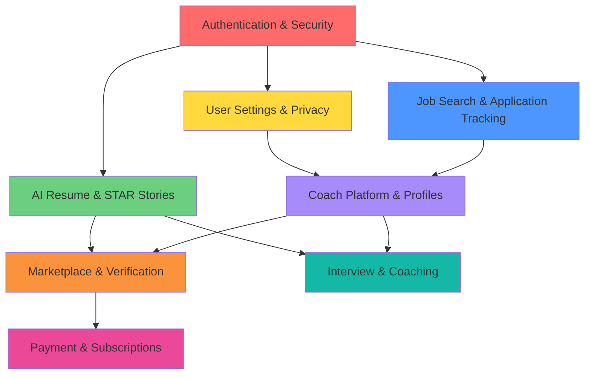
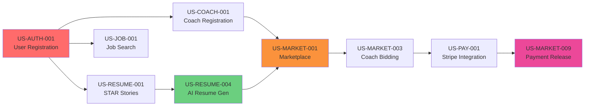

# Job Flow User Stories - Dependency Graph & Sequencing

## Overview

This document maps all 100 user stories across 8 epics with clear dependencies, implementation order, and sprint assignments.

---

## Implementation Phases

### Phase 1: Foundation (Sprints 1-3)
**Dependencies:** None (Foundation layer)
**Goal:** Core infrastructure for authentication, user management, and basic functionality

### Phase 2: Core Features (Sprints 4-8)
**Dependencies:** Phase 1 complete
**Goal:** AI Resume generation, STAR stories, job tracking

### Phase 3: Marketplace & Coach Platform (Sprints 9-14)
**Dependencies:** Phase 2 complete
**Goal:** Coach profiles, marketplace, verification system

### Phase 4: Advanced Features (Sprints 15-18)
**Dependencies:** Phase 3 complete
**Goal:** Payments, subscriptions, advanced coaching features

---

## Epic Breakdown with Dependencies

---

## Epic 1: Authentication & Security (8 Stories)
**Priority:** P0 (Critical - Foundation)
**Total Story Points:** 34
**Sprint Assignment:** Sprint 1-2

### Story List

| Story ID | Story Title | Points | Dependencies | Sprint |
|----------|-------------|--------|--------------|--------|
| US-AUTH-001 | User Registration with Email/Social | 5 | None | 1 |
| US-AUTH-002 | Email Verification Flow | 3 | US-AUTH-001 | 1 |
| US-AUTH-003 | Login with WorkOS SSO | 5 | US-AUTH-001 | 1 |
| US-AUTH-004 | Password Reset Flow | 3 | US-AUTH-001 | 2 |
| US-AUTH-005 | Two-Factor Authentication (2FA) | 8 | US-AUTH-003 | 2 |
| US-AUTH-006 | Session Management & Token Refresh | 5 | US-AUTH-003 | 2 |
| US-AUTH-007 | Role-Based Access Control (RBAC) | 3 | US-AUTH-001 | 2 |
| US-AUTH-008 | Account Security Settings | 2 | US-AUTH-006 | 2 |

### Key Implementation Notes
- WorkOS integration required for SSO
- Convex auth hooks for session management
- Redis or similar for token blacklisting (logout)

---

## Epic 2: User Settings & Privacy (5 Stories)
**Priority:** P1 (High)
**Total Story Points:** 13
**Sprint Assignment:** Sprint 2-3

### Story List

| Story ID | Story Title | Points | Dependencies | Sprint |
|----------|-------------|--------|--------------|--------|
| US-SETTINGS-001 | User Profile Management | 3 | US-AUTH-001 | 2 |
| US-SETTINGS-002 | Privacy Settings & Data Visibility | 3 | US-SETTINGS-001 | 3 |
| US-SETTINGS-003 | Notification Preferences | 2 | US-SETTINGS-001 | 3 |
| US-SETTINGS-004 | GDPR Data Export | 3 | US-SETTINGS-001 | 3 |
| US-SETTINGS-005 | Account Deletion & Data Removal | 2 | US-SETTINGS-004 | 3 |

### Key Implementation Notes
- GDPR compliance mandatory
- Email/SMS notification service integration
- Data export in JSON format

---

## Epic 3: AI Resume & STAR Stories (7 Stories)
**Priority:** P0 (Critical - Core Value)
**Total Story Points:** 34
**Sprint Assignment:** Sprint 3-5

### Story List

| Story ID | Story Title | Points | Dependencies | Sprint |
|----------|-------------|--------|--------------|--------|
| US-RESUME-001 | Create STAR Story (Situation, Task, Action, Result) | 5 | US-AUTH-001 | 3 |
| US-RESUME-002 | AI Conversation to Extract STAR Stories | 8 | US-RESUME-001 | 4 |
| US-RESUME-003 | STAR Story Library & Organization | 3 | US-RESUME-001 | 4 |
| US-RESUME-004 | AI Resume Generation from Job Description | 13 | US-RESUME-003 | 5 |
| US-RESUME-005 | ATS Score Calculation & Feedback | 3 | US-RESUME-004 | 5 |
| US-RESUME-006 | Resume Editing & Customization | 2 | US-RESUME-004 | 5 |
| US-RESUME-007 | Resume Version Management | 1 | US-RESUME-006 | 5 |

### Key Implementation Notes
- AI integration: OpenAI GPT-4 or similar
- Prompt engineering for STAR extraction
- ATS scoring algorithm (keyword matching + formatting)
- Resume parsing library for analysis

---

## Epic 4: Job Search & Application Tracking (14 Stories)
**Priority:** P1 (High)
**Total Story Points:** 42
**Sprint Assignment:** Sprint 5-8

### Story List

| Story ID | Story Title | Points | Dependencies | Sprint |
|----------|-------------|--------|--------------|--------|
| US-JOB-001 | Job Search with Filters | 5 | US-AUTH-001 | 5 |
| US-JOB-002 | Save & Favorite Jobs | 2 | US-JOB-001 | 5 |
| US-JOB-003 | Job Application Tracking (Kanban Board) | 8 | US-JOB-001 | 6 |
| US-JOB-004 | Manual Job Entry | 3 | US-JOB-003 | 6 |
| US-JOB-005 | Auto-Import Jobs from LinkedIn/Indeed | 5 | US-JOB-003 | 6 |
| US-JOB-006 | Application Status Updates | 2 | US-JOB-003 | 6 |
| US-JOB-007 | Follow-Up Reminders & Notifications | 3 | US-JOB-006 | 7 |
| US-JOB-008 | Application Analytics Dashboard | 3 | US-JOB-003 | 7 |
| US-JOB-009 | Job Match Score (Resume vs Job) | 5 | US-RESUME-005, US-JOB-001 | 7 |
| US-JOB-010 | Cover Letter Generation | 3 | US-RESUME-004 | 7 |
| US-JOB-011 | Application Document Management | 2 | US-JOB-003 | 8 |
| US-JOB-012 | Interview Scheduling Integration | 1 | US-JOB-006 | 8 |
| US-JOB-013 | Job Alerts & Recommendations | 2 | US-JOB-001 | 8 |
| US-JOB-014 | Application Export & Reporting | 1 | US-JOB-008 | 8 |

### Key Implementation Notes
- Third-party job board APIs (LinkedIn, Indeed)
- Calendar integration (Google Calendar, Outlook)
- Email parsing for application status updates
- Recommendation engine for job matching

---

## Epic 5: Interview & Coaching (10 Stories)
**Priority:** P1-P2
**Total Story Points:** 34
**Sprint Assignment:** Sprint 8-11

### Story List

| Story ID | Story Title | Points | Dependencies | Sprint |
|----------|-------------|--------|--------------|--------|
| US-INTERVIEW-001 | Interview Preparation Checklist | 2 | US-JOB-006 | 8 |
| US-INTERVIEW-002 | AI Mock Interview with Video Recording | 8 | US-RESUME-001 | 9 |
| US-INTERVIEW-003 | Interview Question Bank by Role | 3 | US-INTERVIEW-002 | 9 |
| US-INTERVIEW-004 | AI Feedback on Interview Responses | 5 | US-INTERVIEW-002 | 9 |
| US-INTERVIEW-005 | Interview Performance Analytics | 3 | US-INTERVIEW-004 | 10 |
| US-INTERVIEW-006 | Book Live Coaching Session | 5 | US-COACH-001 | 10 |
| US-INTERVIEW-007 | Coach Video Call Integration (Zoom/Meet) | 3 | US-INTERVIEW-006 | 10 |
| US-INTERVIEW-008 | Session Notes & Action Items | 2 | US-INTERVIEW-006 | 11 |
| US-INTERVIEW-009 | Coaching Session History | 2 | US-INTERVIEW-008 | 11 |
| US-INTERVIEW-010 | Share Interview Recording with Coach | 1 | US-INTERVIEW-002, US-INTERVIEW-006 | 11 |

### Key Implementation Notes
- Video recording & processing (cloud storage)
- Speech-to-text for transcript analysis
- Third-party video call integration
- AI evaluation model for responses

---

## Epic 6: Coach Platform & Profiles (35 Stories)
**Priority:** P0-P2 (Mixed - Core Marketplace)
**Total Story Points:** 89
**Sprint Assignment:** Sprint 9-14

### Story List (Grouped by Sub-Epic)

#### 6A: Coach Onboarding & Registration (6 Stories)

| Story ID | Story Title | Points | Dependencies | Sprint |
|----------|-------------|--------|--------------|--------|
| US-COACH-001 | Coach Registration & Application | 5 | US-AUTH-001 | 9 |
| US-COACH-002 | Coach Profile Setup (Bio, Experience, Skills) | 3 | US-COACH-001 | 9 |
| US-COACH-003 | Coach Verification & Vetting Process | 8 | US-COACH-001 | 9 |
| US-COACH-004 | Coach Onboarding Checklist | 2 | US-COACH-003 | 10 |
| US-COACH-005 | Coach Certification Upload | 3 | US-COACH-002 | 10 |
| US-COACH-006 | Coach Portfolio & Sample Work | 3 | US-COACH-002 | 10 |

#### 6B: Coach Discovery & Search (7 Stories)

| Story ID | Story Title | Points | Dependencies | Sprint |
|----------|-------------|--------|--------------|--------|
| US-COACH-007 | Browse Coach Directory | 3 | US-COACH-001 | 10 |
| US-COACH-008 | Filter Coaches by Specialty/Industry | 3 | US-COACH-007 | 10 |
| US-COACH-009 | Coach Profile Detail Page | 2 | US-COACH-007 | 10 |
| US-COACH-010 | Coach Ratings & Reviews System | 5 | US-COACH-009 | 11 |
| US-COACH-011 | Coach Search with AI Matching | 5 | US-COACH-008 | 11 |
| US-COACH-012 | Save Favorite Coaches | 1 | US-COACH-007 | 11 |
| US-COACH-013 | Coach Comparison Tool | 3 | US-COACH-009 | 11 |

#### 6C: Coach Availability & Scheduling (8 Stories)

| Story ID | Story Title | Points | Dependencies | Sprint |
|----------|-------------|--------|--------------|--------|
| US-COACH-014 | Coach Availability Calendar | 5 | US-COACH-001 | 11 |
| US-COACH-015 | Set Available Time Slots | 3 | US-COACH-014 | 11 |
| US-COACH-016 | Block Time for Existing Commitments | 2 | US-COACH-014 | 12 |
| US-COACH-017 | Calendar Integration (Google/Outlook) | 3 | US-COACH-014 | 12 |
| US-COACH-018 | Real-Time Availability Updates | 2 | US-COACH-014 | 12 |
| US-COACH-019 | Buffer Time Between Sessions | 1 | US-COACH-015 | 12 |
| US-COACH-020 | Recurring Availability Patterns | 2 | US-COACH-015 | 12 |
| US-COACH-021 | Time Zone Management | 2 | US-COACH-014 | 12 |

#### 6D: Coach Dashboard & Management (8 Stories)

| Story ID | Story Title | Points | Dependencies | Sprint |
|----------|-------------|--------|--------------|--------|
| US-COACH-022 | Coach Dashboard Overview | 5 | US-COACH-001 | 12 |
| US-COACH-023 | Active Tasks & Assignments View | 3 | US-COACH-022 | 12 |
| US-COACH-024 | Upcoming Sessions Calendar | 2 | US-COACH-014, US-COACH-022 | 13 |
| US-COACH-025 | Earnings & Payment History | 3 | US-COACH-022 | 13 |
| US-COACH-026 | Performance Analytics (Rating, Response Time) | 3 | US-COACH-010, US-COACH-022 | 13 |
| US-COACH-027 | Client Management & Notes | 2 | US-COACH-022 | 13 |
| US-COACH-028 | Task Queue & Priority Management | 2 | US-COACH-023 | 13 |
| US-COACH-029 | Coach Notification Center | 2 | US-COACH-022 | 13 |

#### 6E: Coach Communication (6 Stories)

| Story ID | Story Title | Points | Dependencies | Sprint |
|----------|-------------|--------|--------------|--------|
| US-COACH-030 | Secure Messaging with Clients | 5 | US-COACH-001 | 13 |
| US-COACH-031 | File Sharing in Chat | 2 | US-COACH-030 | 13 |
| US-COACH-032 | Message Read Receipts | 1 | US-COACH-030 | 14 |
| US-COACH-033 | Push Notifications for Messages | 2 | US-COACH-030 | 14 |
| US-COACH-034 | Message Templates & Quick Replies | 2 | US-COACH-030 | 14 |
| US-COACH-035 | Video Call Link Sharing | 1 | US-COACH-030, US-INTERVIEW-007 | 14 |

### Key Implementation Notes
- Coach vetting workflow (manual approval process)
- Calendar sync via CalDAV or API integrations
- Real-time WebSocket for messaging
- File upload/download with virus scanning
- Stripe Connect for coach payments

---

## Epic 7: Marketplace & Verification (12 Stories)
**Priority:** P0 (Critical - Revenue Driver)
**Total Story Points:** 55
**Sprint Assignment:** Sprint 11-14

### Story List

| Story ID | Story Title | Points | Dependencies | Sprint |
|----------|-------------|--------|--------------|--------|
| US-MARKET-001 | Marketplace Infrastructure (Task Board) | 8 | US-AUTH-001 | 11 |
| US-MARKET-002 | Create Verification Task (Resume/Cover Letter) | 5 | US-RESUME-004, US-MARKET-001 | 11 |
| US-MARKET-003 | Coach Bidding System | 8 | US-MARKET-001, US-COACH-001 | 11 |
| US-MARKET-004 | Task Assignment to Winning Bid | 3 | US-MARKET-003 | 12 |
| US-MARKET-005 | Task Status Tracking (Open → Assigned → Completed) | 3 | US-MARKET-001 | 12 |
| US-MARKET-006 | Coach Submits Verified Resume | 5 | US-MARKET-004 | 12 |
| US-MARKET-007 | User Reviews & Accepts Verification | 3 | US-MARKET-006 | 12 |
| US-MARKET-008 | Request Changes/Revisions | 3 | US-MARKET-007 | 13 |
| US-MARKET-009 | Escrow Payment Release | 5 | US-MARKET-007 | 13 |
| US-MARKET-010 | Marketplace Analytics (Supply/Demand) | 3 | US-MARKET-001 | 13 |
| US-MARKET-011 | On-Call Coach Pool for Urgent Tasks | 5 | US-MARKET-003 | 14 |
| US-MARKET-012 | Task Dispute Resolution | 4 | US-MARKET-007 | 14 |

### Key Implementation Notes
- Real-time WebSocket for bid updates
- Escrow payment system (Stripe or similar)
- SLA monitoring for task completion
- Automated reassignment logic
- Admin dispute resolution dashboard

---

## Epic 8: Payment & Subscriptions (8 Stories)
**Priority:** P0 (Critical - Revenue)
**Total Story Points:** 34
**Sprint Assignment:** Sprint 13-15

### Story List

| Story ID | Story Title | Points | Dependencies | Sprint |
|----------|-------------|--------|--------------|--------|
| US-PAY-001 | Stripe Payment Integration | 8 | US-AUTH-001 | 13 |
| US-PAY-002 | Add Payment Method | 3 | US-PAY-001 | 13 |
| US-PAY-003 | One-Time Payment for Verification | 5 | US-PAY-001, US-MARKET-002 | 13 |
| US-PAY-004 | Subscription Plans (Free, Premium, Pro) | 5 | US-PAY-001 | 14 |
| US-PAY-005 | Subscription Management & Billing | 3 | US-PAY-004 | 14 |
| US-PAY-006 | Stripe Connect for Coach Payouts | 5 | US-PAY-001, US-COACH-001 | 14 |
| US-PAY-007 | Payment History & Invoices | 3 | US-PAY-001 | 15 |
| US-PAY-008 | Refund & Dispute Handling | 2 | US-PAY-003 | 15 |

### Key Implementation Notes
- Stripe Checkout for subscriptions
- Stripe Connect Express for coach accounts
- Webhook handling for payment events
- Invoice generation (PDF)
- Platform fee calculation (15%)

---

## Cross-Epic Dependencies (Critical Path)

---

## MVP Scope Definition (25 Stories)

### Phase 1: MVP Launch (Sprints 1-8, ~16 weeks)

**Goal:** Launch with core resume generation + human verification

**Included Stories (25 total, 97 story points):**

#### Foundation (8 stories)
- US-AUTH-001, US-AUTH-002, US-AUTH-003, US-AUTH-006, US-AUTH-007
- US-SETTINGS-001, US-SETTINGS-003
- US-SETTINGS-004 (GDPR compliance)

#### Core Resume Features (5 stories)
- US-RESUME-001, US-RESUME-003, US-RESUME-004, US-RESUME-005, US-RESUME-006

#### Coach Platform Basics (6 stories)
- US-COACH-001, US-COACH-002, US-COACH-003, US-COACH-007, US-COACH-009, US-COACH-010

#### Marketplace (4 stories)
- US-MARKET-001, US-MARKET-002, US-MARKET-006, US-MARKET-007

#### Payment (2 stories)
- US-PAY-001, US-PAY-003

**Excluded from MVP (75 stories):**
- Advanced AI features (US-RESUME-002 AI conversation)
- Job tracking features (Epic 4 - post-MVP)
- Interview coaching (Epic 5 - post-MVP)
- Advanced coach features (scheduling, analytics)
- Subscriptions (one-time payments only for MVP)

---

## Implementation Order (Recommended)

### Sprint 1-2: Foundation
1. US-AUTH-001 → US-AUTH-003 → US-AUTH-006 → US-AUTH-007
2. US-SETTINGS-001
3. Basic dashboard UI

### Sprint 3-4: Resume Core
1. US-RESUME-001 (STAR stories)
2. US-RESUME-003 (Library)
3. US-RESUME-004 (AI generation) - **Technical spike in Sprint 3**

### Sprint 5-6: Coach Platform
1. US-COACH-001 (Registration)
2. US-COACH-002 (Profile)
3. US-COACH-003 (Verification)
4. US-COACH-007, US-COACH-009 (Discovery)

### Sprint 7-8: Marketplace & Payment
1. US-MARKET-001 (Infrastructure)
2. US-PAY-001 (Stripe integration) - **Parallel with marketplace**
3. US-MARKET-002, US-MARKET-006, US-MARKET-007
4. US-PAY-003 (One-time payments)
5. **Integration testing**

---

## Technical Spikes Required

| Sprint | Spike Topic | Story Impact | Duration |
|--------|-------------|--------------|----------|
| 3 | AI Resume Generation Quality | US-RESUME-004 | 2 days |
| 5 | Coach Verification Workflow | US-COACH-003 | 1 day |
| 7 | Stripe Connect Payout Flow | US-PAY-006 | 2 days |
| 9 | WebSocket Marketplace Updates | US-MARKET-003 | 1 day |
| 11 | Video Recording & Transcription | US-INTERVIEW-002 | 3 days |

---

## Risk Mitigation

### High-Risk Stories (Complexity 8+)

| Story ID | Risk | Mitigation |
|----------|------|------------|
| US-RESUME-004 | AI quality inconsistent | Extensive prompt engineering, human fallback |
| US-MARKET-003 | Marketplace liquidity (no coaches) | On-call coach pool, guaranteed coverage |
| US-COACH-003 | Coach vetting bottleneck | Automated checks + manual review queue |
| US-INTERVIEW-002 | Video processing costs | Limit recording length, compression |
| US-PAY-001 | Payment compliance (PCI) | Use Stripe Checkout (hosted), no card storage |

---

## Success Metrics by Epic

| Epic | Success Metric | Target |
|------|---------------|--------|
| Authentication | User signup completion rate | >70% |
| Resume & STAR | AI-generated resumes per user | >3 per month |
| Coach Platform | Active coaches | >100 at launch |
| Marketplace | Verification turnaround time | <24 hours (p95) |
| Payment | Payment success rate | >98% |
| Job Search | Jobs tracked per user | >10 |
| Interview | Mock interviews completed | >5 per user |

---

## Total Effort Summary

| Epic | Stories | Story Points | Sprints | Team Size |
|------|---------|--------------|---------|-----------|
| Authentication & Security | 8 | 34 | 2 | 2 engineers |
| User Settings & Privacy | 5 | 13 | 1.5 | 1 engineer |
| AI Resume & STAR Stories | 7 | 34 | 2.5 | 2 engineers + AI specialist |
| Job Search & Tracking | 14 | 42 | 3.5 | 2 engineers |
| Interview & Coaching | 10 | 34 | 3 | 2 engineers |
| Coach Platform | 35 | 89 | 5.5 | 3 engineers |
| Marketplace & Verification | 12 | 55 | 3.5 | 2 engineers |
| Payment & Subscriptions | 8 | 34 | 2.5 | 1 engineer + integration specialist |
| **TOTAL** | **100** | **335** | **~18 sprints** | **4-5 engineers** |

**Timeline:** 36 weeks (9 months) for full feature set, 16 weeks (4 months) for MVP

---

## Next Steps

1. **Approve MVP Scope** - Lock down 25 stories for first release
2. **Staff Team** - Hire/allocate 4-5 engineers + 1 product manager
3. **Technical Spikes** - Complete AI generation spike (Sprint 3)
4. **Begin Sprint 1** - Start with authentication foundation
5. **Weekly Reviews** - Story acceptance every Friday
6. **Adjust as Needed** - Re-prioritize based on user feedback

---

**Document Version:** 1.0  
**Last Updated:** 2025-11-13  
**Author:** Product Management Team
